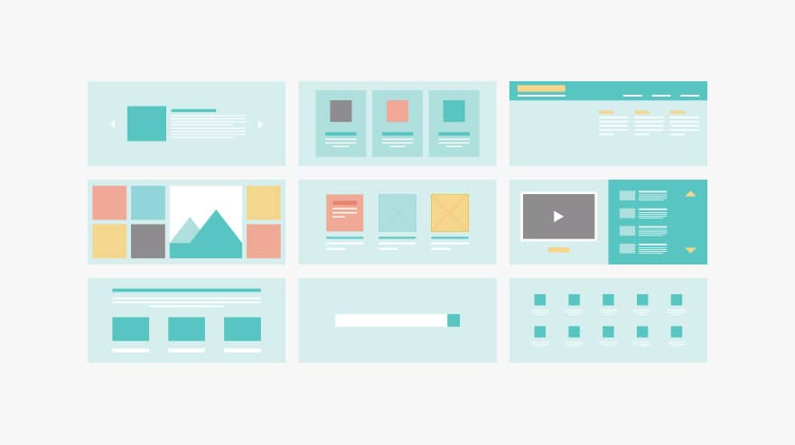

noteThis template is brought to you by Scaled Agile, Inc., provider of SAFe®. All Rights Reserved.

This template is brought to you by Scaled Agile, Inc., provider of SAFe®. All Rights Reserved.

##  Profil Epic

|  **Tanggal mulai project**  |  | 
|  **Proposal tanggal rilis**  |  | 
|  **Pemilik Epic**  |  | 
|  **Stakeholder utama**  |  | 
|  **Deskripsi Epic**  | Master landing page kelas komplit yang dibuat secara modular agar bisa mengakomodasi semua kebutuhan kelas komplit yang berbeda-beda sehingga meningkatkan paid traffic conversion rate dan development process | 
|  **Hasil Prioritas**  | [https://docs.google.com/spreadsheets/d/1JZ6vuL7WfSGMytqj1UZ_4tVwGupo2L8-hSyiPVZ146s/edit#gid=569384378](https://docs.google.com/spreadsheets/d/1JZ6vuL7WfSGMytqj1UZ_4tVwGupo2L8-hSyiPVZ146s/edit#gid=569384378) | 

##  Deskripsi Epic
Master landing page kelas komplit yang dibuat secara modular agar bisa mengakomodasi semua kebutuhan kelas komplit yang berbeda-beda sehingga meningkatkan paid traffic conversion rate dan development process

##  Hipotesa dan Tujuan

|  **Hipotesa hasil bisnis (**  **_Business outcome_**  **)**  _Bagian ini diisi tim business_  |  **Indikator Utama**  _Bagian ini diisi tim business_  | 
| <ul><li>Membuat template ini akan mengurangi kebutuhan designers & freelance developers

</li><li>Membuat template ini akan mempercepat landing page development process

</li><li>Master page tetap bisa dipakai ketika unified platform sudah aktif

</li></ul> | <ul><li>Semua kelas komplit yang kita produce bisa menggunakan 1 design landing page

</li><li>Paid traffic conversion rate meningkat (need exact numbers dari desktop & mobile)

</li><li>Kecepatan landing page development process meningkat dari  **x days**  menjadi  **x-y days** 

</li><li>Improve user session times

</li></ul> | 
|  **Didalam Cakupan (**  **_In scope_**  **)**  _Bagian ini diisi tim business terlebih dahulu, kemudian difinalisasi tim product_  |  **Diluar Cakupan (**  **_Out of scope_**  **)**  _Bagian ini diisi tim bisnis terlebih dahulu, kemudian difinalisasi tim product_  |  **Kebutuhan Non-fungsional**  _Bagian ini diisi tim engineering_  | 
| <ul><li>Desktop Master Page

</li><li>Mobile Master Page

</li><li>Modular sections for both mobile & desktop (main info, kurikulum, why “topik”, why kuncie, biaya, faq, testimonial, photo gallery, mentors, learning method, certificate, competitor comparison). [https://docs.google.com/presentation/d/1XKTQjAxJaPSEUrv5lwH0Dp5fW6wjP6KYnlABuWUYSkw/edit?usp=sharing](https://docs.google.com/presentation/d/1XKTQjAxJaPSEUrv5lwH0Dp5fW6wjP6KYnlABuWUYSkw/edit?usp=sharing)

</li></ul> | <ul><li>

</li><li>

</li></ul> | <ul><li>

</li><li>

</li></ul> | 
|   **_Minimum Viable Product_**  _Bagian ini diisi tim business dan product_  |  **Fitur Potensial Tambahan**  _Bagian ini diisi tim business dan product_  | 
| List out key features or capabilities | List out nice-to-have features or capabilities<ul><li>booking seats before open sales

</li><li>booking seats for next batch

</li></ul> | 
|  **Hasil Analisa**  _Bagian ini diisi bersama-sama_  |   **Go /**   **No-go**  _Bagian ini diisi tim product_  | 
| Briefly summarize the analysis formed to create the business case<ul><li>

</li></ul> | Document final recommendation and reasoning<ul><li>

</li></ul> | 

#  _Lean Business Case_  untuk Kuncie Komplit Master Page

##  Analisa Solusi

|  | 
|  --- |  --- | 
|  **User internal dan/atau eksternal mana yang terpengaruh, dan bagaimana caranya?**  _Bagian ini diisi tim business_  | 
| Describe user community and markets | 
|  **Apa dampak potensial pada solusi, program, dan layanan?**  _Bagian ini diisi tim business_  | 
| Identify teams, departments, etc. that will may be impacted | 
|  **Apa dampak potensial pada penjualan, distribusi, penerapan, dan dukungan yang dilakukan?**  _Bagian ini diisi tim business_  | 
| For external solutions or products, describe outward impact | 
|  | 
|  **Modal Awal**  _Bagian ini diisi tim product dan engineering_  | Calculate investment requested to fund the MVP | Calculate investment of full implementation if MVP hypothesis is proven true _Initial estimate:_  This can be expressed as a range _Refined estimate(s):_  Identify material updates to the estimated implementation cost, usually informed from experiments | 
|  **Keuntungan/**  **Balik modal**  _Bagian ini diisi tim business_  | e.g., Market share, increased revenue, improved productivity, or new markets served | 

##  Strategi Pengembangan Produk
 _bagian ini di isi tim produk dan engineering_ 

|  **Tim Internal Kuncie/Eksternal**  | Provide recommendations on where epic should be developed | 
|  **Strategi implementasi tambahan**  | <ul><li>Membuat skeleton (page slicing) di wordpress (kang Artha need to share best practice to Satria)

</li><li>Menggunakan ulang (reuse) design template dari WP untuk kemudian digunakan untuk unified platform LP

</li></ul> | 
|  **Urutan dan Dependensi**  | Describe any constraints for sequencing and identify potential dependencies with other epics or solutions | 

##  Data Dukungan Tambahan
 _Bagian ini bisa diisi oleh siapa saja_ 

| Referensi other bootcamp pages for testing:[https://maven.com/ksdigital/ga4-bootcamp](https://maven.com/ksdigital/ga4-bootcamp)[https://www.memorisely.com/live-bootcamp/ux-ui-bootcamps/ux-ui-design-bootcamp](https://www.memorisely.com/live-bootcamp/ux-ui-bootcamps/ux-ui-design-bootcamp) | 
| Provide miscellaneous information relevant to LPM team | 
|  --- | 
|  --- | 
| Referensi other bootcamp pages for testing:[https://maven.com/ksdigital/ga4-bootcamp](https://maven.com/ksdigital/ga4-bootcamp)[https://www.memorisely.com/live-bootcamp/ux-ui-bootcamps/ux-ui-design-bootcamp](https://www.memorisely.com/live-bootcamp/ux-ui-bootcamps/ux-ui-design-bootcamp) | 
| Provide miscellaneous information relevant to LPM team | 

*****

[[category.storage-team]] 
[[category.confluence]] 
