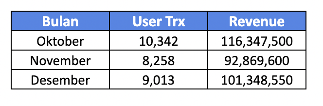

noteThis template is brought to you by Scaled Agile, Inc., provider of SAFe®. All Rights Reserved.

This template is brought to you by Scaled Agile, Inc., provider of SAFe®. All Rights Reserved.

##  Profil Epic

|  **Tanggal mulai project**  | Type // to add a date | 
|  **Proposal tanggal rilis**  |  | 
|  **Pemilik Epic**  |  | 
|  **Stakeholder utama**  | @ mention stakeholder names | 
|  **Deskripsi Epic**  | Use the epic Hypothesis Statement as a starting point | 
|  **Hasil Prioritas**  | [https://docs.google.com/spreadsheets/d/1JZ6vuL7WfSGMytqj1UZ_4tVwGupo2L8-hSyiPVZ146s/edit#gid=569384378](https://docs.google.com/spreadsheets/d/1JZ6vuL7WfSGMytqj1UZ_4tVwGupo2L8-hSyiPVZ146s/edit#gid=569384378) | 

##  Deskripsi Epic
Hipotesa : 

* History penjualan paket kuncie praktis month to month sejak oktober yang bisa memberikan driven revenue pada kelas JAGO sebesar 100 Juta sebulan

* Feature benefit yang didapat oleh user saat membeli paket bundling adalah : 

     **Paket Bundling 1 (Monthly)** 

    - 1 Gb (all net) Kuota Telkomsel

    - Content Video Subscription 30 Hari dari Kuncie (as a partner listing)

    - EUP (end user price = 25,000)

     **Paket Bundling 2 (Weekly)** 

    -  500 MB (all net) Kuota Telkomsel

    - Content Video Subscription 7 Hari dari Kuncie (as a partner listing)

    - EUP (end user price = 20,000)

     **Paket Bundling 3 (Daily)** 

    - 250 Mb (all Net) Kuota Telkomsel

    - Content Video Subscription 1 Hari dari Kuncie (as a partner listing)

    - EUP (end user price = 10,000)

    

##  Hipotesa dan Tujuan

|  **Hipotesa hasil bisnis (**  **_Business outcome_**  **)**  _Bagian ini diisi tim bisnis_  |  **Indikator Utama**  _Bagian ini diisi tim bisnis_  | 
| Increasing Subscriber Kuncie Praktis dengan target paket bundling kuota 300 Juta sebulanChannel Telkomsel untuk mempermudah penjualanPartner community yang akan membawa USP dari product Kuncie PraktisTime based Paket varian Monthly, Weekly and Daily Based | Development API untuk varibale list content partner yang akan menjadi listing dari benefit subscribtion Ex : Kuncie Bundling Young on top Modulee.g., A measurable change in purchaser demographics within 30 days of feature release | 
|  **Didalam Cakupan (**  **_In scope_**  **)**  _Bagian ini diisi tim bisnis terlebih dahulu, kemudian difinalisasi tim produk_  |  **Diluar Cakupan (**  **_Out of scope_**  **)**  _Bagian ini diisi tim bisnis terlebih dahulu, kemudian difinalisasi tim produk_  |  **Kebutuhan Non-fungsional**  _Bagian ini diisi tim engineering_  | 
| <ul><li>Content listing video Subscription yang akan disesuikan dengan jenis partner yang akan bekerjasama dengan Kuncie 

</li><li>Listing jenis video yang akan dijadikan benefit subscription content on demand

</li></ul> | <ul><li>Time based Weekly dan Daily based untuk subscription content vide

</li></ul> | <ul><li>

</li><li>

</li></ul> | 
|   **_Minimum Viable Product_**  _Bagian ini diisi tim bisnis dan produk_  |  **Fitur Potensial Tambahan**  _Bagian ini diisi tim bisnis dan produk_  | 
| List out key features or capabilities<ul><li>Time based Weekly and daily as a benefit Subscription content video learning

</li><li>Listing content yang menjadi variable dynamic dari benefit video yang akan didapatkan user

</li></ul> | List out nice-to-have features or capabilities<ul><li>Variasi jenis Subscription content dari masing-masing partner kuncie

</li><li>Potential revenue dari pilihan jenis paket Kuncie bundling sebesar 

</li></ul> | 
|  **Hasil Analisa**  _Bagian ini diisi bersama-sama_  |   **Go /**   **No-go**  _Bagian ini diisi tim produk_  | 
| Briefly summarize the analysis formed to create the business case<ul><li>

</li></ul> | Document final recommendation and reasoning<ul><li>

</li></ul> | 

#  _Lean Business Case_  untuk <short name of epic>

##  Analisa Solusi

|  | 
|  --- |  --- | 
|  **User internal dan/atau eksternal mana yang terpengaruh, dan bagaimana caranya?**  _Bagian ini diisi tim bisnis_  | 
| <ul><li>Varian Listing video on demand dari kuncie subscription yang akan membuat USP product bundling kuota ini semakin tinggi niali jualnya

</li><li>Partner yang memiliki exclusive content bersama Kuncie <> Telkomsel

</li></ul> | 
|  **Apa dampak potensial pada solusi, program, dan layanan?**  _Bagian ini diisi tim bisnis_  | 
| <ul><li>Revenue driven yang sudah ada history potentialnya pada paket sebelumnya

</li><li>Varian product kuncie praktis dengan time based dan video on demand akan meningkatkan attraction user baik dari partner based maupun user keseluruhan

</li></ul> | 
|  **Apa dampak potensial pada penjualan, distribusi, penerapan, dan dukungan yang dilakukan?**  _Bagian ini diisi tim bisnis_  | 
| salah satu driven channel Telkomsel yang akan membantu memberikan potential revenue 200 juta / bulan | 
|  | 
|  **Modal Awal**  _Bagian ini diisi tim produk dan engineering_  | Calculate investment requested to fund the MVP | Calculate investment of full implementation if MVP hypothesis is proven true<ul><li>1 minggu design + 1 minggu A/B test preparation

</li><li>2 minggu running A/B test 

</li><li>2 minggu development (tentative)

</li></ul> _Initial estimate:_  This can be expressed as a range _Refined estimate(s):_  Identify material updates to the estimated implementation cost, usually informed from experiments | 
|  **Keuntungan/**  **Balik modal**  _Bagian ini diisi tim bisnis_  | e.g., Market share, increased revenue, improved productivity, or new markets served | 

##  Strategi Pengembangan Produk
 _bagian ini di isi tim produk dan engineering_ 

|  **Tim Internal Kuncie/Eksternal**  | Provide recommendations on where epic should be developed | 
|  **Strategi implementasi tambahan**  | Click [here](https://www.scaledagileframework.com/implementation-strategies-for-business-epics/) for potential strategies | 
|  **Urutan dan Dependensi**  | Describe any constraints for sequencing and identify potential dependencies with other epics or solutions | 

##  Data Dukungan Tambahan
 _Bagian ini bisa diisi oleh siapa saja_ 

| Type /link to add studies, models, market analysis, or other data used in the creation of the business case | 
| Provide miscellaneous information relevant to LPM team | 
|  --- | 
|  --- | 
| Type /link to add studies, models, market analysis, or other data used in the creation of the business case | 
| Provide miscellaneous information relevant to LPM team | 

*****

[[category.storage-team]] 
[[category.confluence]] 
