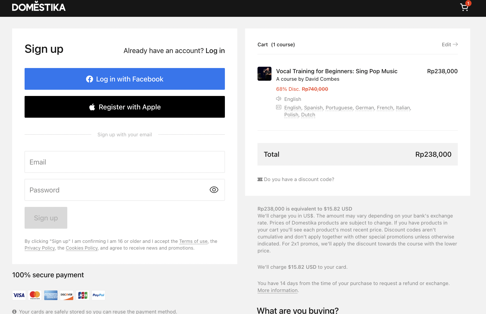

noteThis template is brought to you by Scaled Agile, Inc., provider of SAFe®. All Rights Reserved.

This template is brought to you by Scaled Agile, Inc., provider of SAFe®. All Rights Reserved.

##  Profil Epic

|  **Tanggal mulai project**  |  | 
|  **Proposal tanggal rilis**  |  | 
|  **Pemilik Epic**  |  | 
|  **Stakeholder utama**  |  | 
|  **Stakeholder Terkait**  |  | 
|  **Deskripsi Epic**  | User akan mengetahui lebih jelas mengeni syarat dan ketentuan refund dan reschedule kelas kuncie | 
|  **Hasil Prioritas**  | [https://docs.google.com/spreadsheets/d/1JZ6vuL7WfSGMytqj1UZ_4tVwGupo2L8-hSyiPVZ146s/edit#gid=569384378](https://docs.google.com/spreadsheets/d/1JZ6vuL7WfSGMytqj1UZ_4tVwGupo2L8-hSyiPVZ146s/edit#gid=569384378) | 

##  Deskripsi Epic
Dalam beberapa waktu ini, terutama di dalam case Mini MBA Batch 6, kita mendapatkan peserta yang mengundurkan diri dan melakukan pengajuan refund dan pengajuan perubahan batch ketika kelas telah berlangsung. Ini menjadikan pengalaman belajar (learning experience) peserta lain juga terganggu karena pada dasarnya, khususnya Kelas Kuncie Executive, para peserta akan dibagi dalam kelompok. Ini juga menghasilkan customer experience yang kurang baik karena mereka belum teredukasi secara jelas mengenai informasi refund and reschedule policy.

Informasi refund policy sebenarnya sudah terdapat pada link syarat dan ketentuan yang telah ditautkan ketika seseorang sign up. Namun visibilitas mengenai syarat dan ketentuan tersebut sepertinya masih kecil untuk dapat diakses oleh user.

Sehingga BRD ini digunakan untuk melakukan improvisasi / perbaikan mengenai customer experience terhadap informasi hal tersebut.

Salah satu contoh penerapannya:

[https://www.domestika.org/en/cart/checkout](https://www.domestika.org/en/cart/checkout)

 **Informasi Mengenai Refund & Reschedule Policy**  **Bagaimana Cara Untuk Refund?** 

Refund dapat dilakukan maksimal 14 hari pembelajaran atau telah mengikuti setidaknya 1x live session. Alasan refund harus disertai bukti concrete seperti bukti konflik jadwal atau terdapat surat kuasa yang valid menyatakan bahwa yang tersebut tidak dapat mengikuti program pembelajaran.

Pengubahan jadwal dapat diinformasikan kepada Customer Care Kuncie dengan menyertakan bukti bahwa peserta telah melakukan pembelian kelas

Refund pada maksimal 14 hari masa pembelajaran akan mendapatkan refund 100%

Non-refundable berlaku jika peserta telah mengikuti masa pembelajaran lewat dari 7 hari.

 **Bagaimana jika saya ingin untuk mengubah jadwal Batch?** 

Pengubahan jadwal dapat dilakukan maksimal 7 hari pembalajaran atau dalam masa self learning. Alasan reschedule atau perubahan jadwal Batch harus disertai bukti concrete seperti bukti konflik jadwal atau terdapat surat kuasa yang valid menyatakan bahwa yang tersebut tidak dapat mengikuti program pembelajaran.

Pengubahan jadwal dapat diinformasikan kepada Customer Care Kuncie dengan menyertakan bukti bahwa peserta telah melakukan pembelian kelas.

##  Hipotesa dan Tujuan

|  **Hipotesa hasil bisnis (**  **_Business outcome_**  **)**  _Bagian ini diisi tim business_  |  **Indikator Utama**  _Bagian ini diisi tim business_  | 
| <ul><li>User can be educated on when and how they can refund & reschedule the class

</li></ul> | <ul><li>Reduction number of refund & reschedule of the exsisting class

</li></ul> | 
|  **Didalam Cakupan (**  **_In scope_**  **)**  _Bagian ini diisi tim business terlebih dahulu, kemudian difinalisasi tim product_  |  **Diluar Cakupan (**  **_Out of scope_**  **)**  _Bagian ini diisi tim bisnis terlebih dahulu, kemudian difinalisasi tim product_  |  **Kebutuhan Non-fungsional**  _Bagian ini diisi tim engineering_  | 
| <ul><li>tersedia informasi mengenai ketentuan refund & reschedule policy di bagian yang terlihat oleh user (salah satu journey ketika melakukan pembelian)

</li></ul> | <ul><li>Bahwa informasi yang telah tersampaikan dianggap valid dan dipahami maknanya oleh user dan dianggap setuju dengan policy tersebut

</li><li>

</li></ul> | <ul><li>

</li><li>

</li></ul> | 
|   **_Minimum Viable Product_**  _Bagian ini diisi tim business dan product_  |  **Fitur Potensial Tambahan**  _Bagian ini diisi tim business dan product_  | 
| <ul><li>informasi mengenai ketentuan refund & reschedule

</li><li>bahwa informasi tersebut dianggap valid dan dipahami dan dianggap setuju oleh user

</li></ul> | List out nice-to-have features or capabilities<ul><li>

</li><li>

</li></ul> | 
|  **Hasil Analisa**  _Bagian ini diisi bersama-sama_  |   **Go /**   **No-go**  _Bagian ini diisi tim product_  | 
| Briefly summarize the analysis formed to create the business case<ul><li>

</li></ul> | Document final recommendation and reasoning<ul><li>

</li></ul> | 

#  _Lean Business Case_  untuk <short name of epic>

##  Analisa Solusi

|  | 
|  --- |  --- | 
|  **User internal dan/atau eksternal mana yang terpengaruh, dan bagaimana caranya?**  _Bagian ini diisi tim business_  | 
| User & Calon User pembelajaran kelas Kuncie Executive maupun Bootcamp | 
|  **Apa dampak potensial pada solusi, program, dan layanan?**  _Bagian ini diisi tim business_  | 
| Penurunan jumlah yang akan request refund dan reschedule  | 
|  **Apa dampak potensial pada penjualan, distribusi, penerapan, dan dukungan yang dilakukan?**  _Bagian ini diisi tim business_  | 
| revenue yang tercatat ketika pembelian dapat segera di klaim, karena tidak ada pengurangan refund / reschedule | 
|  | 
|  **Modal Awal**  _Bagian ini diisi tim product dan engineering_  | Calculate investment requested to fund the MVP | Calculate investment of full implementation if MVP hypothesis is proven true _Initial estimate:_  This can be expressed as a range _Refined estimate(s):_  Identify material updates to the estimated implementation cost, usually informed from experiments | 
|  **Keuntungan/**  **Balik modal**  _Bagian ini diisi tim business_  | improve experience, revenue increasement | 

##  Strategi Pengembangan Produk
 _bagian ini di isi tim produk dan engineering_ 

|  **Tim Internal Kuncie/Eksternal**  | Provide recommendations on where epic should be developed | 
|  **Strategi implementasi tambahan**  | Click [here](https://www.scaledagileframework.com/implementation-strategies-for-business-epics/) for potential strategies | 
|  **Urutan dan Dependensi**  | Describe any constraints for sequencing and identify potential dependencies with other epics or solutions | 

##  Data Dukungan Tambahan
 _Bagian ini bisa diisi oleh siapa saja_ 

| Type /link to add studies, models, market analysis, or other data used in the creation of the business case | 
| Provide miscellaneous information relevant to LPM team | 
|  --- | 
|  --- | 
| Type /link to add studies, models, market analysis, or other data used in the creation of the business case | 
| Provide miscellaneous information relevant to LPM team | 

*****

[[category.storage-team]] 
[[category.confluence]] 
