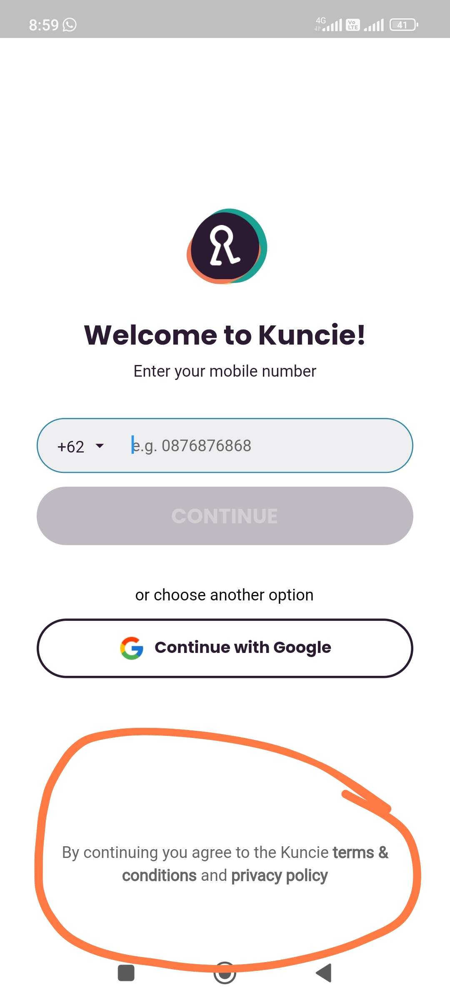
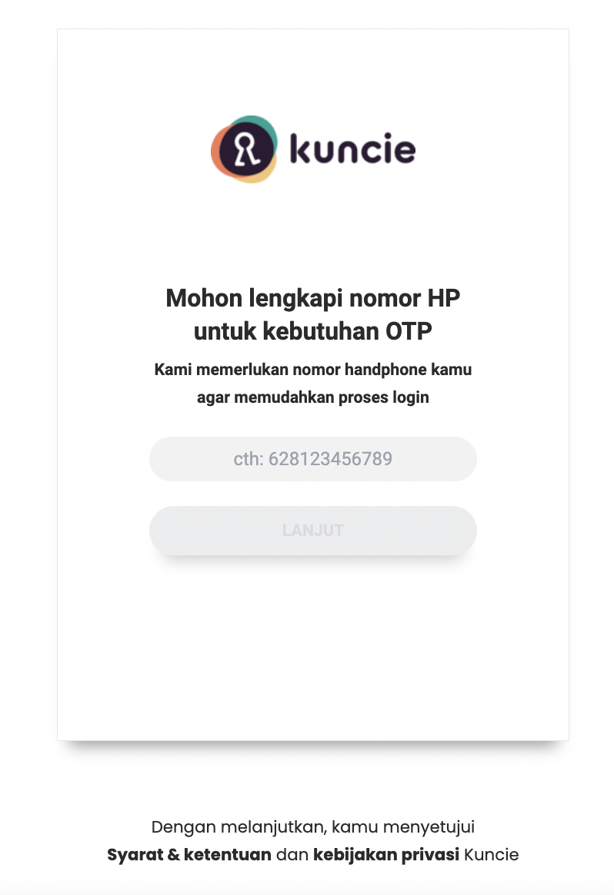

noteThis template is brought to you by Scaled Agile, Inc., provider of SAFe®. All Rights Reserved.

This template is brought to you by Scaled Agile, Inc., provider of SAFe®. All Rights Reserved.

##  Profil Epic

|  **Tanggal mulai project**  |  | 
|  **Proposal tanggal rilis**  |  | 
|  **Pemilik Epic**  |  | 
|  **Stakeholder utama**  |  | 
|  **Deskripsi Epic**  | terdapat consent form dan syarat ketentuan saat registrasi  | 
|  **Hasil Prioritas**  | [https://docs.google.com/spreadsheets/d/1JZ6vuL7WfSGMytqj1UZ_4tVwGupo2L8-hSyiPVZ146s/edit#gid=569384378](https://docs.google.com/spreadsheets/d/1JZ6vuL7WfSGMytqj1UZ_4tVwGupo2L8-hSyiPVZ146s/edit#gid=569384378) | 

##  Deskripsi Epic
Use the epic hypothesis statement as a starting point.

##  Hipotesa dan Tujuan

|  **Hipotesa hasil bisnis (**  **_Business outcome_**  **)**  _Bagian ini diisi tim business_  |  **Indikator Utama**  _Bagian ini diisi tim business_  | 
| Saat ini tidak ada consent form / informasi syarat dan ketentuan ketika mendaftarkan diri sebagai pengguna kunciecontoh:[https://www.kuncie.com/terms](https://www.kuncie.com/terms)[https://www.kuncie.com/privacy](https://www.kuncie.com/privacy)[https://siplah.tokoladang.co.id/help/conditions](https://siplah.tokoladang.co.id/help/conditions)[https://help.shopee.co.id/portal/article/71187](https://help.shopee.co.id/portal/article/71187)[https://helps.jd.id/s/article/Syarat-dan-Ketentuan?language=in](https://helps.jd.id/s/article/Syarat-dan-Ketentuan?language=in)yang menyatakan pelanggan/pengguna setuju untuk memberikan data merekaHal ini juga ditanyakan oleh pihak telkomsel apakah Kuncie memiliki consent from dalam memberikan keluluasan pihak kuncie mengolah data user untuk berbagai macam hal lain contoh (marketing campaign & informasi lainnya)ini dirasa penting untuk menghindari penyalahgunaan wewenang atas penggunaan data customer sebagai bentuk perlindungan terhadap customer dan sebagai bentuk transparansi Kuncie dalam menggunakan data customer | Establish innovation accounting metricse.g., A measurable change in purchaser demographics within 30 days of feature release | 
|  **Didalam Cakupan (**  **_In scope_**  **)**  _Bagian ini diisi tim business terlebih dahulu, kemudian difinalisasi tim product_  |  **Diluar Cakupan (**  **_Out of scope_**  **)**  _Bagian ini diisi tim bisnis terlebih dahulu, kemudian difinalisasi tim product_  |  **Kebutuhan Non-fungsional**  _Bagian ini diisi tim engineering_  | 
| <ul><li>pertanyaan: apakah dengan sekarang sudah lebih baik atau kita menggunakan metode pop up bagi user untuk dapat klik menyetujui

</li><li>Karena tidak clickable

</li></ul> | <ul><li>

</li><li>

</li></ul> | <ul><li>

</li><li>

</li></ul> | 
|   **_Minimum Viable Product_**  _Bagian ini diisi tim business dan product_  |  **Fitur Potensial Tambahan**  _Bagian ini diisi tim business dan product_  | 
| List out key features or capabilities<ul><li>SOP & muncl S&K yang perlu disetujui customer saat registrasi

</li></ul> | List out nice-to-have features or capabilities<ul><li>

</li></ul> | 
|  **Hasil Analisa**  _Bagian ini diisi bersama-sama_  |   **Go /**   **No-go**  _Bagian ini diisi tim product_  | 
| Briefly summarize the analysis formed to create the business case<ul><li>

</li></ul> | Document final recommendation and reasoning<ul><li>

</li></ul> | 

#  _Lean Business Case_  untuk <short name of epic>

##  Analisa Solusi

|  | 
|  --- |  --- | 
|  **User internal dan/atau eksternal mana yang terpengaruh, dan bagaimana caranya?**  _Bagian ini diisi tim business_  | 
| Seluruh customer Kuncie | 
|  **Apa dampak potensial pada solusi, program, dan layanan?**  _Bagian ini diisi tim business_  | 
| terdapat payung hukum dalam melindungi customer dan juga melindungi kuncie atas penggunaan data yang telah diberikan oleh customer | 
|  **Apa dampak potensial pada penjualan, distribusi, penerapan, dan dukungan yang dilakukan?**  _Bagian ini diisi tim business_  | 
| menghindari penyalahgunaan data jika terdapat audit dsb karena sampai saat ini tidak ada consent tersebut | 
|  | 
|  **Modal Awal**  _Bagian ini diisi tim product dan engineering_  | Calculate investment requested to fund the MVP | Calculate investment of full implementation if MVP hypothesis is proven true _Initial estimate:_  This can be expressed as a range _Refined estimate(s):_  Identify material updates to the estimated implementation cost, usually informed from experiments | 
|  **Keuntungan/**  **Balik modal**  _Bagian ini diisi tim business_  | e.g., Market share, increased revenue, improved productivity, or new markets served | 

##  Strategi Pengembangan Produk
 _bagian ini di isi tim produk dan engineering_ 

|  **Tim Internal Kuncie/Eksternal**  | Provide recommendations on where epic should be developed | 
|  **Strategi implementasi tambahan**  | Click [here](https://www.scaledagileframework.com/implementation-strategies-for-business-epics/) for potential strategies | 
|  **Urutan dan Dependensi**  | Describe any constraints for sequencing and identify potential dependencies with other epics or solutions | 

##  Data Dukungan Tambahan
 _Bagian ini bisa diisi oleh siapa saja_ 

| Type /link to add studies, models, market analysis, or other data used in the creation of the business case | 
| Provide miscellaneous information relevant to LPM team | 
|  --- | 
|  --- | 
| Type /link to add studies, models, market analysis, or other data used in the creation of the business case | 
| Provide miscellaneous information relevant to LPM team | 

*****

[[category.storage-team]] 
[[category.confluence]] 
