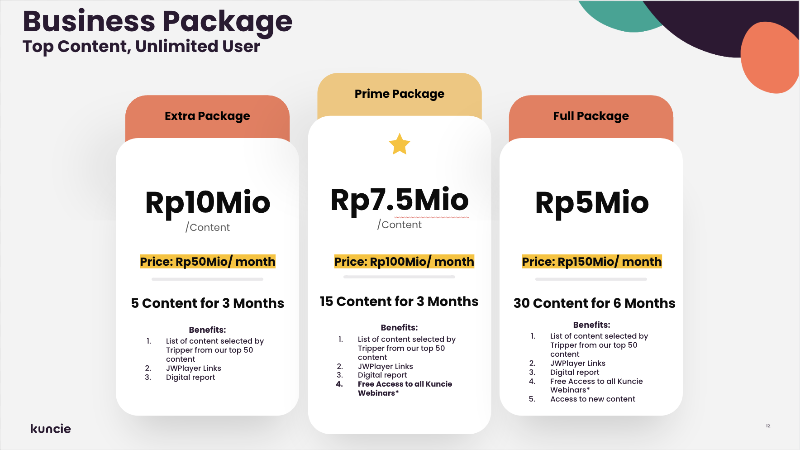
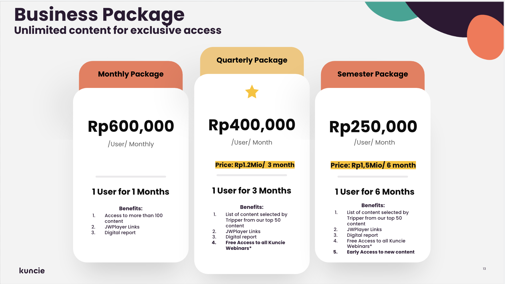

noteThis template is brought to you by Scaled Agile, Inc., provider of SAFe®. All Rights Reserved.

This template is brought to you by Scaled Agile, Inc., provider of SAFe®. All Rights Reserved.

##  Profil Epic

|  **Tanggal mulai project**  |  | 
|  **Proposal tanggal rilis**  |  | 
|  **Pemilik Epic**  |  | 
|  **Stakeholder utama**  |  | 
|  **Deskripsi Epic**  | As we strengthen our retail business, we also developing our B2B business, in training (outside platform) and in content licensing to utilize our asynchronous product portfolio | 
|  **Hasil Prioritas**  |  | 
|  **Potential Revenue**  | contribution to achieve Rp1bio revenue on B2B (outside platform) target → [here](https://docs.google.com/spreadsheets/d/19QusoXMx__sJFi-NVHdOiyTdCvluI8Cj/edit#gid=287173125) | 

##  Context
Deck content licensing → [here](https://docs.google.com/presentation/d/1vMqmUF6pz8KZ4qaWus1hvnpOFaVljwo0/edit#slide=id.g20192d5b9c7_0_0)

 **Pay per content package**  **Pay per user package** 
##  Hipotesa dan Tujuan

|  **Hipotesa hasil bisnis (**  **_Business outcome_**  **)**  _Bagian ini diisi tim business_  |  **Indikator Utama**  _Bagian ini diisi tim business_  | 
| <ul><li>Bank Indonesia as one of our prominent leads, interested in exploring this package

</li><li>This package used by one of edu learning platform [ **Disprz** ](https://disprz.com/)

</li><li>for integration with B2B Telkomsel content licensing Subscription 

</li></ul> | <ul><li>Implementation on this business model

</li><li>how the user access?

</li><li>how to track the user activity

</li></ul>Reference plug in : - [https://woocommerce.com/products/woocommerce-memberships/](https://woocommerce.com/products/woocommerce-memberships/)- [https://woocommerce.com/products/teams-woocommerce-memberships/](https://woocommerce.com/products/teams-woocommerce-memberships/) | 
|  **Didalam Cakupan (**  **_In scope_**  **)**  _Bagian ini diisi tim business terlebih dahulu, kemudian difinalisasi tim product_  |  **Diluar Cakupan (**  **_Out of scope_**  **)**  _Bagian ini diisi tim bisnis terlebih dahulu, kemudian difinalisasi tim product_  |  **Kebutuhan Non-fungsional**  _Bagian ini diisi tim engineering_  | 
| <ul><li>Library Kuncie Jago (Premium)

</li><li>Library Kuncie Praktis

</li></ul> | <ul><li>Kuncie Praktis Apps

</li><li>

</li></ul> | <ul><li>

</li><li>

</li></ul> | 
|   **_Minimum Viable Product_**  _Bagian ini diisi tim business dan product_  |  **Fitur Potensial Tambahan**  _Bagian ini diisi tim business dan product_  | 
| <ul><li>List out key features or capabilities

</li><li>Checking the plugin capability for the requested scenario 

<ul><li>[https://woocommerce.com/products/woocommerce-memberships/](https://woocommerce.com/products/woocommerce-memberships/)

</li><li>[https://woocommerce.com/products/teams-woocommerce-memberships/](https://woocommerce.com/products/teams-woocommerce-memberships/)

</li></ul></li></ul> | <ul><li>API Integration to create order from external system to activate the subscription product

</li><li>

</li></ul> | 
|  **Hasil Analisa**  _Bagian ini diisi bersama-sama_  |   **Go /**   **No-go**  _Bagian ini diisi tim product_  | 
| Briefly summarize the analysis formed to create the business case<ul><li>

</li></ul> | Document final recommendation and reasoning<ul><li>

</li></ul> | 

#  _Lean Business Case_  untuk 

##  Analisa Solusi

|  | 
|  --- |  --- | 
|  **User internal dan/atau eksternal mana yang terpengaruh, dan bagaimana caranya?**  _Bagian ini diisi tim business_  | 
| Describe user community and markets | 
|  **Apa dampak potensial pada solusi, program, dan layanan?**  _Bagian ini diisi tim business_  | 
| Identify teams, departments, etc. that will may be impacted | 
|  **Apa dampak potensial pada penjualan, distribusi, penerapan, dan dukungan yang dilakukan?**  _Bagian ini diisi tim business_  | 
| For external solutions or products, describe outward impact | 
|  | 
|  **Modal Awal**  _Bagian ini diisi tim product dan engineering_  | Calculate investment requested to fund the MVP | Calculate investment of full implementation if MVP hypothesis is proven true _Initial estimate:_  This can be expressed as a range _Refined estimate(s):_  Identify material updates to the estimated implementation cost, usually informed from experiments | 
|  **Keuntungan/**  **Balik modal**  _Bagian ini diisi tim business_  | Increase revenue asynchronous product portfolio to Rp1bio on April 2023 | 

##  Strategi Pengembangan Produk
 _bagian ini di isi tim produk dan engineering_ 

|  **Tim Internal Kuncie/Eksternal**  | Provide recommendations on where epic should be developed | 
|  **Strategi implementasi tambahan**  |  | 
|  **Urutan dan Dependensi**  | Describe any constraints for sequencing and identify potential dependencies with other epics or solutions | 

##  Data Dukungan Tambahan
 _Bagian ini bisa diisi oleh siapa saja_ 

| Reference plug in : [https://woocommerce.com/products/woocommerce-memberships/](https://woocommerce.com/products/woocommerce-memberships/)[https://woocommerce.com/products/teams-woocommerce-memberships/](https://woocommerce.com/products/teams-woocommerce-memberships/) | 
| Provide miscellaneous information relevant to LPM team | 
|  --- | 
|  --- | 
| Reference plug in : [https://woocommerce.com/products/woocommerce-memberships/](https://woocommerce.com/products/woocommerce-memberships/)[https://woocommerce.com/products/teams-woocommerce-memberships/](https://woocommerce.com/products/teams-woocommerce-memberships/) | 
| Provide miscellaneous information relevant to LPM team | 

*****

[[category.storage-team]] 
[[category.confluence]] 
