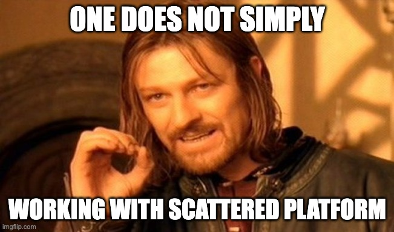

##  Overview
Reflect on past work and identify opportunities for improvement by following the instructions for the [Retrospective Play](https://www.atlassian.com/team-playbook/plays/retrospective).

|  | 
| Business, Product, Design, and Engineering representative | 
|  --- | 
|  --- | 
|  | 
| Business, Product, Design, and Engineering representative | 

##  Kudos

* Kudos to  &  atas keaktifan di document PR FAQ. Mempertajam brief & requirements - Daron

* Makasih pak atas gotong-royongnya di Scholarship Platform  -Tevi.

* Kudos to  krn sudah aktif di dokumen2 feasibility tech utk alignment with time bisnis - Aldi

* Kudos to  untuk kolaborasinya handling SMK sertifikat - Aldi

##  Retrospective
Add your Start doing, Stop doing, and Keep doing items to the table below. We'll use these to talk about how we can improve our process going forward.

|  **Name**  |  **What helped you forward this sprint?**  _Within a scope of BIZ & PDE collaborations_  |  **What slowing you down this sprint?**  _Within a scope of BIZ & PDE collaborations_  |  **What made you feel good this sprint?**  _Within a scope of BIZ & PDE collaborations_  |  **Any future risks ahead?**  _Within a scope of BIZ & PDE collaborations_  | 
|  --- |  --- |  --- |  --- |  --- | 
|  | <ul><li>Continuous async discussion on PR/FAQ document

</li><li>Scholarship: consistent alignment cadence

</li></ul> |  |  | <ul><li>Constant changes in scholarship requirements

</li><li>Lack of co-design session will decrease alignment between biz x PDE

</li></ul> | 
|  | <ul><li>Product team growth

</li></ul> | <ul><li>Over-optimized on engineering solution. Sometimes we need to focus on deliver in first release

</li></ul> | <ul><li>Kaizen Release

</li></ul> | <ul><li>Don’t get easily give up on technical limitation. have a mindset in striving to find optimum solution for both engineering effort and business. Not just what perceived the easiest solution

</li></ul> | 
|  | <ul><li>

</li></ul> | <ul><li>

</li></ul> | <ul><li>

</li></ul> | <ul><li>Changes of deadline might affect delivery strategy. Changing delivery strategy requires time and squad’s bandwidth, might negatively affect development velocity

</li><li>

</li></ul> | 
|  | <ul><li>Business and PDE active collaboration together on discussion (PRFAQ & solutioning)

</li><li>Less idealism from team members

</li></ul> | <ul><li>Fast unexpected request on SMK certificate. it was a success tho, go go go! let’s make it better next time

</li><li>Challenge on business x pde initiatives clarity

<ul><li>Business need to know the tech feasibility for firmly executing business effort, on the other side

</li><li>PDE demanding a business forecast & strategy to support the initiatives

</li><li>Kinda solved by both understanding the importance of experimenting

</li></ul></li></ul> | <ul><li>Experiment and building prototype first without any ideal information → Increasing trust between Business X PDE

</li></ul> | <ul><li>Get lost on celebration and miss or lack of post release analysis both from business and PDE

</li></ul> | 
|  | <ul><li>Collaboration with learning operations team to prepare Kaizen Writing Class Batch 9 on Core Platform

</li></ul> | <ul><li>Get some questions/requests that require deep thought & discussion with related stakeholder to find the answer

</li></ul> | <ul><li>Kaizen release

</li></ul> | <ul><li>Additional effort are needed from ops team to support migration process

</li></ul> | 
|  | Active communication among stakeholders facilitated the development process to proceed smoothly. | Context switching, particularly regarding landing page execution and product configuration, as we still rely on product and tech dependencies due to the absence of a dedicated commercial personal to handle these aspects. | Move Login to Add to Cart Configuration has been released. | What is the definition of "Business" in Biz x PDE ? Does it include the PGM Team? Considering that business requests also come from PGM, there is a possibility of misalignment if it is not addressed in future discussions. | 
|  | <ul><li>Amazing “Make it happen” mind set for core team

</li></ul> | <ul><li>Too much switching context outside Core topics

</li><li></li></ul> | Kaizen release | <ul><li>Migration strategies and plan for PN 

</li><li>Awareness about our complexity

</li></ul> | 
|  |  | <ul><li>flow & requirement delivered before validated to right owner, this lead to extra work such as more solutioning & revision \*issue in free trials > will initiate CDS & validate requirements to both business-PM before start design process

</li></ul> |  |  | 
|  | <ul><li>regular weekly alignment between PDE and Business team of the scholarship project

</li><li>support in terms of inviting participant to research activity, thanks to 

</li></ul> |  |  | <ul><li>mismatch between business expectation and product deliverable if there’s no regular product proposal discussion (visual driven is preferred)

</li></ul> | 
|  | <ul><li>Clear discussion & updates

</li></ul> |  | <ul><li>Clear updates & async discussion

</li></ul> |  | 
|  |  |  |  |  | 
|  | Simplifying the end-to-end feature development process with partial assistance from the ops team greatly helps deliver new high-priority features with less effort. | Features that are still unclear in terms of flow and requirements, and require preparation for solutioning, can lead to extra work and the possibility of frequent changes after the requirements become clear. Therefore, it would be better if the validated requirements are finalized before creating the solution. | MVP scholarship release | "Making things happen" must still be prepared for "making it better," so what has been done manually with support from the ops team should be prepared on the roadmap (when it will be worked on) with automation to prevent it from getting lost amidst the increasing number of initiatives. | 
|  |  |  |  |  | 
|  |  |  |  |  | 
|  |  |  |  |  | 
|  |  |  |  |  | 

##  Action items
2incomplete

*****

[[category.storage-team]] 
[[category.confluence]] 
