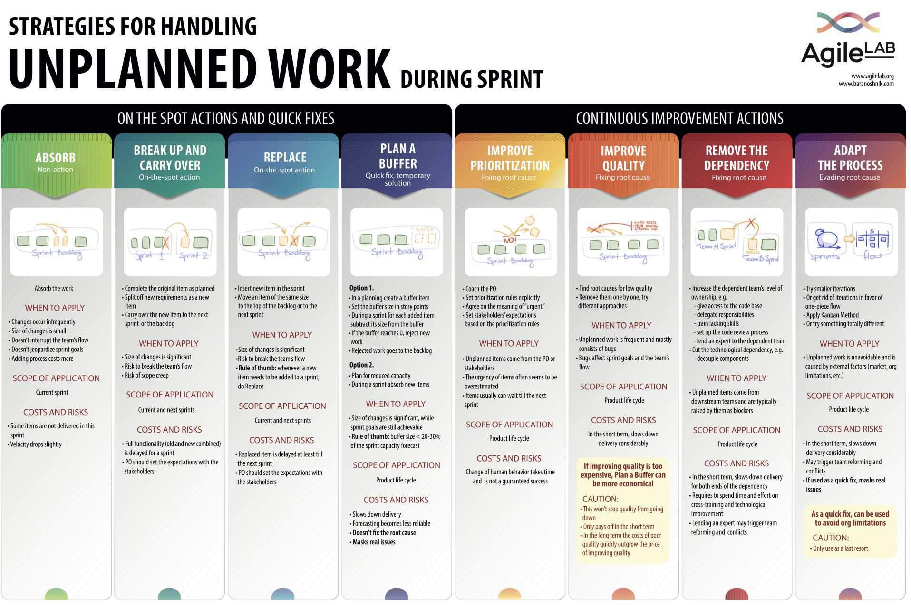

note **Ringkasan** 

* Kita akan menggunakan kombinasi kerangka kerja  **Dual-track agile**  dan  **LeSS framework**  untuk meningkatkan  _workflow_  dan kesepahaman antar departemen

* Inisiatif proposal dari tim bisnis harus dijelaskan dalam dokumen  **PRFAQ** atau format lain yang bisa membantu tim produk, desainer, dan engineering untuk memahami masalah dan objektif yang perlu dicapai. , serta ditinjau bersama dengan tim product-design di meeting review BRD yang dijadwalkan di sprint awal.

* Proposal dokumen briefing ini harus disiapkan paling lambat sebelum  **meeting Business x PDE planning**  dimulai

* Berdasarkan hasil review dan prioritas dalam meeting review, proposal ini akan dianalisa atau dinilai terlebih dahulu yang akan memakan waktu 1 sampai 2 minggu tergantung kompleksitas dari masalah yang akan dipecahkan

* Oleh karena itu, proposal  **hanya**  akan dilanjutkan ke  _development_  paling cepat pada sprint berikutnya (bukan pada saat sprint yang sedang berlangsung). Kecuali untuk Kuncie Executive yang cadencenya cenderung lebih cepat.

* Sehingga paling cepat, waktu yang dibutuhkan dari submit proposal hingga delivery minimal 1 bulan (2 sprint). Kecuali untuk Kuncie Executive, minimal lead time adalah 2 minggu (1 Sprint).

* Jika ada inisiatif mendesak ( _urgent task_ ) yang memiliki prioritas dan jadwal yang bertentangan dengan inisiatif yang direncanakan atau sedang berlangsung, Tim bisnis, product, dan stakeholder lainnya harus memiliki kesepakatan tentang item yang direncanakan atau yang sedang berlangsung yang harus diprioritaskan, ditunda atau dibatalkan sepenuhnya

 **Ringkasan** 

* Kita akan menggunakan kombinasi kerangka kerja  **Dual-track agile**  dan  **LeSS framework**  untuk meningkatkan  _workflow_  dan kesepahaman antar departemen

* Inisiatif proposal dari tim bisnis harus dijelaskan dalam dokumen  **PRFAQ** atau format lain yang bisa membantu tim produk, desainer, dan engineering untuk memahami masalah dan objektif yang perlu dicapai. , serta ditinjau bersama dengan tim product-design di meeting review BRD yang dijadwalkan di sprint awal.

* Proposal dokumen briefing ini harus disiapkan paling lambat sebelum  **meeting Business x PDE planning**  dimulai

* Berdasarkan hasil review dan prioritas dalam meeting review, proposal ini akan dianalisa atau dinilai terlebih dahulu yang akan memakan waktu 1 sampai 2 minggu tergantung kompleksitas dari masalah yang akan dipecahkan

* Oleh karena itu, proposal  **hanya**  akan dilanjutkan ke  _development_  paling cepat pada sprint berikutnya (bukan pada saat sprint yang sedang berlangsung). Kecuali untuk Kuncie Executive yang cadencenya cenderung lebih cepat.

* Sehingga paling cepat, waktu yang dibutuhkan dari submit proposal hingga delivery minimal 1 bulan (2 sprint). Kecuali untuk Kuncie Executive, minimal lead time adalah 2 minggu (1 Sprint).

* Jika ada inisiatif mendesak ( _urgent task_ ) yang memiliki prioritas dan jadwal yang bertentangan dengan inisiatif yang direncanakan atau sedang berlangsung, Tim bisnis, product, dan stakeholder lainnya harus memiliki kesepakatan tentang item yang direncanakan atau yang sedang berlangsung yang harus diprioritaskan, ditunda atau dibatalkan sepenuhnya

# Latar Belakang

* Berdasarkan arahan CEO, tim PDE dikembalikan ke struktur tim  _squad_  dengan masing  _domain of work_  yaitu:

    * Kuncie Executive (Wordpress)

    * Kuncie Praktis (App, DPI, channel activation etc)

    * B2B dan Scholarship Platform (App smith)

    * Core Platform (Leanring Experience migration)

    
* Dengan struktur yang baru ini, diperlukan workflow alignment antara tim bisnis dan product, design engineering (PDE) untuk memastikan alur informasi yang efektif dan kejelasan mengenai kebutuhan bisnis yang hendak dibangung melalui solusi teknologi

* Setelah melakukan beberapa retrospeksi, kami menyadari bahwa antara tim bisnis dan PDE belum memiliki sesi perencanan yang efektif dan efisien.

* Ketidaksesuaian dalam ritme antara tim bisnis dan product-design-engineer juga membawa kita ke masalah lain seperti:

    * Solusi yang tidak utuh karena ruang masalah yang tidak divalidasi

    * Beberapa anggota team menunjukkan gejala kelelahan/burnout

    * Perubahan prioritas yang terus-menerus dan tidak jelas

    
* Melalui dokumen ini, kami ingin mengatasi masalah dengan menyelaraskan alur kerja antar stream dengan mengadopsi framework  _scrum/agile_  yang sudah dibuat lebih  _lean_ . (Harap dicatat bahwa  _agile_  bukan  berarti "terburu-buru")

* Kami juga ingin meminimalkan jumlah rapat “ _status update_ ” (yang sebenarnya bisa dilakukan lewat email atau slack) dan menggantinya dengan rapat interaktif yang menghasilkan  _deliverables_  yang lebih nyata

# Objektif

* Meningkatkan kesepahaman antar stream pada inisiatif yang memenuhi segi product development

* Memastikan kejelasan prioritas dalam ( _after all, if everything is urgent, nothing is urgent_ )

* Mengurangi  _overhead meetings_  yang hanya berfokus pada  _status update_ 

* Meningkatkan produktivitas dan kolaborasi tim 

# Terminologi
Silakan merujuk ke tabel terminologi ini untuk memahami definisi beberapa kata kunci dalam  _agile methodology_ .

|  **Tim**  |  **Definisi**  |  **Contoh**  | 
|  --- |  --- |  --- | 
|  **Dual-track Agile**  | Dual-track Agile adalah metodologi pengembangan produk yang melihat tim antar function yang membagi aktivitas hariannya menjadi dua jalur paralel — discovery dan delivery (penemuan dan penyampaian) | [https://www.bornfight.com/blog/dual-track-agile-the-what-the-why-the-pros-the-cons/](https://www.bornfight.com/blog/dual-track-agile-the-what-the-why-the-pros-the-cons/)[https://aktiasolutions.com/dual-track-agile/](https://aktiasolutions.com/dual-track-agile/) | 
|  **Discovery track** (Eksplorasi masalah dan validasi) |  _Discovery track_  memungkinkan kita untuk mengenal dan memprioritaskan kebutuhan pengguna. Sisi ini berfokus pada belajar dengan cepat, memvalidasi atau mengesampingkan ide-ide sebelum mengembangkannya, mengukur secara berkelanjutan dan mendapatkan pemahaman setelah diluncurkan, sehingga menghilangkan asumsi dan memastikan bahwa produk tersebut layak dan menambah nilai bagi user atau tim bisnis.Dengan kata lain, menghindari terbuangnya waktu dan sumber daya di product yang tidak akan digunakan oleh user, dan memungkinkan semua upaya tim untuk terfokus pada masalah dan ide yang sudah tervalidasi. | <ul><li>Lakukan wawancara kepada stakeholder

</li><li>User testing

</li><li>Sesi workshop co-design

</li><li>Rancang fitur baru atau tanggapi feedback user testing

</li><li>Lakukan riset pasar (survei, wawancara pengguna, dll.)

</li><li>Penilaian kelayakan teknis, solusi, dan penilaian lain

</li></ul> | 
|  **Delivery track**  (Product Development) |  _Delivery track_  mengambil pelajaran dari  _product discovery_  dan menerapkannya pada product akhir. Tujuan pengembangannya adalah mendapatkan jumlah maksimum perbaikan dan melengkapi fungsionalitas yang mungkin selama  _sprint_ , yang dikenal dengan kenaikan; jumlah semua tugas, kasus penggunaan, persyaratan, dan elemen apa pun yang telah dikembangkan dan akan dikembangkan ke pengguna pada akhirnya. | <ul><li>Kembangkan fitur baru

</li><li>Refactoring

</li><li>Perencanaan arsitektur dan kapasitas

</li><li>Perbaikan bug dan masalah potensial

</li><li>Mengatasi hutang teknis

</li></ul> | 
|  **Scrum**  | Scrum adalah salah satu metodologi yang memfasilitasi project management dalam pendekatan yang lebih terstruktur (biasanya) dalam iterasi waktu  **2 minggu**  (dikenal sebagai  **Sprint** ) | [https://www.gojek.io/blog/the-process-behind-program-management](https://www.gojek.io/blog/the-process-behind-program-management) | 
| [ **LeSS Framework** ](https://less.works/) | LeSS adalah singkatan dari Large-Scale Scrum (scrum skala besar). Ini adalah kerangka kerja yang memungkinkan penerapan kolaborasi beberapa tim yang menjalankan proses Scrum untuk memastikan keselarasan antar tim | [https://www.atlassian.com/agile/agile-at-scale/less](https://www.atlassian.com/agile/agile-at-scale/less) | 
|  **Kanban**  |  _Kanban_  adalah cara untuk membantu tim menyeimbangkan pekerjaan yang harus dilakukan dengan kapasitas yang tersedia dari setiap anggota tim. Kerangka kerja Kanban dibuat berdasarkan pada filosofi peningkatan berkelanjutan, di mana item pekerjaan "ditarik" dari Backlog produk ke dalam alur kerja yang stabil. |  | 
|  **PRFAQ**  | PR/FAQ adalah dokumen tertulis yang digunakan untuk mengusulkan ide produk pada tahap awal. Dokumen ini umumnya ditulis oleh tim bisnis,  | [https://docs.google.com/document/d/1_6K30xdCCau9aPuMdBC00Qf33Cqc5ZA2NxyLoAixZ6k/edit](https://docs.google.com/document/d/1_6K30xdCCau9aPuMdBC00Qf33Cqc5ZA2NxyLoAixZ6k/edit)Mandatory info: **Date** The potential date to launch the product or service.  **Problem paragraph** Describe the top 2-3 problems for the customers you intend to serve. **Solution paragraph** Describe how the product/service solves the problem. It’s oke if it’s only preliminary **Expected Outcome** Describe what is the expected business impact or the relevant OKR improvement of the proposed initiative | 
|  **PRD/PFD**  | PRD adalah singkatan dari Dokumen Persyaratan Produk ( _Product Requirement Document_ ). Ini adalah panduan yang mendefinisikan persyaratan product tertentu, termasuk tujuan, fitur, fungsionalitas, dan perilakunya.Dokumen ini umumnya ditulis oleh  _Product manager_  untuk mengomunikasikan apa yang sedang mereka bangun, untuk siapa, dan bagaimana manfaatnya bagi user | [[Netcore Integration : The Nudges Feature|Netcore-Integration---The-Nudges-Feature]] | 

# Bagaimana workflow ini bekerja?

*  _Discovery track_  mengidentifikasi masalah, bekerja dalam solusi, membuat prototipe, mengujinya dan kemudian ketika prototipe divalidasi, masuk ke arah delivery di mana pengembangan product dimulai.

*  _Discovery_  dan _delivery track_  dijalankan secara paralel dalam waktu 2 minggu yang sama,  **tetapi**  topik yang sedang dieksekusi di discovery track  **selalu satu sprint di depan**  sebelum dipindahkan ke eksekusi pengembangan di delivery track.

* Setelah "topik" yang divalidasi masuk ke proses  _delivery track_ , proses  _discovery_  dapat mulai mengeksplor dan memvalidasi  _topik/masalah baru_  sehingga siklus dimulai kembali.

* Proses ini sejalan dengan konsep agile yaitu:  _Continuous problem discovery, continuous value delivery_ 

    *  _Discovery_ : proses memutuskan produk apa yang tepat untuk dibangun

    *  _Delivery_ : proses membangun product dengan cara yang tepat

    

# Mengapa kita harus mengadopsi kerangka kerja ini? apa manfaatnya bagi kita?

* Metodologi ini memfasilitasi koeksistensi bisnis, design, UX, dan tujuan pengembangan serta perbaikan komunikasi dan kesepemahaman antar tim.

* Di sisi lain, ini meningkatkan efisiensi berkat integrasi dan optimalisasi research dan testing, dan karena semua ide yang masuk ke backlog sudah divalidasi, mereka hanya perlu diprioritaskan dan diestimasi.

* Semua ini memungkinkan iterasi cepat pada produk yang menambah nilai langsung kepada end user dan mempromosikan design berdasarkan data yang dikumpulkan pada penggunaan product.

# Bagaimana kita bisa mengadopsi alur kerja ini di Kuncie?

1. Tim bisnis dapat menjelaskan proposal PRFAQ mereka di  **forum meeting Business X PDE planning** 

1. Tim bisnis dapat melalui dan mempresentasikan kepada tim tentang setiap inisiatif bisnis

1. Product Manager dapat memfasilitasi diskusi dan bersama dengan Design lead, Research dan Tech lead dapat mengajukan pertanyaan klarifikasi kepada tim bisnis

1. PM dan Design Lead  **mengklasifikasikan**  inisiatif berdasarkan kejelasan dan keyakinan masalahnya

1. Jalur penemuan (Discovery track) dapat diklasifikasikan menjadi dua jenis karya:

    *  **Eksploration** . Dalam fase ini kita bisa mulai dari sebuah ide atau masalah, merumuskan atau merestrukturisasi untuk mencapai tujuan bisnis atau meningkatkan nilai bagi pengguna. Selama  _eksplorasi_  **,**  kami berusaha memahami masalah dengan data kualitatif dan kuantitatif melalui wawancara dengan user, survei, feedback Net Promoter Score (NPS), penggunaan product dan heatmap. Setelah mengumpulkan data, Tim design dapat mendefinisikan masalah dan memikirkan solusi, dengan mempertimbangkan target user. Tim kemudian akan siap untuk menentukan value proposition dan prototipe.

    *  **Validation** . Setelah kami memiliki prototipe, kami melihat untuk memvalidasi keinginan, kegunaan, atau kelayakannya dengan user dan tim development. Ini adalah siklus perbaikan terus-menerus dari mana kita mengumpulkan pengetahuan, perubahan yang diperlukan dibuat dan kita mulai lagi. Ketika ide akhir yang divalidasi tercapai – yang tidak selalu menyiratkan produk baru, tetapi juga dapat menjadi tes konsep, peningkatan kegunaan atau solusi kelayakan teknis – itu mengarah ke tim development untuk memulai implementasi.

    
1. Semua inisiatif kemudian diprioritaskan bersama (menggunakan kerangka kerja R.I.C.E)

1. Sebelum meeting  **Business x PDE Planning** diakhiri, pastikan hal ini telah diputuskan:

    * inisiatif apa yang akan dijalankan dalam  _discovery track sprint_ 

    * inisiatif apa yang harus diprioritaskan, ditunda atau dibatalkan  **jika**  ada prioritas yang berbenturan atau task yang mendesak perlu dimasukkan ke dalam sprint yang sedang berlangsung (hanya jika dibutuhkan)

    
1. Setiap inisiatif yang telah diproses melalui  _discovery track_  tidak menjamin akan masuk ke  _delivery track_  tergantung pada hasil penemuan.

1. Setelah inisiatif divalidasi, maka dapat ditransfer ke developer untuk memulai development di delivery track dengan kepastian bahwa mereka mendedikasikan waktu dan usaha mereka dengan keyakinan tinggi.

1. Urgent dan critical task masih bisa diakomodasi melalui ad-hoc meeting

Alur kerja ini dapat divisualisasikan dalam diagram berikut:

.jpg)

# Bagaimana tampilannya di kalender saya?

* Berikut ini adalah contoh bagaimana meeting discovery dan development akan dijadwalkan dalam satu bulan

* Topik/masalah/inisiatif selalu dieksplorasi dan divalidasi di  _Discovery track_ 2 minggu sebelumnya sebelum dieksekusi dalam pengembangan ( _Delivery track_ )

    * Kecuali untuk Kuncie Executive, discovery track maximum dilakukan dalam 1 minggu

    
* Namun  _Discovery Track_  dan  _Delivery Track_  akan berjalan secara paralel dengan topik/masalah/inisiatif yang berbeda untuk dikerjakan.

    *  _Discovery track_  akan mulai mengeksplorasi dan memvalidasi masalah untuk sprint berikutnya

    * Saat  _development track_  mengeksekusi ide yang divalidasi dari temuan  _discovery track_  sebelumnya

    
* Dengan cara ini, kita dapat memiliki proses  _discovery_  ( _build the right thing_ ) dan  _development_  ( _build the things right_ ) yang berkelanjutan.

* Tim bisnis hanya perlu menghadiri metting yang berlabel \[business] / warna magenta

.jpg)
# Apa maksud dan tujuan dari meeting tersebut?

Tabel berikut menjelaskan tentang tujuan meeting, hasil kerja, dan peserta.

|  **Meeting**  |  **Jadwal**  |  **Partisipan**  Facilitator Presenter |  **Tujuan meeting**  |  **Apa yang disampaikan**  | 
|  --- |  --- |  --- |  --- |  --- | 
| Business Planning  |  Kapan saja sebelum Business x PDE meeting dimulai Setiap 2 minggu |  **Mandatory** <ul><li>Business Owner

</li></ul> **Optional** <ul><li>CEO/CCO

</li><li>PMs

</li></ul> | Tim bisnis akan membahas persiapan internal inisiatif bisnis yang mungkin memerlukan development baru sebelum membawanya ke Meeting Business x PDE planning | <ul><li> **Output**  Daftar inisiatif yang diprioritaskan dari sisi bisnis

</li><li> **Hasil**  Diskusi selama meeting review BRD akan lebih terstruktur dan efektif

</li></ul> | 
| Business x PDE planning |  Senin awal di setiap sprint Setiap 2 minggu (kecuali Kuncie Executive, 1 kali seminggu) |  **Mandatory** <ul><li> Business owner

</li><li> PMs

</li><li>Design lead

</li><li>Researcher(s)

</li><li>Tech lead/Engineering managers/QA lead

</li></ul> **Optional** <ul><li>CEO/CCO

</li><li>Content Manager

</li></ul> | <ul><li>Meningkatkan kesepahaman lintas stream pada inisiatif yang membutuhkan product development

</li><li>Pastikan kejelasan pada tiap prioritas

</li><li>Berikan waktu yang tepat untuk eksplorasi dan validasi masalah sebelum beralih ke solusi dan development.

</li><li>Meningkatkan kepercayaan dari target masalah yang akan dipecahkan

</li></ul> |  **Output** <ul><li>Daftar inisiatif yang sudah dikategorikan dan diprioritaskan untuk dieksekusi dalam discovery track sprint

</li></ul> **Outcome** <ul><li>Pemahaman yang sama terhadap prioritas inisiatif yang akan dilakukan dalam proses discover track

</li></ul> | 
| Progress checkin | Senin awal di setiap sprint Setiap 2 minggu |  **Mandatory** <ul><li> Business owner

</li><li> PMs

</li><li>Design lead

</li><li>Researcher(s)

</li><li>Tech lead/Engineering managers/QA lead

</li></ul> **Optional** <ul><li>CEO/CCO

</li><li>Content Manager

</li></ul> | Membahas progress dan perubahan prioritas jika dibutuhkan |  **Output** <ul><li>Daftar inisiatif yang sudah dikategorikan dan diprioritaskan untuk dieksekusi dalam discovery track sprint

</li></ul> **Outcome** <ul><li>Pemahaman yang sama terhadap prioritas inisiatif yang akan dilakukan dalam proses discover track

</li><li>Transparansi dari status masing masing inisiatif

</li></ul> | 
| Co-design session |  Setiap hari di minggu pertama sprint<ul><li>Amsterdam: Selasa 1pm

</li><li>Budapest: Kamis 1pm

</li><li>Canberra: Kasmi 4pm

</li></ul> 1 hour Setiap 2 minggu (bisa 1 mingguan tergantung situasi) |  **Mandatory** <ul><li> PMs

</li><li>Engineers and QA

</li><li>Designer(s)

</li></ul> **Optional** <ul><li>CEO/CCO

</li><li>Content Manager

</li><li>Tech lead/Engineering managers/QA lead

</li><li> Business PIC/PMM

</li></ul> | <ul><li>Co-design adalah proses yang dipimpin oleh design berorientasi pada metode kreatif dan partisipatif.

</li><li>Mengumpulkan masukan tentang design dari perspektif peran yang berbeda

<ul><li>Kelangsungan bisnis

</li><li>Kelayakan teknis

</li><li>Keputusan tentang prioritas

</li></ul></li></ul> |  **Output** <ul><li>Lingkup prioritas untuk eksekusi design

</li></ul> **Outcome** <ul><li>Tim di project yang sama tentang apa ruang lingkup desain

</li><li>Bangun kepemilikan bersama antar tim

</li></ul> | 
| Sprint Planning (Squad) |  Senin awal di setiap sprint Setiap 2 minggu |  **Mandatory** <ul><li> PMs

</li><li>Engineers and QA

</li><li>Designer(s)

</li></ul> **Optional** <ul><li>Business PIC/PMM

</li></ul> | <ul><li>Berikan visibilitas item backlog produk yang akan datang, review dan revisi kontennya.

</li><li>Memungkinkan untuk setiap pertanyaan/klarifikasi atas item backlog produk pada tahap awal.

</li><li>Untuk mengonfirmasi kapasitas tim

</li><li>Seluruh tim memberi sinyal jika ini adalah rencana terbaik yang dapat mereka buat mengingat apa yang mereka ketahui sekarang

</li></ul> |  **Output** <ul><li>Cerita pengguna/User story yang diperbarui/diperbaiki (Irisan Epic dan pemetaan cerita)

</li><li>Kriteria penerimaan yang diperbarui

</li><li>Dokumentasi design akhir

</li><li>Test case terbaru

</li></ul> **Outcome** <ul><li>Minimalkan salah perkiraan selama sprint planning

</li></ul> | 
| Daily Standup (Squad) |  Setiap pagi Setiap hari kerja |  **Mandatory** <ul><li> PMs

</li><li> Engineer(s) and QA

</li></ul> **Optional** <ul><li>Designer(s)

</li></ul> | <ul><li>Mengurangi risiko di awal pengembangan

</li><li>Mengetahui dan menemui halangan

</li></ul> |  **Output** <ul><li>Rencana aksi tingkat tinggi hari ini

</li></ul> **Outcome** <ul><li>Bangun kesadaran situasional secara keseluruhan di lintas departemen

</li><li>Ini bukan hanya meeting - update status

</li><li>ini bukan untuk "menagih hutang"

</li><li>Tidak lebih dari 15 menit

</li></ul> | 
| Sprint Retrospective (Squad) |  Jumat kedua di setiap sprint Setiap 2 minggu |  **Mandatory** <ul><li> PMs and Product Analyst

</li><li> Engineers and QA

</li><li> Designer(s)

</li></ul> **Optional** <ul><li>Data analyst

</li></ul> | <ul><li>Kesempatan bagi tim untuk menginspeksi dirinya sendiri dan membuat rencana perbaikan yang akan dilakukan selama Sprint berikutnya.

</li><li>Untuk meningkatkan alur kerja lintas stream

</li></ul> |  **Output** <ul><li>Rencana tindakan tentang bagaimana meningkatkan alur kerja tim lintas departemen dan kinerja sprint berikutnya

</li></ul> **Outcome** <ul><li>Kolaborasi dan komunikasi antar tim ditingkatkan

</li><li>Lingkungan kerja yang aman secara psikologis

</li></ul> | 
| Overall Retrospective |  Jumat kedua di setiap sprint Setiap 2 minggu |  **Mandatory** <ul><li> Business owner

</li><li> PMs

</li><li>Design lead

</li><li>Researcher(s)

</li><li>Tech lead/Engineering managers/QA lead

</li></ul> **Optional** <ul><li>CEO/CCO

</li><li>Content Manager

</li></ul> | <ul><li>Kesempatan bagi tim untuk menginspeksi dirinya sendiri dan membuat rencana perbaikan yang akan dilakukan selama Sprint berikutnya.

</li><li>Untuk meningkatkan alur kerja lintas stream

</li></ul> |  **Output** <ul><li>Rencana tindakan tentang bagaimana meningkatkan alur kerja tim lintas departemen dan kinerja sprint berikutnya

</li></ul> **Outcome** <ul><li>Kolaborasi dan komunikasi antar tim ditingkatkan

</li><li>Lingkungan kerja yang aman secara psikologis

</li></ul> | 
| Post-Launch Performance Analysis |  Jumat kedua di setiap sprint Setiap 2 minggu |  **Mandatory** <ul><li> Business PIC/PMM  

</li><li> Other key departments members

</li><li>PMs

</li><li>Design lead

</li><li>Researcher(s)

</li><li>Tech lead/Engineering Managers/QA lead

</li></ul> **Optional** <ul><li>CEO/CCO

</li></ul> | <ul><li>Meninjau ulang inisiatif yang sedang berjalan 

</li><li>Memutuskan untuk keberlangsungan inisiatif berdasarkan performa setelah rilis

</li></ul> |  **Output** <ul><li>Keputusan mengenai keberlangsungan inisiatif yang sedang berjalan

</li></ul> **Outcome** <ul><li>Kolaborasi dan komunikasi antar tim ditingkatkan

</li><li>Mengoptimalkan kapasitas tim agar tidak teralokasi pada inisiatif yang tidak memiliki performa yang baik

</li></ul> | 

## Bagaimana jika ada masalah mendesak yang muncul di tengah sprint yang sedang berlangsung?

1. PMM atau Business PIC dapat menyebutkan masalah tersebut selama suku standup harian; tapi tolong jangan menuntut solusi langsung di tempat karena masalah ini perlu dinilai terlebih dahulu

1. PMM atau Business PIC dapat menemukan slot yang tersedia untuk berkumpul dengan PM dan perwakilan teknis pada hari itu untuk membahas masalah secara detail

1. PM (dengan dukungan dari engineer) akan menilai apakah masalah tersebut dapat dimasukkan dalam sprint yang sedang berlangsung atau tidak, di antaranya:

    1. selama diskusi, atau

    1. memerlukan diskusi terpisah dengan insinyur (tanpa PMM)

    
1.  _Effort_  untuk solusi yang dieksplorasi oleh PM dan engineer harus cukup kecil untuk dimasukkan ke dalam sprint yang sedang berlangsung atau memanfaatkan layanan pihak ke-3 jika perlu

1. Jika  _effort_ untuk  _urgent task_  cukup besar dan dapat menunda item yang sedang dikembangkan dalam sprint yang sedang berlangsung, maka PM perlu mengeskalasi ke para pemimpin (CEO/COO, Head of Product dan Head of Business) dan memutuskan apakah:

    1. kita bisa menunda item yang sedang berlangsung di sprint untuk memberi ruang pada  _urgent task_  atau

    1.  _urgent task_  tersebut dapat menunggu jika dibandingkan dengan item yang sedang berlangsung

    

# Hal-hal yang perlu diperhatikan selama review proposal saat Business x PDE planning

## PM akan mereview dengan tim bisnis dan design

* Apakah ini mendukung perusahaan atau OKR tim?

* Apakah itu membawa visi kita lebih dekat dengan kondisi yang nyata/real?

* Apakah ini meningkatkan user experience dari alur kerja penting yang lebih bermakna?

* Apakah itu kebutuhan user atau hanya keinginan kita?

* Apakah ini sangat penting bagi user?

## PM akan mereview dengan Tech Lead

* Kompleksitas engineering yang dapat diterima. Kita ingin menjaga kemampuan teman-teman untuk membuat perubahan dengan cepat di masa mendatang, jadi kami mencoba menghindari kode yang rumit, struktur data yang rumit, dan pengaturan opsional.

* Ini ortogonal dengan fitur lain (mencegah tumpang tindih dengan fitur saat ini dan yang akan datang).

* Persyaratannya jelas.

* Ini dapat dicapai dalam milestone yang dijadwalkan. Masalah yang lebih besar harus dibagi, sehingga langkah-langkah individu dapat dicapai dalam satu milestone tunggal.

### Discussion Notes

|  **No**  |  **Discussion**  |  **Decisions**  |  **Notes**  | 
|  --- |  --- |  --- |  --- | 
| 1 | siapa yang megang master dari list priority?cara mencapai kesepakatan ini gimana? apakah perlu ada standar framework yg perlu digunakan? sesuai hasil diskusi di dalam meeting atau gimana? Prioritisasi ini bakal dihandle siapa mass buat lead prioritizationnya ? Definisi Reach, Impact ini gimana soalnya tiap domain mungkin punya metric turunan beda2Effort ini gimana karena mungkin bakal berbagi eng dan define effortnya butuh waktuSorry lost context, soalnya yang gue liat ini bakal jadi pool semua domain ya mas | Single list of priority: Biz owner ( )Framework: apapun yang mempermudah biz owner untuk manage priority. Contoh: [https://docs.google.com/spreadsheets/d/1JZ6vuL7WfSGMytqj1UZ_4tVwGupo2L8-hSyiPVZ146s/edit#gid=569384378](https://docs.google.com/spreadsheets/d/1JZ6vuL7WfSGMytqj1UZ_4tVwGupo2L8-hSyiPVZ146s/edit#gid=569384378) | need to have follow up discussion with  | 
| 2 | harus dijelaskan scope dari core platform ini apa? | <ul><li>Kuncie Executive: Wordpress | PDE PIC: 

</li><li>Kuncie Praktis: App, DPI, channel activation etc | PDE PIC: 

</li><li>B2B dan Scholarship Platform: App smith | PDE PIC: 

</li><li>Core Platform: Learning Experience Migration | PDE PIC: 

</li></ul> |  | 
| 3 | Masukan untuk note hal ini, sepertinya view di kita PRFAQ adalah a must go initative document yg dihandover ke Product, AFAIK supposed to be bukan. Ini dokumen usulan yg diases bersama2, dan expected ok klo ada multiple PRFAQ yang gak di brought up jadi PRD | PR/FAQ bisa ditulis pleh siapa saja yang kemudian akan dibahas di Business x PDE Planning meeting. Belum tentu semua PRFAQ akan dieksekusi |  | 
| 4 | 2c. Gimana kalau tim bisnis inform desired outcome + maybe proposed solutionnya. Untuk fixed solutionnya, masuk ke ranah decisionnya PDE.<ul><li>Harus clear di meeting BRD seperti apa requirement yang perlu disubmit bisnis, karena too much documentation juga tidak efektif, too little jg jadi ga jelas

</li><li>Perlu format PRFAQ yang concise

</li><li>Kalo bisa ada 2 outcome dari sini, make it happen phase dan make it better phase. Dilengkapi dengan measurements feature goal nya.

</li></ul> | Minimal informasi yang perlu untuk dilampirkan dalam PRFAQ antara lain: **Date** The potential date to launch the product or service.  **Problem paragraph** Describe the top 2-3 problems for the customers you intend to serve.Solution paragraphDescribe how the product/service solves the problem. It’s ok if it’s only preliminary<ul><li>Make it happens: The easiest and simplest way

</li><li>Make it better: Improve and optimize

</li></ul> **Expected Outcome** Describe what is the expected business impact or the relevant OKR improvement of the proposed initiative |  | 
| 5 | Perlu define tipe “TOPIK” apa aja yang mau dimasukin, dan apakah 1 Topik = 1 Request? | <ul><li>1 “Topik” = 1 PR/FAQ

</li><li>Create spreadsheet for all request and topic by Biz owner:  , refer to discussion = 1

</li></ul> |  | 
| 6 | Pesonal opinion, gw kalo initiative/ projects lebih dari 5, agak susah untuk selalu dapet context di semuanya. Ada suggestions ga dari teman2? | <ul><li>Assign senior engineering PIC tiap stream

</li><li>But each senior engineering should be available for advice

</li></ul> |  | 
| 7 | Perlu definisi urgentPerlu di define jg flow critical sprint dan disiapkan urgent release flow, apalagi in-case ada incident/critical fix/request yang perlu dilakukan | <ul><li> is working on the priority definition

</li><li>For incident, we can use this severity definition [[Severity Definitions|Severity-Definitions]]

</li></ul> | p0 e.g system down, P1 purchase UX, metorik p0,  p2 learning UX p3 opportunity lossNeed to create matrix on thisNeed to define platform ownership and engineer PIC. Need to escalate to biz owner/master of priority | 
| 8 | Release date dan mekasisme utk Kuncie executive (WP) dan Core Platform bagaimana ? Di track mana ? | Bisa memanfaatkan workflow dari [[Features Request Flow|Features-Request-Flow]] |  | 

*****

[[category.storage-team]] 
[[category.confluence]] 
