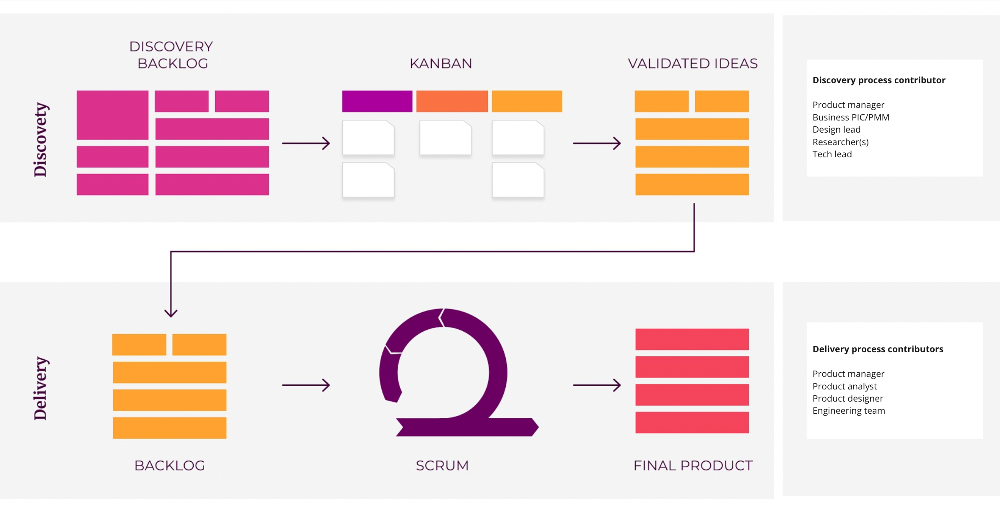

note **Ringkasan** 

* Kami akan menggunakan kombinasi kerangka kerja  **Dual-track agile**  dan  **LeSS framework**  untuk meningkatkan alur kerja dan kesepahaman antar departemen

* Inisiatif proposal dari tim bisnis harus dijelaskan dalam  **BRD (Business Requirement Document)** , serta ditinjau bersama dengan tim product-design di meeting review BRD yang dijadwalkan di sprint awal.

* Proposal BRD ini harus disiapkan paling lambat sebelum  **meeting review BRD**  dimulai

* Berdasarkan hasil review dan prioritas dalam meeting review BRD, proposal BRD akan dianalisa atau dinilai terlebih dahulu yang akan memakan waktu minimal 1 sprint (2 minggu)

* Oleh karena itu, proposal BRD  **hanya**  akan dilanjutkan ke  _development_  paling cepat pada sprint berikutnya (bukan pada saat sprint berjalan)

* Artinya paling cepat, lead time dari submit hingga delivery minimal 2 sprint (1 bulan). (Bisa lebih lama tergantung ruang lingkupnya)

* Jika ada inisiatif mendesak ( _urgent task_ ) yang memiliki prioritas dan jadwal yang bertentangan dengan inisiatif yang direncanakan atau sedang berlangsung, Tim bisnis, product, dan stakeholder lainnya harus memiliki kesepakatan tentang item yang direncanakan atau yang sedang berlangsung yang harus diprioritaskan, ditunda atau dibatalkan sepenuhnya

 **Ringkasan** 

* Kami akan menggunakan kombinasi kerangka kerja  **Dual-track agile**  dan  **LeSS framework**  untuk meningkatkan alur kerja dan kesepahaman antar departemen

* Inisiatif proposal dari tim bisnis harus dijelaskan dalam  **BRD (Business Requirement Document)** , serta ditinjau bersama dengan tim product-design di meeting review BRD yang dijadwalkan di sprint awal.

* Proposal BRD ini harus disiapkan paling lambat sebelum  **meeting review BRD**  dimulai

* Berdasarkan hasil review dan prioritas dalam meeting review BRD, proposal BRD akan dianalisa atau dinilai terlebih dahulu yang akan memakan waktu minimal 1 sprint (2 minggu)

* Oleh karena itu, proposal BRD  **hanya**  akan dilanjutkan ke  _development_  paling cepat pada sprint berikutnya (bukan pada saat sprint berjalan)

* Artinya paling cepat, lead time dari submit hingga delivery minimal 2 sprint (1 bulan). (Bisa lebih lama tergantung ruang lingkupnya)

* Jika ada inisiatif mendesak ( _urgent task_ ) yang memiliki prioritas dan jadwal yang bertentangan dengan inisiatif yang direncanakan atau sedang berlangsung, Tim bisnis, product, dan stakeholder lainnya harus memiliki kesepakatan tentang item yang direncanakan atau yang sedang berlangsung yang harus diprioritaskan, ditunda atau dibatalkan sepenuhnya

# Latar Belakang

* Saat ini kita sedang bereksperimen dengan 4 unit bisnis, kami mengelompokkan unit bisnis tersebut menjadi dua unit tim

* Dua unit tim ini dikenalkan dalam meeting harian dengan tujuan untuk memastikan kesepahaman informasi dan rencana yang sudah yang ditentukan antara departemen

* Namun, meeting harian baru ini sering digunakan untuk briefing bisnis yang bukan merupakan forum yang tepat untuk pertanyaan bisnis atau request product-design, dan engineering.

* Setelah melakukan beberapa retrospeksi, kami menyadari bahwa pada evaluasi meeting harian ini sering menyebabkan adanya gangguan planning dan delivery antar departemen terutama ketika tim product, design, dan engineer masih dibagi dalam seluruh unit tim.

* Ketidaksesuaian dalam ritme antara tim bisnis dan product-design-engineer juga membawa kita ke masalah lain seperti:

    * Solusi tidak utuh karena ruang masalah yang tidak divalidasi

    * Beberapa member team menunjukkan gejala kelelahan/burnout

    * Perubahan prioritas yang terus-menerus dan tidak jelas

    * Lebih dari 20% waktu kita dihabiskan hanya untuk mempersiapkan presentasi untuk  _weekly status update_  dan menghadiri meeting  _weekly status update_  dibandingkan melakukan pekerjaan  _actual_  yang harus dikerjakan

    
* Melalui dokumen ini, kami ingin mengatasi masalah dengan menyelaraskan alur kerja antar stream dengan mengadopsi kerangka kerja scrum/tangkas yang tepat. (Harap dicatat bahwa  _agile_  tidak  berarti "terburu-buru")

* Kami juga ingin meminimalkan jumlah rapat “ _status update_ ” (yang sebenarnya bisa dilakukan lewat email atau slack) dan menggantinya dengan rapat interaktif yang menghasilkan  _deliverables_  yang lebih nyata

# Objektif

* Meningkatkan kesepahaman antar stream pada inisiatif yang memenuhi segi product development

* Pastikan kejelasan prioritas dalam kondisi (setelah semua, jika semuanya mendesak, tidak ada yang mendesak, dll)

* Mengurangi  _overhead meetings_  yang hanya berfokus pada  _status update_ 

* Meningkatkan produktivitas dan kolaborasi tim 

# Terminologi
Silakan merujuk ke tabel terminologi ini untuk memahami definisi beberapa kata kunci dalam  _agile methodology_ .

|  **Tim**  |  **Definisi**  |  **Contoh**  | 
|  --- |  --- |  --- | 
|  **Dual-track Agile**  | Dual-track Agile adalah metodologi pengembangan produk yang melihat tim antar function yang membagi aktivitas hariannya menjadi dua jalur paralel — discovery dan delivery (penemuan dan penyampaian) | [https://www.bornfight.com/blog/dual-track-agile-the-what-the-why-the-pros-the-cons/](https://www.bornfight.com/blog/dual-track-agile-the-what-the-why-the-pros-the-cons/)[https://aktiasolutions.com/dual-track-agile/](https://aktiasolutions.com/dual-track-agile/) | 
|  **Discovery track** (Eksplorasi masalah dan validasi) |  _Discovery track_  memungkinkan kita untuk mengenal dan memprioritaskan kebutuhan pengguna. Sisi ini berfokus pada belajar dengan cepat, memvalidasi atau mengesampingkan ide-ide sebelum mengembangkannya, mengukur secara berkelanjutan dan mendapatkan pemahaman setelah diluncurkan, sehingga menghilangkan asumsi dan memastikan bahwa produk tersebut layak dan menambah nilai bagi user atau tim bisnis.Dengan kata lain, menghindari terbuangnya waktu dan sumber daya di product yang tidak akan digunakan oleh user, dan memungkinkan semua upaya tim untuk terfokus pada masalah dan ide yang sudah tervalidasi. | <ul><li>Lakukan wawancara kepada stakeholder

</li><li>User testing

</li><li>Sesi workshop co-design

</li><li>Rancang fitur baru atau tanggapi feedback user testing

</li><li>Lakukan riset pasar (survei, wawancara pengguna, dll.)

</li><li>Penilaian kelayakan teknis, solusi, dan penilaian lain

</li></ul> | 
|  **Delivery track**  (Product Development) |  _Delivery track_  mengambil pelajaran dari  _product discovery_  dan menerapkannya pada product akhir. Tujuan pengembangannya adalah mendapatkan jumlah maksimum perbaikan dan melengkapi fungsionalitas yang mungkin selama  _sprint_ , yang dikenal dengan kenaikan; jumlah semua tugas, kasus penggunaan, persyaratan, dan elemen apa pun yang telah dikembangkan dan akan dikembangkan ke pengguna pada akhirnya. | <ul><li>Kembangkan fitur baru

</li><li>Refactoring

</li><li>Perencanaan arsitektur dan kapasitas

</li><li>Perbaikan bug dan masalah potensial

</li><li>Mengatasi hutang teknis

</li></ul> | 
|  **Scrum**  | Scrum adalah salah satu metodologi yang memfasilitasi project management dalam pendekatan yang lebih terstruktur (biasanya) dalam iterasi waktu  **2 minggu**  (dikenal sebagai  **Sprint** ) | [https://www.gojek.io/blog/the-process-behind-program-management](https://www.gojek.io/blog/the-process-behind-program-management) | 
| [ **LeSS Framework** ](https://less.works/) | LeSS adalah singkatan dari Large-Scale Scrum (scrum skala besar). Ini adalah kerangka kerja yang memungkinkan penerapan kolaborasi beberapa tim yang menjalankan proses Scrum untuk memastikan keselarasan antar tim | [https://www.atlassian.com/agile/agile-at-scale/less](https://www.atlassian.com/agile/agile-at-scale/less) | 
|  **Kanban**  |  _Kanban_  adalah metode manajemen alur kerja  _Lean_  yang populer untuk mendefinisikan, mengelola, dan memperbaiki layanan dalam penyampaian pengetahuan. Ini membantu Anda memvisualisasikan pekerjaan, memaksimalkan efisiensi, dan perbaikan secara berkelanjutan. Pekerjaan dicantumkan di papan Kanban, memungkinkan Anda untuk mengoptimalkan delivery pekerjaan di beberapa tim dan menangani bahkan project yang paling kompleks dalam satu environment/lingkungan. |  | 
|  **BRD/RFP**  | BRD adalah singkatan dari  _Business Requirement Document._  Dokumen yang menjelaskan proposal bisnis yang mungkin memerlukan prioritas dalam pengembangan produk. Dokument ini harus menjelaskan masalah yang perlu kita selesaikan, tujuan yang perlu kita capai dan nilai bisnis apa dalam memecahkan masalah tersebut BRD juga dikenal sebagai RFP: Request for Proposal. | [[BRD Template - Bahasa Indonesia|BRD-Template---Bahasa-Indonesia]] | 
|  **PRD/PFD**  | PRD adalah singkatan dari Dokumen Persyaratan Produk ( _Product Requirement Document_ ). Ini adalah panduan yang mendefinisikan persyaratan product tertentu, termasuk tujuan, fitur, fungsionalitas, dan perilakunya.Dokumen ini umumnya ditulis oleh  _Product manager_  untuk mengomunikasikan apa yang sedang mereka bangun, untuk siapa, dan bagaimana manfaatnya bagi user | [[Netcore Integration : The Nudges Feature|Netcore-Integration---The-Nudges-Feature]] | 
|  **Kerangka R.I.C.E**  | Kerangka penilaian prioritas yang mempertimbangkan 4 faktor: (Reach, Impact, Cost and Effort) Jangkauan, Dampak, Biaya, dan Upaya.Rumus menghitung skor R.I.C.E = (Jangkauan x Dampak x Biaya) / Upaya | [https://docs.google.com/spreadsheets/d/1JZ6vuL7WfSGMytqj1UZ_4tVwGupo2L8-hSyiPVZ146s/edit#gid=0](https://docs.google.com/spreadsheets/d/1JZ6vuL7WfSGMytqj1UZ_4tVwGupo2L8-hSyiPVZ146s/edit#gid=0) | 

# Bagaimana alur kerja ini bekerja?

*  _Discovery track_  mengidentifikasi masalah, bekerja dalam solusi, membuat prototipe, mengujinya dan kemudian ketika prototipe divalidasi, masuk ke arah delivery di mana pengembangan product dimulai.

*  _Discovery_  dan _delivery track_  dijalankan secara paralel dalam waktu 2 minggu yang sama,  **tetapi**  topik yang sedang dieksekusi di discovery track  **selalu satu sprint di depan**  sebelum dipindahkan ke eksekusi pengembangan di delivery track.

* Setelah "topik" yang divalidasi masuk ke proses  _delivery track_ , proses  _discovery_  dapat mulai mengeksplor dan memvalidasi  _topik/masalah baru_  sehingga siklus dimulai kembali.

* Proses ini sejalan dengan konsep agile yaitu:  _Continuous problem discovery, continuous value delivery_ 

    *  _Discovery_ : proses memutuskan produk apa yang tepat untuk dibangun

    *  _Delivery_ : proses membangun product dengan cara yang tepat

    

# Mengapa kita harus mengadopsi kerangka kerja ini? apa manfaatnya bagi kita?

* Metodologi ini memfasilitasi koeksistensi bisnis, design, UX, dan tujuan pengembangan serta perbaikan komunikasi dan kesepemahaman antar tim.

* Di sisi lain, ini meningkatkan efisiensi berkat integrasi dan optimalisasi research dan testing, dan karena semua ide yang masuk ke backlog sudah divalidasi, mereka hanya perlu diprioritaskan dan diestimasi.

* Semua ini memungkinkan iterasi cepat pada produk yang menambah nilai langsung kepada end user dan mempromosikan design berdasarkan data yang dikumpulkan pada penggunaan product.

# Bagaimana kita bisa mengadopsi alur kerja ini di Kuncie?

1. Tim bisnis dapat membawa proposal prioritas mereka (Dokumen Persyaratan Bisnis) di  **forum meeting BRD** 

1. Tim bisnis dapat melalui dan mempresentasikan kepada tim tentang setiap inisiatif bisnis

1. Product Manager dapat memfasilitasi diskusi dan bersama dengan Design lead, Research dan Tech lead dapat mengajukan pertanyaan klarifikasi kepada tim bisnis

1. PM dan Design Lead  **mengklasifikasikan**  inisiatif berdasarkan kejelasan dan keyakinan masalahnya

1. Jalur penemuan (Discovery track) dapat diklasifikasikan menjadi dua jenis karya:

    *  **Eksplorasi** . Dalam fase ini kita bisa mulai dari sebuah ide atau masalah, merumuskan atau merestrukturisasi mereka untuk mencapai tujuan bisnis atau meningkatkan nilai bagi pengguna. Selama  **eksplorasi,**  kami berusaha memahami masalah dengan data kualitatif dan kuantitatif melalui wawancara dengan user, survei, feedback Net Promoter Score (NPS), penggunaan product dan heatmap. Setelah mengumpulkan data, Tim design dapat mendefinisikan masalah dan memikirkan solusi, dengan mempertimbangkan target user. Tim kemudian akan siap untuk menentukan proposisi nilai dan prototipe.

    *  **Validasi** . Setelah kami memiliki prototipe, kami melihat untuk memvalidasi keinginan, kegunaan, atau kelayakannya dengan user dan tim development. Ini adalah siklus perbaikan terus-menerus dari mana kita mengumpulkan pengetahuan, perubahan yang diperlukan dibuat dan kita mulai lagi. Ketika ide akhir yang divalidasi tercapai – yang tidak selalu menyiratkan produk baru, tetapi juga dapat menjadi tes konsep, peningkatan kegunaan atau solusi kelayakan teknis – itu mengarah ke tim development untuk memulai implementasi.

    
1. Semua inisiatif kemudian diprioritaskan bersama (menggunakan kerangka kerja R.I.C.E)

1. Sebelum meeting  **review BRD** diakhiri, pastikan untuk memiliki tentang:

    * inisiatif apa yang akan dijalankan dalam discovery track sprint

    * inisiatif apa yang harus diprioritaskan, ditunda atau dibatalkan  **jika**  ada prioritas yang berbenturan atau task yang mendesak perlu dimasukkan ke dalam sprint yang sedang berlangsung (tidak disarankan)

    
1. Setiap inisiatif yang telah diproses melalui discovery track tidak menjamin akan masuk ke delivery track tergantung pada hasil penemuan.

1. Setelah inisiatif divalidasi, maka dapat ditransfer ke developer untuk memulai development di delivery track dengan kepastian bahwa mereka mendedikasikan waktu dan usaha mereka dengan keyakinan tinggi.

Alur kerja ini dapat divisualisasikan dalam diagram berikut:

# Bagaimana tampilannya di kalender saya?

* Berikut ini adalah contoh bagaimana meeting seputar penemuan dan pengembangan akan dijadwalkan dalam satu bulan

* Topik/masalah/inisiatif selalu dieksplorasi dan divalidasi di Discovery track 2 minggu sebelumnya sebelum dieksekusi dalam pengembangan (Delivery track)

* Namun jalur penemuan dan jalur pengembangan akan berjalan secara paralel dengan topik/masalah/inisiatif yang berbeda untuk dikerjakan.

    * Discovery track akan mulai mengeksplorasi dan memvalidasi masalah untuk sprint berikutnya

    * Saat trek pengembangan mengeksekusi ide yang divalidasi dari temuan trek Discovery (penemuan) sebelumnya

    
* Dengan cara ini, kita dapat memiliki proses penemuan (membangun hal yang benar) dan pengembangan (membangun hal yang benar) yang berkelanjutan.

* Tim bisnis hanya perlu menghadiri yang biru.

.jpg)
# Tentang apa pertemuan-pertemuan ini?

Tabel berikut menjelaskan tentang tujuan meeting, hasil kerja, dan peserta.

|  **Meeting**  |  **Jadwal**  |  **Partisipan**  Facilitator Presenter |  **Tujuan meeting**  |  **Apa yang disampaikan**  | 
|  --- |  --- |  --- |  --- |  --- | 
| Perencanaan bisnis  |  Kapan saja sebelum ulasan BRD  Setiap 2 minggu |  **Mandatory** <ul><li>Business PIC

</li></ul> **Optional** <ul><li>CEO/COO

</li><li>PMs

</li></ul> | Tim bisnis akan membahas persiapan internal inisiatif bisnis yang mungkin memerlukan development baru sebelum membawanya ke meeting review BRD | <ul><li> **Output**  Prioritaskan BRD dari sisi bisnis

</li><li> **Hasil**  Diskusi selama meeting review BRD akan lebih terstruktur dan efektif

</li></ul> | 
| BRD Review (Antar lintas Tribe) |  Senin awal di setiap sprint Setiap 2 minggu |  **Mandatory** <ul><li> Business PIC/PMM

</li><li> PMs

</li><li>Design lead

</li><li>Researcher(s)

</li><li>Tech lead/Engineering managers/QA lead

</li></ul> **Optional** <ul><li>CEO/COO

</li><li>Content Manager

</li></ul> | <ul><li>Meningkatkan kesepahaman lintas stream pada inisiatif yang membutuhkan product development

</li><li>Pastikan kejelasan pada tiap prioritas

</li><li>Berikan waktu yang tepat untuk eksplorasi dan validasi masalah sebelum beralih ke solusi dan development.

</li><li>Meningkatkan kepercayaan dari target masalah yang akan dipecahkan

</li></ul> |  **Output** <ul><li>Daftar BRD yang sudah dikategorikan dan diprioritaskan untuk dieksekusi dalam discovery track sprint

</li></ul> **Hasil** <ul><li>Tim di project yang sama pada discovery task untuk 2 minggu ke depan

</li></ul> | 
| Sesi co-design |  Setiap hari di minggu pertama sprint<ul><li>Amsterdam: Selasa 1pm

</li><li>Budapest: Kamis 1pm

</li><li>Canberra: Kasmi 4pm

</li></ul> 1 hour Setiap 2 minggu (bisa 1 mingguan tergantung situasi) |  **Mandatory** <ul><li> PMs

</li><li>Engineers and QA

</li><li>Designer(s)

</li></ul> **Optional** <ul><li>CEO/COO

</li><li>Content Manager

</li><li>Tech lead/Engineering managers/QA lead

</li><li> Business PIC/PMM

</li></ul> | <ul><li>Co-design adalah proses yang dipimpin oleh design berorientasi pada metode kreatif dan partisipatif.

</li><li>Mengumpulkan masukan tentang design dari perspektif peran yang berbeda

<ul><li>Kelangsungan bisnis

</li><li>Kelayakan teknis

</li><li>Keputusan tentang prioritas

</li></ul></li></ul> |  **Output** <ul><li>Lingkup prioritas untuk eksekusi design

</li></ul> **Hasil** <ul><li>Tim di project yang sama tentang apa ruang lingkup desain

</li><li>Bangun kepemilikan bersama antar tim

</li></ul> | 
| Sprint Briefing (Squad) |  Senin awal di setiap sprint Setiap 2 minggu |  **Mandatory** <ul><li> PMs

</li><li>Engineers and QA

</li><li>Designer(s)

</li></ul> **Optional** <ul><li>Business PIC/PMM

</li></ul> | <ul><li>Berikan visibilitas item backlog produk yang akan datang, review dan revisi kontennya.

</li><li>Memungkinkan untuk setiap pertanyaan/klarifikasi atas item backlog produk pada tahap awal.

</li><li>Diskusikan informasi baru apa pun yang dapat memengaruhi plan

</li><li>Menghapus beberapa yang tidak diketahui dan hal yang bergantungan

</li><li>Kurangi durasi sesi sprint planning

</li><li>Item backlog produk yang tidak perlu dapat dihapus / diprioritaskan.

</li></ul> |  **Output** <ul><li>Cerita pengguna/User story yang diperbarui/diperbaiki (Irisan Epic dan pemetaan cerita)

</li><li>Kriteria penerimaan yang diperbarui

</li><li>Dokumentasi design akhir

</li><li>Test case terbaru

</li></ul> **Hasil** <ul><li>Minimalkan salah perkiraan selama sprint planning

</li></ul> | 
| Sprint Planning (Squad) |  Selasa awal di setiap sprint Setiap 2 minggu |  **Mandatory** <ul><li> PMs and Product Analyst

</li><li>Engineers and QA

</li><li>Designer(s)

</li></ul> **Optional** <ul><li>Data analyst

</li></ul> | <ul><li>Untuk mengingatkan tim tentang gambaran besar atau tujuan

</li><li>Untuk menyajikan kecepatan yang akan digunakan untuk rilis ini

</li><li>Untuk mengonfirmasi kapasitas tim

</li><li>Untuk meninjau definisi SELESAI dan membuat pembaruan yang sesuai berdasarkan teknologi, keterampilan, atau perubahan anggota tim sejak sprint terakhir

</li><li>Untuk menyajikan item backlog produk yang diusulkan untuk dipertimbangkan untuk sprint backlog

</li><li>Seluruh tim memberi sinyal jika ini adalah rencana terbaik yang dapat mereka buat mengingat apa yang mereka ketahui sekarang

</li></ul> |  **Output** <ul><li>Tujuan sprint

</li><li>Estimasi (poin cerita atau ukuran afinitas: x, m, xxl)

</li><li>Prakiraan (berdasarkan kecepatan dan kapasitas tim)

</li><li>Siap mengembangkan sprint backlog

</li></ul> **Hasil** <ul><li>Sprint backlog bukanlah komitmen, itu adalah perkiraan

</li><li>Peningkatan akurasi perkiraan sprint demi sprint

</li></ul> | 
| Daily Standup (Tribe) |  Setiap pagi Setiap hari kerja |  **Mandatory** <ul><li> Business PIC/PMM

</li><li>Other key departments

</li><li>PMs

</li><li>Design lead

</li><li>Researcher(s)

</li><li>Tech lead/Engineering Managers/QA lead

</li></ul> **Optional** <ul><li>CEO/COO

</li></ul> | <ul><li>Mengurangi risiko lebih awal di lintas stream

</li><li>Mengetahui dan mengatasi halangan

</li><li>Bangun kesadaran situasional secara keseluruhan

</li></ul> |  **Output** <ul><li>Rencana high level action 

</li></ul> **Hasil** <ul><li>Bangun kesadaran situasional secara keseluruhan di lintas stream

</li><li>Ini bukan hanya meeting - update status

</li><li>ini bukan untuk "menagih hutang"

</li><li>Tidak lebih dari 15 menit

</li></ul> | 
| Daily Standup (Squad) |  Setiap pagi Setiap hari kerja |  **Mandatory** <ul><li> PMs

</li><li> Engineer(s) and QA

</li></ul> **Optional** <ul><li>Designer(s)

</li></ul> | <ul><li>Mengurangi risiko di awal pengembangan

</li><li>Mengetahui dan menemui halangan

</li></ul> |  **Output** <ul><li>Rencana aksi tingkat tinggi hari ini

</li></ul> **Hasil** <ul><li>Bangun kesadaran situasional secara keseluruhan di lintas departemen

</li><li>Ini bukan hanya meeting - update status

</li><li>ini bukan untuk "menagih hutang"

</li><li>Tidak lebih dari 15 menit

</li></ul> | 
| Sprint Review (Tribe) |  Jumat kedua di setiap sprint Setiap 2 minggu |  **Mandatory** <ul><li> Business PIC/PMM

</li><li> Other key departments members

</li><li>PMs

</li><li>Product Ops

</li><li>Design lead

</li><li>Researcher(s)

</li><li>Tech lead/Engineering Managers/QA lead

</li></ul> **Optional** <ul><li>CEO/COO

</li></ul> | <ul><li>Ini bisa menggantikan pertemuan mingguan unit tim

</li><li>Ini adalah perayaan task yang diselesaikan dalam dua minggu terakhir

</li><li>Ini adalah kesempatan berbagi balik lintas tim untuk membuat semua orang tetap up-to-date

</li><li>Ini bukan update bisnis formal

</li><li>Ini bukan forum untuk membuat keputusan strategis utama

</li></ul> |  **Keluaran** <ul><li>Slidesharing untuk menyoroti kemajuan dan pencapaian utama tim

</li></ul> **Hasil** <ul><li>Bangun kesadaran situasional secara keseluruhan khususnya pada pencapaian dan pencapaian lintas departemen

</li></ul> | 
| Sprint Review (Squad) |  Jumat kedua di setiap sprint Setiap 2 minggu |  **Mandatory** <ul><li>PMs

</li><li>Product Ops

</li><li>Design lead

</li><li>Researcher(s)

</li><li> Tech lead/Engineering Managers/QA lead

</li></ul> **Optional** <ul><li>CEO/COO

</li><li>Business PIC/PMM

</li><li>Other key departments members

</li></ul> | <ul><li>Untuk meninjau kinerja dan kualitas pengembangan (perkiraan vs pengembangan)

</li><li>Untuk meninjau kepatuhan terhadap "definisi selesai" tim

</li><li>Meninjau backlog yang perlu dirilis

</li><li>Untuk memahami masalah apa yang menyebabkan backlog tidak terkirim

</li><li>Untuk memberikan masukan yang berharga untuk Perencanaan Sprint berikutnya

</li><li>Untuk meninjau timeline, budget, kemampuan potensial, dan pasar untuk rilis fungsionalitas dan kapabilitas product

</li></ul> |  **Output** <ul><li>Demonstrasi item "Selesai"

</li><li>Design akhir dan spek review sebelum rilis (hanya minor)

</li></ul> **Hasil** <ul><li>Tim mengetahui apa yang telah dideliver oleh tim engineering

</li><li>Tim engineer akan mengakui kontribusinya

</li></ul> | 
| Sprint Retrospective (Squad) |  Jumat kedua di setiap sprint Setiap 2 minggu |  **Mandatory** <ul><li> PMs and Product Analyst

</li><li> Engineers and QA

</li><li> Designer(s)

</li></ul> **Optional** <ul><li>Data analyst

</li></ul> | <ul><li>Kesempatan bagi tim untuk menginspeksi dirinya sendiri dan membuat rencana perbaikan yang akan dilakukan selama Sprint berikutnya.

</li><li>Untuk meningkatkan alur kerja lintas stream

</li></ul> |  **Output** <ul><li>Rencana tindakan tentang bagaimana meningkatkan alur kerja tim lintas departemen dan kinerja sprint berikutnya

</li></ul> **Hasil** <ul><li>Kolaborasi dan komunikasi antar tim ditingkatkan

</li><li>Lingkungan kerja yang aman secara psikologis

</li></ul> | 
| Sprint Retrospective (Tribe) |  Jumat kedua di setiap sprint Setiap 2 minggu |  **Mandatory** <ul><li> Business PIC/PMM  

</li><li> Other key departments members

</li><li>PMs

</li><li>Design lead

</li><li>Researcher(s)

</li><li>Tech lead/Engineering Managers/QA lead

</li></ul> **Optional** <ul><li>CEO/COO

</li></ul> | <ul><li>Kesempatan bagi tim untuk menginspeksi dirinya sendiri dan membuat rencana perbaikan yang akan dilakukan selama Sprint berikutnya.

</li><li>Untuk meningkatkan proses dan praktik pengembangannya agar lebih efektif

</li><li>Untuk meningkatkan kualitas pengiriman produk (definisi selesai yang diperbarui)

</li></ul> |  **Output** <ul><li>Rencana tindakan bagaimana meningkatkan kinerja tim regu sprint berikutnya

</li></ul> **Hasil** <ul><li>Kolaborasi dan komunikasi antar tim ditingkatkan

</li><li>Lingkungan kerja yang aman secara psikologis

</li></ul> | 

## Bagaimana jika ada masalah mendesak yang muncul di tengah sprint yang sedang berlangsung?

1. PMM atau Business PIC dapat menyebutkan masalah tersebut selama suku standup harian; tapi tolong jangan menuntut solusi langsung di tempat karena masalah ini perlu dinilai terlebih dahulu

1. PMM atau Business PIC dapat menemukan slot yang tersedia untuk berkumpul dengan PM dan perwakilan teknis pada hari itu untuk membahas masalah secara detail

1. PM (dengan dukungan dari engineer) akan menilai apakah masalah tersebut dapat dimasukkan dalam sprint yang sedang berlangsung atau tidak, di antaranya:

    1. selama diskusi, atau

    1. memerlukan diskusi terpisah dengan insinyur (tanpa PMM)

    
1.  _Effort_  untuk solusi yang dieksplorasi oleh PM dan engineer harus cukup kecil untuk dimasukkan ke dalam sprint yang sedang berlangsung atau memanfaatkan layanan pihak ke-3 jika perlu

1. Jika  _effort_ untuk  _urgent task_  cukup besar dan dapat menunda item yang sedang dikembangkan dalam sprint yang sedang berlangsung, maka PM perlu mengeskalasi ke para pemimpin (CEO/COO, Head of Product dan Head of Business) dan memutuskan apakah:

    1. kita bisa menunda item yang sedang berlangsung di sprint untuk memberi ruang pada  _urgent task_  atau

    1.  _urgent task_  tersebut dapat menunggu jika dibandingkan dengan item yang sedang berlangsung

    

# Hal-hal yang perlu diperhatikan selama peninjauan BRD

## PM akan mereview dengan tim bisnis dan design

* Apakah ini mendukung perusahaan atau OKR tim?

* Apakah itu membawa visi kita lebih dekat dengan kondisi yang nyata/real?

* Apakah ini meningkatkan user experience dari alur kerja penting yang lebih bermakna?

* Apakah itu kebutuhan user atau hanya keinginan kita?

* Apakah ini sangat penting bagi user?

## PM akan mereview dengan Tech Lead

* Kompleksitas engineering yang dapat diterima. Kita ingin menjaga kemampuan teman-teman untuk membuat perubahan dengan cepat di masa mendatang, jadi kami mencoba menghindari kode yang rumit, struktur data yang rumit, dan pengaturan opsional.

* Ini ortogonal dengan fitur lain (mencegah tumpang tindih dengan fitur saat ini dan yang akan datang).

* Persyaratannya jelas.

* Ini dapat dicapai dalam milestone yang dijadwalkan. Masalah yang lebih besar harus dibagi, sehingga langkah-langkah individu dapat dicapai dalam satu milestone tunggal.

*****

[[category.storage-team]] 
[[category.confluence]] 
