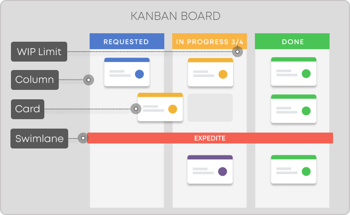
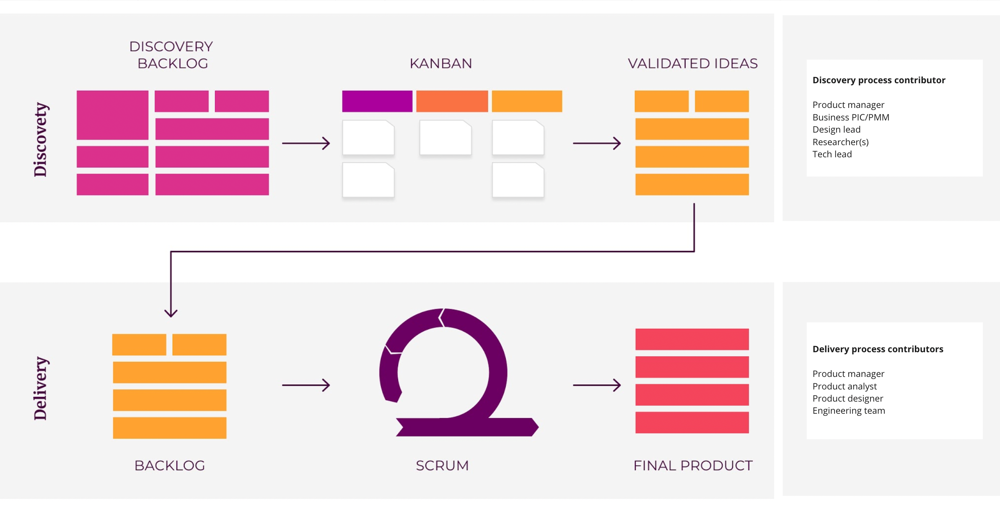
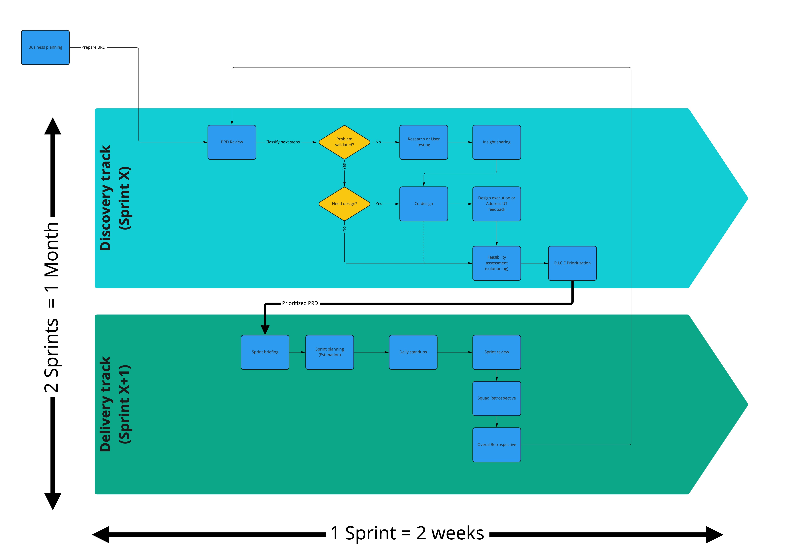
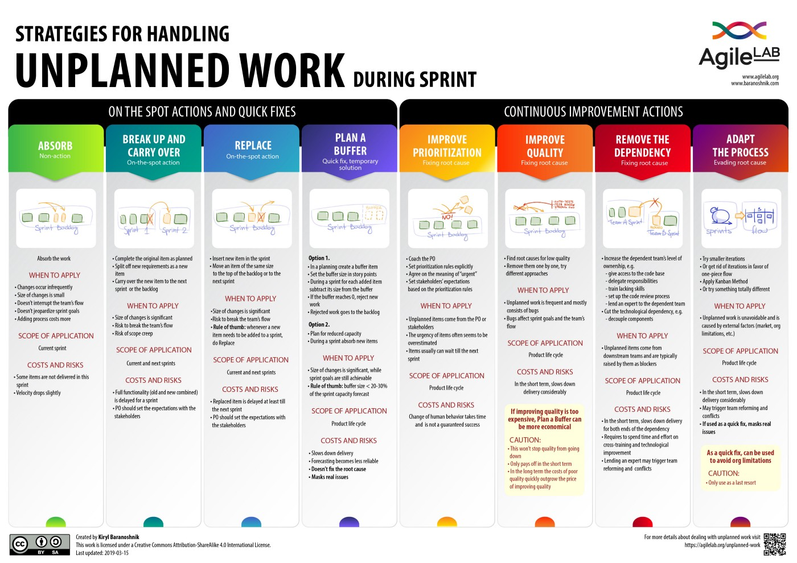
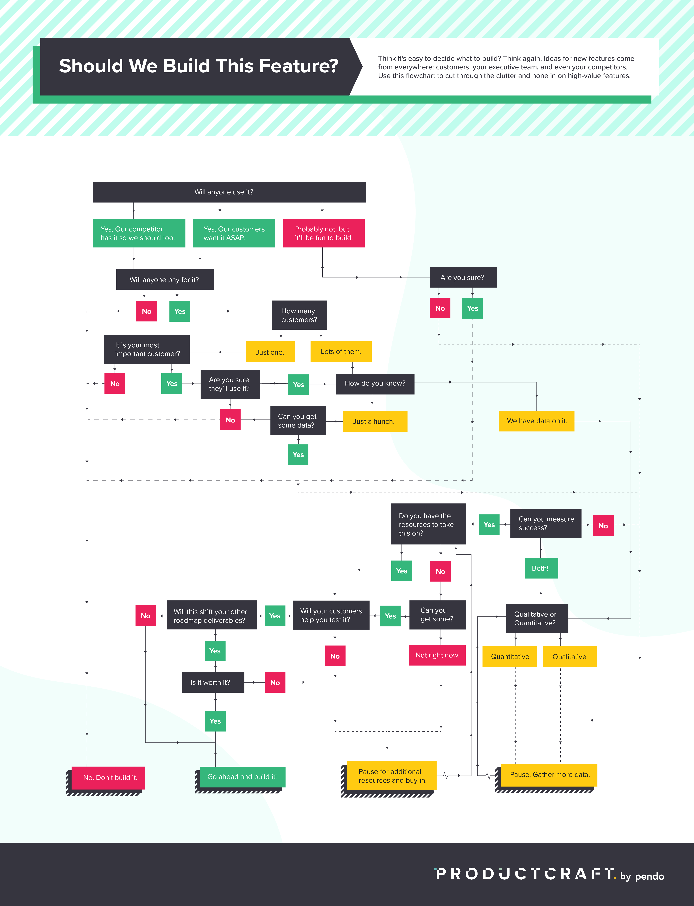
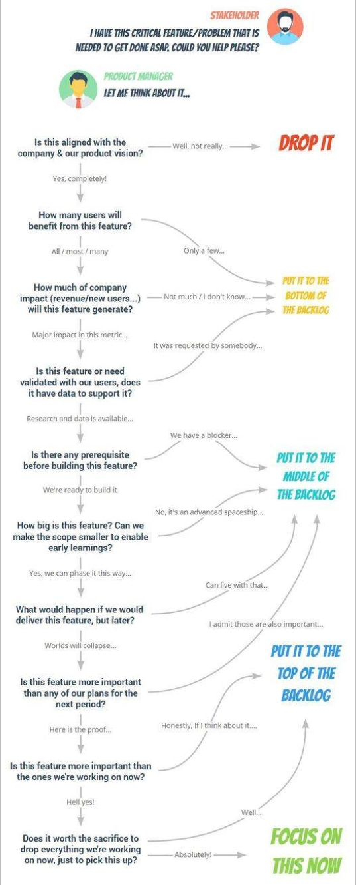

note **Summary** 

* We will use the combination of  **Dual-track agile**  and  **LeSS framework**  to improve workflow and alignment between departments

* Business initiative proposal from business team should be explained in Business Requirement Documents and being discussed and reviewed together with product and designer team in the  **BRD Review meeting**  which scheduled beginning of the sprint

* These BRD proposal should be prepared at  _very late_  before the BRD review meeting starts

* Based on review and prioritization result in BRD review meeting, BRD proposal will be subject for research or feasibility assessment that will take  _at least_  1 sprint (2 weeks) 

* Hence, BRD proposal will  **only**  be proceed to development  _at earliest on the next sprint_  (not in the sprint where BRD were being discussed)

* This means that at earliest, the lead time from submission to delivery is at  _very least_ 2 sprints (1 month). (Could be longer depending on the scope)

* If there’s urgent initiatives that has conflicting priority and timeline with planned or ongoing initiative, business, product, and other stakeholders should have a consensus which planned or ongoing item that should be deprioritized, postponed or dropped completely

 **Summary** 

* We will use the combination of  **Dual-track agile**  and  **LeSS framework**  to improve workflow and alignment between departments

* Business initiative proposal from business team should be explained in Business Requirement Documents and being discussed and reviewed together with product and designer team in the  **BRD Review meeting**  which scheduled beginning of the sprint

* These BRD proposal should be prepared at  _very late_  before the BRD review meeting starts

* Based on review and prioritization result in BRD review meeting, BRD proposal will be subject for research or feasibility assessment that will take  _at least_  1 sprint (2 weeks) 

* Hence, BRD proposal will  **only**  be proceed to development  _at earliest on the next sprint_  (not in the sprint where BRD were being discussed)

* This means that at earliest, the lead time from submission to delivery is at  _very least_ 2 sprints (1 month). (Could be longer depending on the scope)

* If there’s urgent initiatives that has conflicting priority and timeline with planned or ongoing initiative, business, product, and other stakeholders should have a consensus which planned or ongoing item that should be deprioritized, postponed or dropped completely

## Background

* As we experiment with 4 business units, we group those business units into 2 tribes

* These 2 tribes introduce new daily meeting cadence with the purpose to ensure alignment between department

* However, this new daily meeting cadence often used for business briefing which is not the right forum for point blank business inquiry or request to product, design and engineering

* After doing conducting some retrospective, we realized that this daily inquiry often causing disruption of planning and delivery between department especially when product, design, and engineering members are still shared across the tribes

* This mismatch between business cadence and product-design-engineer process also leads us to other issues such as:

    * Half-baked solution due to unvalidated problem space

    * Some members are showing symptom of burn out

    * Unclear constantly change of priority

    * More than 20% of our time are expended  _just_  for preparing weekly status update and attending the status update rather than doing the actual work

    
* Through this document, we’d like to address these issues by aligning the workflow between departments by adopting a proper agile framework (Please note that agile doesn’t necessarily means “rush”). 

* We also want to minimizing number of “status update overhead” meetings (that could have been an email) and switching it with meetings that produce a more tangible deliverables

## Objective

* Improve cross department alignment on initiatives that require product development

* Ensure clarity on priority (after all, if everything is urgent, nothing is)

* Reduce meetings that focus solely on status updates

* Improve team productivity and collaboration by doing a more interactive meeting/discussions and actual work

## Terminology
Please refer to this terminology table to understand the definition of some keywords in agile methodology.

|  **Term**  |  **Definition**  |  **Example**  | 
|  --- |  --- |  --- | 
| Dual track agile | Dual-track Agile is a product development methodology that sees a cross-functional team dividing its daily activities into two parallel tracks — discovery and delivery. | [https://www.bornfight.com/blog/dual-track-agile-the-what-the-why-the-pros-the-cons/](https://www.bornfight.com/blog/dual-track-agile-the-what-the-why-the-pros-the-cons/)[https://aktiasolutions.com/dual-track-agile/](https://aktiasolutions.com/dual-track-agile/) | 
| Discovery track(Problem exploration and validation) | The discovery track allows us to get to  **know and prioritise the needs of the users** . This lane focuses on learning quickly, validating or discarding ideas before developing them, continuing to measure and learning after launch, thus eliminating assumptions and ensuring that the product is viable and adds value to the user or business.In other words, it avoids wasting time and resources on products that the end user is not going to use, and it allows putting all the team effort into something safe. | <ul><li>Conduct stakeholder interviews

</li><li>User testing

</li><li>Co-design workshop

</li><li>Design new feature or addressing user testing feedback

</li><li>Perform market research (surveys, user interviews, etc.)

</li><li>Technical feasibility assessment, solutioning, and assessment

</li></ul> | 
| Delivery track (Product development) | The delivery track takes the learnings from the discovery lane and applies them to the final product. The development objective is to get the maximum number of improvements and complete functionalities possible during a sprint, which is known by the name of increment: the sum of all the tasks, use cases, requirements and any element that has been developed and they will be made available to the client in the end | <ul><li>Develop new features

</li><li>Refactoring

</li><li>Architecture and capacity planning

</li><li>Fix bugs and potential issues 

</li><li>Addressing technical debts

</li></ul> | 
| Scrum | Scrum is one of agile methodology that facilitate project management in a more structured approach within a (typically) 2 weeks time-box iteration (known as Sprint) | [https://www.gojek.io/blog/the-process-behind-program-management](https://www.gojek.io/blog/the-process-behind-program-management) | 
| [LeSS Framework](https://less.works/) | LeSS stands for Large-Scale Scrum. It’s a framework that allows scaling the collaboration of multiple teams that run Scrum process to ensure alignment between team | [https://www.atlassian.com/agile/agile-at-scale/less](https://www.atlassian.com/agile/agile-at-scale/less) | 
| Kanban | Kanban is a popular Lean workflow management method for defining, managing, and improving services that deliver knowledge work. It helps you visualize work, maximize efficiency, and improve continuously. Work is represented on Kanban boards, allowing you to optimize work delivery across multiple teams members in a single environment. |  | 
| BRD/RFP | BRD stands for Business Requirement Document. Document that describe the business case proposal that may require prioritization in product development. It should provide the problem that we need to solve, the objective that we need to achieve and what is the business value in solving those problem.BRD is also known as RFP: Request for Proposal.  | [[BRD Template - English|BRD-Template---English]] | 
| PRD/PFD | PRD stands for Product Requirement Documents. It's a guide that defines a particular product’s requirements, including its purpose, features, functionality, and behavior.This document is generally written by the Product Manager to communicate  **what** they are building,  **who** it is for, and  **how** it benefits the end-user.  | [[Netcore Integration : The Nudges Feature|Netcore-Integration---The-Nudges-Feature]] | 
| R.I.C.E Framework | A framework of assessing priority that considering 4 factors:  **R** each,  **I** mpact,  **C** ost, and  **E** ffort.Formula of calculating R.I.C.E score = ( **R** each x  **I** mpact x  **C** ost) /  **E** ffort | [https://docs.google.com/spreadsheets/d/1JZ6vuL7WfSGMytqj1UZ_4tVwGupo2L8-hSyiPVZ146s/edit#gid=0](https://docs.google.com/spreadsheets/d/1JZ6vuL7WfSGMytqj1UZ_4tVwGupo2L8-hSyiPVZ146s/edit#gid=0) | 

## How this workflow works?

* The  _discovery track_  identifies the problem, works on solutions, creates prototypes, tests them and then when the prototype is validated, goes to the  _delivery track_  where product development begins.

* Discovery and delivery track are run parallel in the same 2 weeks time box,  **_but_**  the topics that are being executed in  _discovery track_  **are always one sprint ahead**  before being transferred to development execution in  _delivery track_ .

* After the validated “topic” goes to delivery track, the discovery process can start exploring and validating new topic/problems and the cycle starts again.

* This process is in line with the agile concept:  _Continuous problem finding, continuous value delivery_ 

    * Discovery: (how to decide to) build the right thing

    * Delivery: (how can we) build the things right

    

## Why should we adopt this framework? what’s the benefit for us?

* This methodology facilitates the coexistence of business, design, UX and development objectives and improves communication and understanding between teams. 

* On the other hand, it increases efficiency thanks to the integration and optimization of the research and testing stages, and because all the ideas that enter the backlog are already validated, they only need to be prioritized and estimated.

*  All of this enables quick iterations on the product that add direct value to the end user and promote design based on data collected on product usage.

## How can we adopt this workflow at Kuncie?

1. Business team can bring their prioritized proposal (Business Requirement Documents) in the  **BRD meeting**  forum

1. Business team can go through and present to the team about each of the business initiatives

1. Product Managers can facilitate the discussion and together with the Design lead, Researchers and Tech lead can ask clarification question to the business team

1. PM and Design lead  **classify**  the initiatives based on the clarity and the confidence of the problem

1. The  _discovery track_  can be classify into two type of works: 

    *  **Exploration** . In this phase we can start from an idea or a problem, reformulating or restructuring them to achieve a business objective or increasing the value for users. During  **exploration** , we seek to understand the problem with qualitative and quantitative data through interviews with users, surveys, net promoter score (NPS) comments, product use and heat maps. After collecting the data, designers can define the problem and think up solutions,  with the target users in mind. The team will then be ready to define a value proposition and prototypes.

    *  **Validation** . Once we have the prototypes, we look to validate their desirability, usability or feasibility with both users and the development team. It is a cycle of continuous improvement from which we gather knowledge, the necessary changes are made and we start again. When a final validated idea is reached – which does not necessarily imply a new product, but can also be a test of a concept, a usability improvement or a technical feasibility solution – it goes to the development team to begin implementation.

    
1. All of the initiatives then being prioritised together (using R.I.C.E framework)

1. Before  **BRD Review**  wrapping up the meeting, make sure to have a consensus on:

    * which initiatives that will be executed in  _discovery track_ sprint

    * what initiatives to be deprioritized, postponed or dropped  **if**  there’s a conflict of priority or urgent task needs to be inserted into the ongoing sprint (not recommended)

    
1. Any initiatives that has been processed through  _discovery track_  doesn’t guarantee that it will goes into the development ( _delivery track_ ) depending on the discovery result

1. Once the initiatives are validated, then it can be transferred into developers to start the development in  _delivery track_  with the reassurance that they are dedicating their time and effort with high confidence.

This workflow can be visualized in the following diagram:

### How it will look like on my calendar?

* The following are example of how both discovery meetings and delivery meetings meeting would be scheduled in one month

* The topic/problems/initiative is always being explored and validated in  _Discovery track_  2 weeks in advance before being executed in development ( _Delivery track_ )

* But Discovery track and Delivery track will run in parallel with different topic/problem/initaitive to work on. 

    * Discovery track will starts exploring and validating problem for the next sprint

    * While Delivery track is executing the validated ideas from the previous Discovery track findings

    
* This way, we can have a continuous  _discovery_  (build the right things) and  _delivery_  (build the things right) process.

* Business team will only need to attend the blue ones.

.jpg)

### What are these meetings about?
The following table explains about the purpose of the meeting, deliverables and the attendees.

|  **Meeting**  |  **Schedule**  |  **Attendees** Roles: _Facilitator_  _Presenter_  |  **Meeting objective**  |  **Deliverables**  | 
|  --- |  --- |  --- |  --- |  --- | 
| Business planning  |  Anytime before BRD review  Every 2 weeks |  **Mandatory** <ul><li>Business PIC

</li></ul> **Optional** <ul><li>CEO/COO

</li><li>PMs

</li></ul> | Business team to discuss internally preparing business initiatives that may require new development before bringing them in BRD Review meeting |  **Output** <ul><li>Prioritized BRD from business side

</li></ul> **Outcome** <ul><li>Discussion during BRD Review meeting will be more structured and effective

</li></ul> | 
| BRD Review (Cross Tribe) |  The first Monday in every sprint 1-1.5 hour Every 2 weeks |  **Mandatory** <ul><li> Business PIC/PMM

</li><li> PMs

</li><li>Design lead

</li><li>Researcher(s)

</li><li>Tech lead/Engineering managers/QA lead

</li></ul> **Optional** <ul><li>CEO/COO

</li><li>Content Manager

</li></ul> | <ul><li>Improve cross department alignment on initiatives that require product development

</li><li>Ensure clarity on priority

</li><li>Give proper time for problem exploration and validation before jumping into solution and development

</li><li>Increase the confidence of the target problem to be solved

</li></ul> |  **Output** <ul><li>List of BRD that has be categorized and prioritized to be executed in discovery track sprint

</li></ul> **Outcome** <ul><li>Team on the same page on the discovery task for the next 2 weeks

</li></ul> | 
| Co-design session |  Any day in first week of the sprint (depending on designer schedule on each squad)<ul><li>Amsterdam: Tuesday 1pm

</li><li>Budapest: Thursday 1pm

</li><li>Canberra: Thursday 4pm

</li></ul> 1 hour Every 2 weeks (could be weekly depending on the situation) |  **Mandatory** <ul><li> PMs

</li><li>Engineers and QA

</li><li>Designer(s)

</li></ul> **Optional** <ul><li>CEO/COO

</li><li>Content Manager

</li><li>Tech lead/Engineering managers/QA lead

</li><li> Business PIC/PMM

</li></ul> | <ul><li>Co-design is a design-led process that uses creative and participatory methods.

</li><li>Gathering input about design from different perspective of roles

<ul><li>Business viability

</li><li>Technical feasibility

</li><li>Decision on priority

</li></ul></li></ul> |  **Output** <ul><li>Prioritized scope for design execution

</li></ul> **Outcome** <ul><li>Team on the same page on what are the scope of the design

</li><li>Build shared ownership between teams

</li></ul> | 
| Sprint Briefing (Squad) |  The first Monday in every sprint 1 hour Every 2 weeks |  **Mandatory** <ul><li> PMs

</li><li>Engineers and QA

</li><li>Designer(s)

</li></ul> **Optional** <ul><li>Business PIC/PMM

</li></ul> | <ul><li>Give visibility of the upcoming product backlog items, reviewing and revising their content.

</li><li>Allows for any queries/clarification over product backlog item at an early stage.

</li><li>Discuss any new information that may impact the plan

</li><li>Removing some of the unknowns and dependencies

</li><li>Reduce the length of sprint planning sessions

</li><li>Unnecessary product backlog items can be removed/deprioritized.

</li></ul> |  **Output** <ul><li>Updated/refined user stories (sliced Epic and story mapping)

</li><li>Updated acceptance criteria

</li><li>Final design documentation

</li><li>Updated test case

</li></ul> **Outcome** <ul><li>Minimize misestimation during sprint planning

</li></ul> | 
| Sprint Planning (Squad) |  The first Tuesday in every sprint 1 hour Every 2 weeks |  **Mandatory** <ul><li> PMs and Product Analyst

</li><li>Engineers and QA

</li><li>Designer(s)

</li></ul> **Optional** <ul><li>Data analyst

</li></ul> | <ul><li>To remind the team of the big picture or goal

</li><li>To present the velocity to be used for this release

</li><li>To confirm team capacity

</li><li>To review the definition of DONE and make any appropriate updates based on technology, skill, or team member changes since the last sprint

</li><li>To present proposed product backlog items to consider for the sprint backlog

</li><li>The entire team signal if this is the best plan they can make given what they know right now

</li></ul> |  **Output** <ul><li>Sprint goal

</li><li>Estimation (story points or affinity sizing: x, m, xxl)

</li><li>Forecast (based on team velocity and capacity)

</li><li>Ready to develop sprint backlog

</li></ul> **Outcome** <ul><li>Sprint backlog is not commitment, it is a forecast

</li><li>Improved forecast accuracy sprint by sprint

</li></ul> | 
| Daily Standup (Tribe) |  Every morning 15 minutes Every workday |  **Mandatory** <ul><li> Business PIC/PMM

</li><li>Other key departments

</li><li>PMs

</li><li>Design lead

</li><li>Researcher(s)

</li><li>Tech lead/Engineering Managers/QA lead

</li></ul> **Optional** <ul><li>CEO/COO

</li></ul> | <ul><li>Mitigating risk early in cross department

</li><li>Acknowledge and addressing blocker

</li><li>Build overall situational awareness

</li></ul> |  **Output** <ul><li>High level action plan of the day

</li></ul> **Outcome** <ul><li>Build overall situational awareness on cross department

</li><li>It's a not a just status update meeting

</li><li>it's not for "debt collecting" 

</li><li>Not more than 15 minutes

</li></ul> | 
| Daily Standup (Squad) |  Every morning 15 minutes Every workday |  **Mandatory** <ul><li> PMs

</li><li> Engineer(s) and QA

</li></ul> **Optional** <ul><li>Designer(s)

</li></ul> | <ul><li>Mitigating risk early in development

</li><li>Acknowledge and addressing blocker

</li></ul> |  **Output** <ul><li>High level action plan of the day

</li></ul> **Outcome** <ul><li>Build overall situational awareness between squad team embers

</li><li>It's a not a just status update meeting

</li><li>it's not for "debt collecting" 

</li><li>Not more than 15 minutes

</li></ul> | 
| Sprint Review (Tribe) |  The second Friday in every sprint 1-1.5 hour Every 2 weeks |  **Mandatory** <ul><li> Business PIC/PMM

</li><li> Other key departments members

</li><li>PMs

</li><li>Product Ops

</li><li>Design lead

</li><li>Researcher(s)

</li><li>Tech lead/Engineering Managers/QA lead

</li></ul> **Optional** <ul><li>CEO/COO

</li></ul> | <ul><li>This can replace tribe weekly meeting

</li><li>It is a celebration of the work completed in the last two weeks

</li><li>It is an opportunity shareback across streams to keep everyone up to date

</li><li>It is not a formal business update

</li><li>It is not the forum to make key strategic decisions

</li></ul> |  **Output** <ul><li>Slide presentation that share highlight key progress and achievements

</li></ul> **Outcome** <ul><li>Build overall situational awareness specifically on the cross department’s milestone and achievements

</li></ul> | 
| Sprint Review (Squad) |  The second Friday in every sprint 1 hour Every 2 weeks or Monthly |  **Mandatory** <ul><li>PMs

</li><li>Product Ops

</li><li>Design lead

</li><li>Researcher(s)

</li><li> Tech lead/Engineering Managers/QA lead

</li></ul> **Optional** <ul><li>CEO/COO

</li><li>Business PIC/PMM

</li><li>Other key departments members

</li></ul> | <ul><li>To review delivery performance and quality (forecast vs delivered)

</li><li>To review the compliance to the team's "definition of done"

</li><li>Reviewing backlog that needed to be release

</li><li>To understand what problems that caused undelivered backlog

</li><li>To provide valuable input to subsequent Sprint Planning

</li><li>To review of the timeline, budget, potential capabilities, and marketplace for the next anticipated releases of functionality and capability of the product

</li></ul> |  **Output** <ul><li>Demonstration of "Done" item

</li><li>Final design and spec review before release (minor only)

</li></ul> **Outcome** <ul><li>Team are aware about what have been delivered by the engineering team

</li><li>Engineering team will be acknowledged of their contribution

</li></ul> | 
| Sprint Retrospective (Squad) |  The second Friday in every sprint 1 hour Every 2 weeks |  **Mandatory** <ul><li> PMs and Product Analyst

</li><li> Engineers and QA

</li><li> Designer(s)

</li></ul> **Optional** <ul><li>Data analyst

</li></ul> | <ul><li>Opportunity for the team to inspect itself and create a plan for improvements to be enacted during the next Sprint.

</li><li>To improve the cross department workflow

</li></ul> |  **Output** <ul><li>Action plan of how to improve the cross department team workflow and performance next sprint

</li></ul> **Outcome** <ul><li>The collaboration and communication between team are improved

</li><li>Psychological safe working environment

</li></ul> | 
| Sprint Retrospective (Tribe) |  The second Friday in every sprint 1 hour Every 2 weeks |  **Mandatory** <ul><li> Business PIC/PMM  

</li><li> Other key departments members

</li><li>PMs

</li><li>Design lead

</li><li>Researcher(s)

</li><li>Tech lead/Engineering Managers/QA lead

</li></ul> **Optional** <ul><li>CEO/COO

</li></ul> | <ul><li>Opportunity for the team to inspect itself and create a plan for improvements to be enacted during the next Sprint.

</li><li>To improve its development process and practices to make it more effective

</li><li>To improve the product deliverables quality (updated definition of done)

</li></ul> |  **Output** <ul><li>Action plan of how to improve the squad team performance next sprint

</li></ul> **Outcome** <ul><li>The collaboration and communication between team are improved

</li><li>Psychological safe working environment

</li></ul> | 

## What if there’s an urgent issue arise in the middle of the ongoing sprint?

1. PMM or Business PIC can mention the issue during daily standup tribe; but please refrain to demand solution right on the spot because the issue needs to be assessed first

1. PMM or Business PIC can find available slot for huddle with PM and a technical representative on that day to discuss about the issue in details

1. PM (with the support from engineer) will assess if the issue can be inserted in the ongoing sprint or not either:

    1. during the discussion or

    1. require separate discussion with engineer (without PMM)

    
1. The solution effort to be explored by PM and engineer should be small enough to be inserted in the ongoing sprint or leverage 3rd party service if necessary

1. If the effort of the urgent task is big and could delay the ongoing items being develop in ongoing sprint, then PM needs to escalate to leaders (CEO/COO, Head of Product and Head of Business) and ensure consensus on whether:

    1. to delay ongoing items on the sprint to give space of the urgent task or 

    1. the urgent task can wait if compare to the ongoing task

    

## Things to be considered during BRD review 

### PM to check with business and design

* Is this in support of a company or team  **OKR** ?

* Does it bring our  **vision**  closer to reality?

* Does it meaningfully improve the user experience of an important workflow?

* Is it customer  **needs**  or  _just_  our  **wants** ?

* Is it particularly  **important for customers** ?

### PM to check with tech lead

* The technical complexity is acceptable. We want to preserve our ability to make changes quickly in the future so we try to avoid complex code, complex data structures, and optional settings.

* It is orthogonal to other features (prevents overlap with current and future features).

* The requirements are clear.

* It can be achieved within the scheduled milestone. Larger issues should be split up, so that individual steps can be achieved within a single milestone.

*****

[[category.storage-team]] 
[[category.confluence]] 
