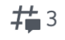
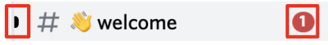
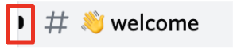
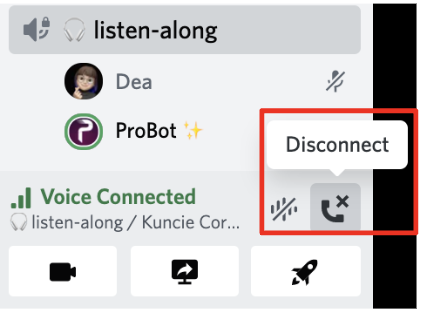
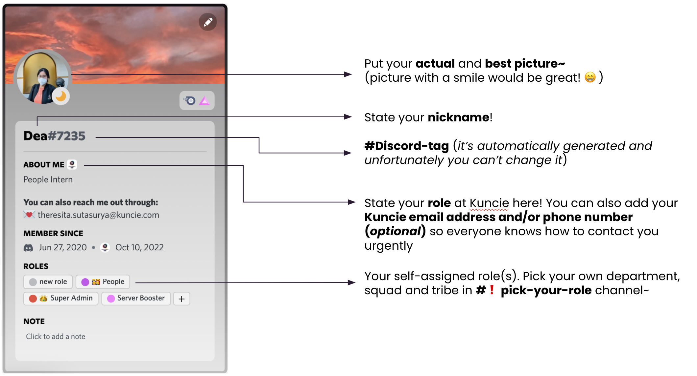
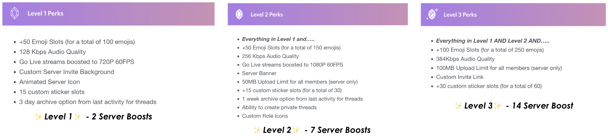

# Email Guideline

#  **Discord Guideline** 

*  **Discord** is the  **primary ** communication channel for all work related conversations.

*  **When to use Discord?** 

    *  **All the time!** Discord should be the main communication channel for  work in Kuncie

    * For cross team coordination & file sharing related

    * Non-work and casual related  banter

    
*  **How to ask for urgency when sending message to Discord:** 

Please indicate the urgency of your message:

    * ASAP: if you need immediate response

    * \[By EOD]: if the response can wait until the end of day

    * \[By EOW]: if the response can wait until the end of week

    * If there is no urgency indication on a message, it is safe to assume that  the message is not urgent and can wait  **until EOW for response** 

     **Example:** 

 _“@mario,  could you provide me the report on yesterday alfamart promo campaign by EOD? Thanks”_ 

 **📝 Discord 101** 
1.  **First up: Set and configure your Discord account ⚙️** 

    1. Register yourself on Discord by using your  **Kuncie email.** 

    1.  **Set**  **2-Factor Authentication**  by going to  **User Settings > My Profile > Password & Authentication.**  Tutorial [here](https://www.youtube.com/watch?v=RJrGv1m-_Ok).

    1. Configure your Discord profile so we’re able to recognize you! Guide [here](https://docs.google.com/presentation/d/1weuiKPIOj8sdZf9d2QQ2uDYSA7j2k-ua4vZmlD_FHkc/edit#slide=id.g197fb7ed623_0_1131).

    
1.  **Join our Kuncie Corporate server! 🔑** 

    1. Click on the link sent by the server admin. Log into your Discord account via website by clicking  **“Already have an account?”** 

    1. Soon after, you’ll be redirected to the server, specifically to the  **#👋welcome**  channel. Admins will assign you to a role based on your employment contract first.

    1. Go to  **#❗️go-here-first** and  **pick your department by reacting with the respective emoji**  to get the access to our public channels.

    1. Next up, run through everything you need to know to get started in  **#📝rules-and-tips!** 

    
1.  **It’s okay to create a new channel, just be mindful about it! 🧠** 

    1. Set up a temporary channel to do quick asynchronous discussion. It’s also recommended to  **place the channel under a relevant category** to keep everything organized.

    1. Set up a new Discord channel for any project that will take minimum 2 weeks continuous coordination.

    1.  **Always**  set the channel open (public) as we are trying instill the culture of being open and transparent.

    1.  **Always**  set a topic and description in a channel – to let other team members know which channel to discuss specific topics.

    1. If you need to have a  **confidential discussion**  between team members – you can create group DMs under  **“Direct Messages”**  section in your upper left corner.

    1. Once the objective is completed,  **archive the channel by placing it under “🗂Archived” category.** 

    
1.  **Start every conversation by making a** [ **thread** ](https://support.discord.com/hc/en-us/articles/4403205878423-Threads-FAQ) **⚙️** 

    1. Simply  **type the topic**  and hover to the right side of your message and click on  **# Create Thread**  

    1. Type the thread’s name and enter a message to start the conversation, maybe a little  **heads up about the project** or  **callout to your colleagues**  by mentioning them there.

    1. You can simply  **run through** and also  **create new threads**  by clicking on this icon on your  **upper right of your screen:** 

    
1.  **Adapting to Discord notifications 🔔** 

    1. You can see all mentions and unread messages by clicking on the  **📥 Inbox tab on the upper right of your Discord screen, near the search tab.** 

    1. There you can see every mentions and unread messages not only from this server, but also from another server that you're joining in.

    1. However, notifications will be shown in some ways:

    *  **A little black blob and number of notifications that indicates**  **_you’ve been mentioned_** 

    *  **Only a little black blob indicates that**  **_there’s a new message in the channel (not mentioning you)_** 

    
    1. It is  **mandatory** for everyone to  **always mention relevant parties in every discussion.**  You can  **@mention**  their name, team, squad, etc. 

    1. You can also use  **@here (to notify everyone that’s online)** and  **@everyone (all channel members).** 

    
1.  **Voice channel in Discord 🎙** 

    1. Discord have a different system for in-app voice call. In Slack, we might call it as Huddle, but here, we need to  **make a voice channel which is separated from the text channel. ** 

    1. You can make voice channel and simply  **click on it to join the call.** 

    1. You can adjust other users’ volume for your own hearing by right clicking their profile and move the volume slider.

    1. To disconnect, click the  **Disconnect**  button in the red box below:

    

##  **Discord Policies** 

1.  **Invitation to Discord 💌** 

    1. The server invitation link  **can only be generated and distributed by admins.** 

    1. For inviting  **external partners, contractors, or freelancers**  to the server, please look at [this](https://docs.google.com/presentation/d/1weuiKPIOj8sdZf9d2QQ2uDYSA7j2k-ua4vZmlD_FHkc/edit#slide=id.g197fb7ed623_0_1117) slide.

    
1.  **Discord channel creation & naming policy ⌨️** 

    1. For a channel with  **external partners or contractors**  in it, please add  **“ext-”**  in front of the channel name,  _i.e: #ext-wgs-mobile-site._ 

    1. For a  **temporary project-based**  channel, please add  **“proj-”** in front of the channel name,  _i.e: #proj-career-site_ .

    1. Quickly close a finished discussion/thread by clicking  **Close and Lock Thread**  or archive the channel by moving it to  **“🗂Archived”** category.

    
1.  **Account configuration & security ⚙️** 

    1. Everyone is  **required** to set 🔐 **Two-Factor Authentication**  in their Discord account.

    1.  **Set your profile** properly according to [this](https://docs.google.com/presentation/d/1weuiKPIOj8sdZf9d2QQ2uDYSA7j2k-ua4vZmlD_FHkc/edit#slide=id.g197fb7ed623_0_1131) guide.

    1. State your current condition that need to be known by other team members by customizing your status to:

    1. 🟢 Online

    1. 🌙 Idle

    1. ⛔️ Do Not Disturb, or you can customize it by yourself.

    
    1.  **Set your birthday in #🎂birthday channel**  by triggering the setup with  **/remember-birthday.** Add your birth date and username. You can also add someone else’s birthday.

    
1.  **Communication around the server 💬** 

    1. Build a habit to start the conversation by  **creating a thread.** This is meant to keep every discussion organized and make it less cluttered as well. 

    1. As the server notification settings has been set to  **Only @mentions** , it is mandatory for everyone to  **mention relevant parties**  in every discussion. This can be done by mentioning their usernames, squad, tribe, specific team, etc.

    
1.  **Accessibility for each roles 🚶** 

    1.  **Full member**  will get accesses to  **almost everything** , including access to every public channels,  _except: managing the server (inviting other people to the server, switch regions, add bots to the server), managing members (kick, ban, time out), and doing some of voice channel management (deafen, mute, and move members)._ 

    1.  **Guest**  will get  **limited access**  to the server and only have permissions to view and interact  **ONLY in required channels.** 

    1.  **Super Admin** will get  **all permissions**  to manage the server and see every channels’ activities, including private ones.

    
1.  **As we use Discord on daily basis – you should download Discord app on your mobile phone for ease of communication 📱** 

##  **Involving External Partners, Freelancers, and Contractors in Discord** 

* It is  **mandatory for everyone (especially leaders)**  **to inform People Team** before inviting external partners, freelancers or contractors, because there will a few adjustments about the  _auto-role feature. _ 

* The request will be forwarded to the admins so they can work on the invites.

* The admins will send an invitation link that  **expires within 1 day**  and  **limit max number of uses to the amount of external users that will be joining the server shortly.** This is meant to keep our server secure.

* External partners, freelancers, and contractors will be given a role as  **Guest** .

* For a channel with external partners or contractors in it, please add  **“ext-”** in front of the channel name, **i.e: #ext-wgs-mobile-site.** 

* Make sure that our external partners have accesses  **ONLY to the required channels for them to work on their projects.** 

## 👤  **Discord Guidelines - Profile** 

##  ** ** [ **Server Boosting in Discord** ](https://support.discord.com/hc/en-us/articles/360028038352-Server-Boosting-FAQ-)
 **What is Server Boosting in Discord?** 

Server Boosts is a feature that enables us to unlock some fresh, new and improved collective perks for a server each month and share those epic perks to the rest of the server community! A totally free-built server might be enough for most of the communities, but having these perks below might  **boost our productivity and makes our Discord experience more personal:** 

 **Example:** We’ll get the  **Level 1 perks**  once there are  **2 server members**  boosting our server  **each month.** Runs the same for every level, we’ll get the  **Level 3 perks** once there are  **14 server members**  boosting our server  **each month.** 

 **💰A budget will be set for us to boost our server to Level 2. Server boosting will be handled by People Team.** 

 **I’m still interested to boost our server to the next level. How much does a Server Boost cost? 💰** 

* A server boost costs  **$4.99/month (approx. Rp 80.000/month)** or $59.88/year (approx. Rp 940.000/year).

* If you have Discord Nitro, you’ll get a 30% discount on server boosts with Discord Nitro, so a server boost with Discord Nitro will cost  **$3.49/month (approx. Rp 55.000/ month)** or $41.88/year (approx. Rp 660.000/year).

 **Will I be able to get a reimbursement for boosting Kuncie Team server? 💳** 

* Since this additional server boost is voluntary, the purchase of Server Boosts for our server won’t be reimbursed afterwards.

* However, if you still want to boost Kuncie Team server, please inform our People Team first, so it can be discussed further.

 **See the slides here:** 

[https://docs.google.com/presentation/d/1weuiKPIOj8sdZf9d2QQ2uDYSA7j2k-ua4vZmlD_FHkc/edit#slide=id.g197fb7ed623_0_1022](https://docs.google.com/presentation/d/1weuiKPIOj8sdZf9d2QQ2uDYSA7j2k-ua4vZmlD_FHkc/edit#slide=id.g197fb7ed623_0_1022)

# Slack Guideline

# Whatsapp Guideline

* Don’t use whatsapp for internal business communication,

*****

[[category.storage-team]] 
[[category.confluence]] 
