by Shafa A Probosari

## 📢  **TADA Dashboard Ownership** 

*  **Website:**  [https://dashboard.usetada.com/](https://dashboard.usetada.com/)

*  **Username (owner):** [harnendio.aditia@kuncie.com](mailto:harnendio.aditia@kuncie.com), [shafaap@kuncie.com](mailto:shafaap@kuncie.com), [rofiqi@kuncie.com](mailto:rofiqi@kuncie.com), [christina.debbyannie@kuncie.com](mailto:christina.debbyannie@kuncie.com), [ardi.kemara@kuncie.com](mailto:ardi.kemara@kuncie.com), [khairunnisa.afifah@kuncie.com](mailto:khairunnisa.afifah@kuncie.com)

*  **Password:** check to owner 

## ✨  **General Flow for Point Redemption through TADA** 
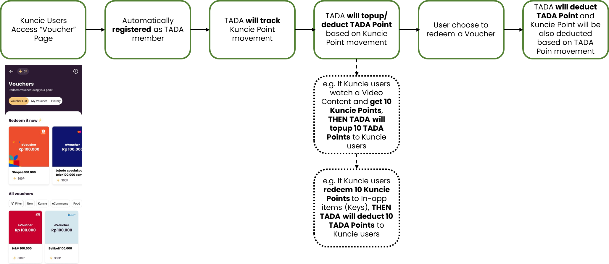
* Only Kuncie Users who access Voucher page, that is counted as MAU on TADA. This will impact our Monthly Payment (Transaction Fee) to TADA

## 💰  **TADA Payment** 

* Sales Quotation Signed: [https://drive.google.com/file/d/1XzfaOLCBpsdCR4ODFIin5wRFFL8OGQLI/view?usp=sharing](https://drive.google.com/file/d/1XzfaOLCBpsdCR4ODFIin5wRFFL8OGQLI/view?usp=sharing)

*  **Platform Fee** 

    * We already PAID the  **Set-Up Fee** for API Integration (Rp15.000.000) and  **Program Support Fee** for 6 Months (Rp45.000.000) based on these conversations:

    *  **PIC budget for Platform Fee is Engineering Team** [https://kuncieteam.slack.com/archives/C0315E69NBX/p1643969180591259](https://kuncieteam.slack.com/archives/C0315E69NBX/p1643969180591259)

    * Approval for 6 months [https://kuncieteam.slack.com/archives/C0315E69NBX/p1643971599650799](https://kuncieteam.slack.com/archives/C0315E69NBX/p1643971599650799)

    

    

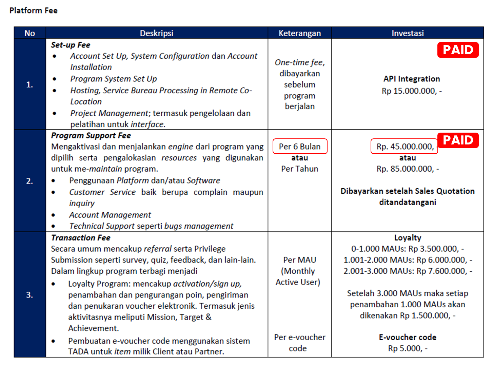
*  **Additional Fee (optional)** 

    * PIC Budget for  **Additional Fee is GTM Team** [https://kuncieteam.slack.com/archives/C0315E69NBX/p1643969180591259](https://kuncieteam.slack.com/archives/C0315E69NBX/p1643969180591259)

    * We  **don't** request any  **Communication Fee and Masking Fee,** and don’t do any Customization as well, so  **there should be NO Customization Fee** 

    * We only apply e-vouchers, we don’t select any physical rewards. So, there should be  **NO Asuransi Pengiriman Barang Fisik** 

    *  **We will only be changed with Processing Fee: Per Redemption Per Month and Deposit** 

    

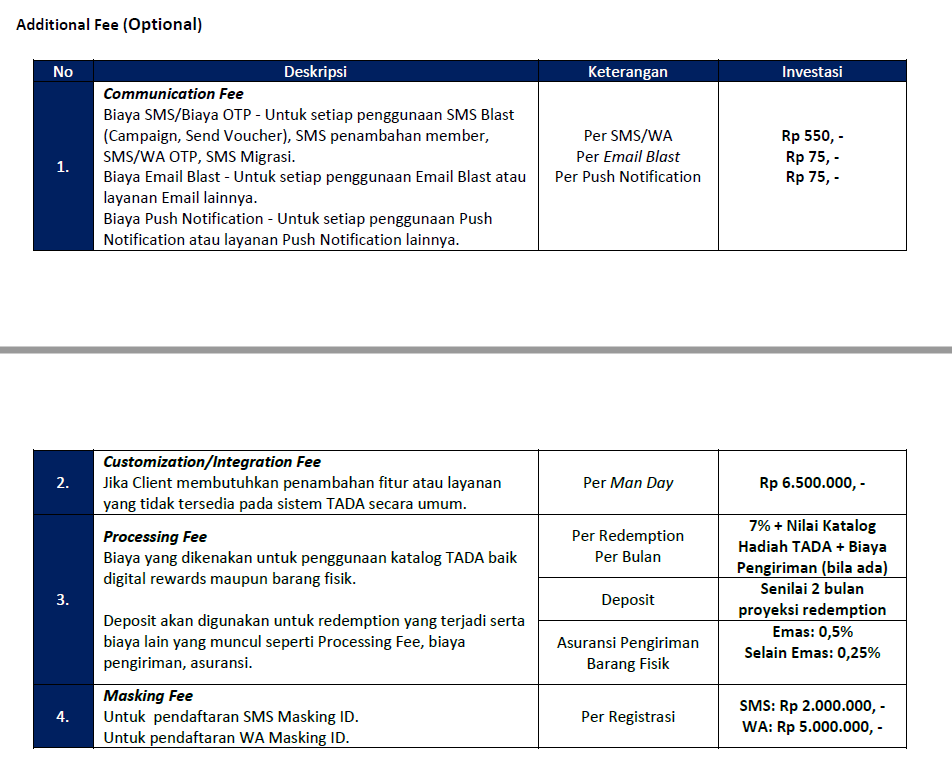
*  **Paid Invoices** 

|  **No.**  |  **Invoice**  |  **Period**  |  **Amount**  |  **Proof**  | 
|  --- |  --- |  --- |  --- |  --- | 
| 1 | Integration  | 23 Feb | 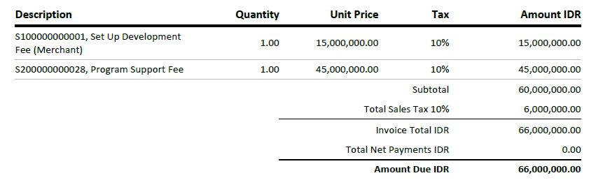<ul><li>Program Support Fee for 6 Months

</li></ul> |  | 
| 2 | Monthly Payment | May22, invoice appears in June22 | 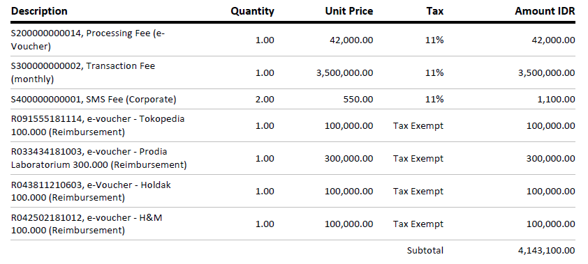<ul><li>Processing Fee = 7%\*Total Nilai Rewards. In this case:

<ul><li>Total Nilai Rewards = 100,000+300,000+100,000+100,000 = 600,000

</li><li>Then, Processing Fee = 7% \* 600,000 = 42,000

</li></ul></li><li>MAU in range 0-1000 MAU in this months, so we were charged 3,500,000

</li><li>SMS fee is still accruing in this month. This SMS the First SMS users get after accessing Voucher Page.  **But we already ask to** TURN OFF **the SMS**  **since we never ask to activate it in the beginning.**  Please expect a little SMS Fee that still occurs in early June on the next Invoice in July.

</li></ul>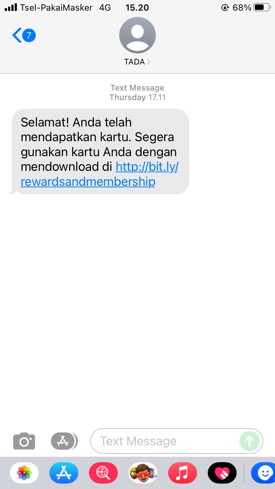 |  | 

## 🎨  **Training Documentation** 

* Members tab

    * Summary of membership

    * Membership list

    
* Transaction tab

    * Card Transaction

    * e-Voucher Transaction

    

 **Link video:** [https://drive.google.com/file/d/1nduNubWQ1jTi1vZHyT6dKYbWOsA1YCk1/view?usp=sharing](https://drive.google.com/file/d/1nduNubWQ1jTi1vZHyT6dKYbWOsA1YCk1/view?usp=sharing)

## 💡  **Training Notes** 

|  **No**  |  **Question and Notes**  |  **Details**  |  **Anwer**  |  **Question asked**  |  **Question Resolved**  | 
|  --- |  --- |  --- |  --- |  --- |  --- | 
| 1 |  **Total Revenue from Member** di tab Member, apakah akan sama dengan Total Poin Kuncie yang saat ini dimiliki oleh seluruh member? (Include hasil penambahan dan pengurangan Kuncie Point dari seluruh transaksi point, baik transaksi ke merchant TADA maupun ke Item In-App Kuncie) | 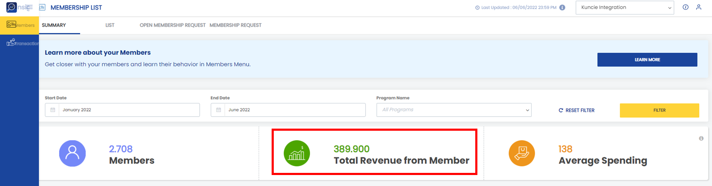 | Total Revenue tsb menampilkan data Penambahan dan pengurangan yang terjadi pada poin member Kuncie (existing member dan new member Kuncie) dan akan terhitung sesuai bulan yang di filter  |  |  | 
| 2 | Confirmed bahwa transaksi yang masuk di Invoice Kuncie (contoh di bulan Mei), adalah transaksi based on Redemption, bukan Used voucher. Mohon di cek kenapa di Dashboard tab Transaction, part **E-Voucher Transaction** , transaksi untuk bulan Mei tidak tercatat? Padahal ada 4 transaksi di tab Member,  **part Summary - Member Ranked by Performance** bulan Mei tercatat 4 transaksi seperti di Invoice | 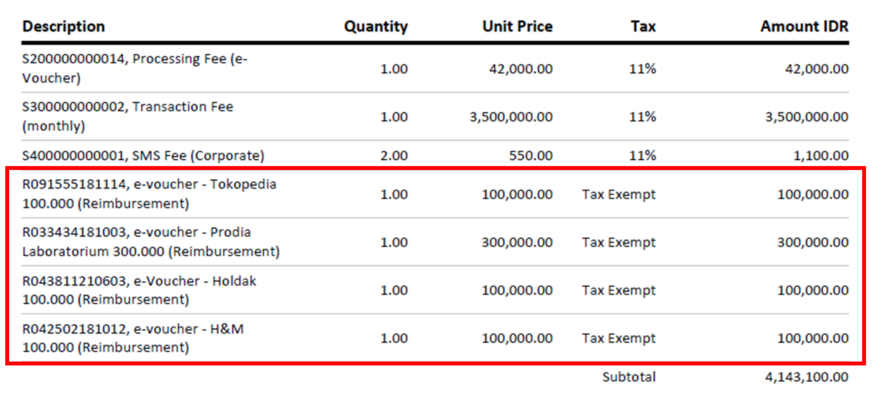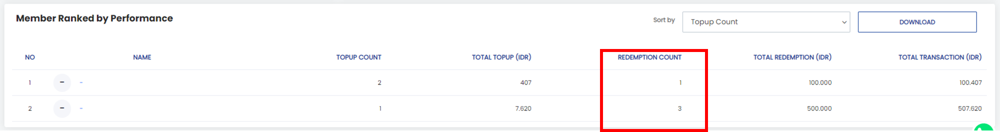 | Mba Shafa saya ralat sedikit, untuk melihat semua e-Voucher yang statusnya sudah ditukarkan dari poin menjadi e-Voucher dapat dilakukan pengecekan pada  _Menu Order (sedang saya berikan akses tambahan)_  sedangkan pada Menu  _Transaction - e-Voucher Transaction_  mencatat e-Voucher yang statusnya sudah digunakan member saja.  Please note:  |  |  | 
| 3 | Di tab Transaction, part **card transaction** , ada terms Activation. Apakah Activation = Member registered? Karna kalau di cek ddi tab "Member", kemaren berbeda angka Activation dengan Member Registered. Lalu Apa arti angka 0/ x Transaction? | 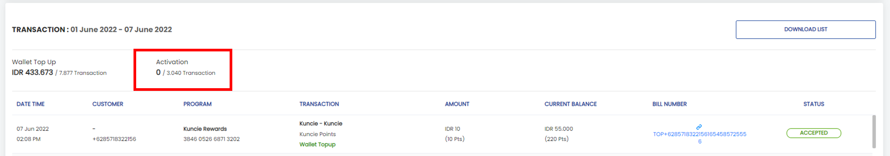 |  **Activation**  0/256 transaction Penjelasan: terdapat 0 member yang ketika aktivasi tidak mendapatkan poin sign up reward / 256 yang aktif di range tanggal tsb (hasil filter tgl)Since Kuncie tidak memberikan sign up reward maka akan 0/xxx trasaction |  |  | 
| 4 | Masi di tab Transaction, part  **card transaction** , ada terms Wallet Top Up dengan nilai Rp X/ Y Transaction. Apakah Rp X ini adalah total point yang dimiliki oleh member include hasil penambahan dan pengurangan Kuncie Point dari seluruh transaksi point, baik transaksi ke merchant TADA maupun ke Item In-App Kuncie? | 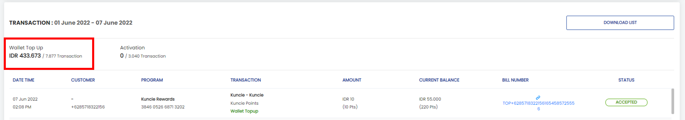 |  **Wallet top up**  IDR 30.250/991 Penjelasan: terdapat 30.250 poin atas 991 transaksi di range tanggal tsb (hasil filter tgl) |  |  | 
| 5 | Di tab Member part  **List,** ada data users yang sangat lengkap (Name, Phone number, email, date birth, age), apakah ini berarti users kuncie yang juga register ke app TADA? karna PII yang Kuncie kirim untuk melakukan transaksi itu hanya Phone Number | 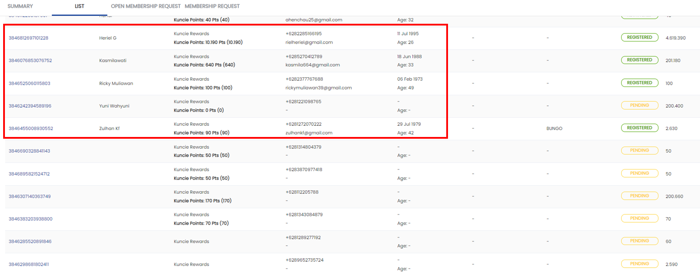 | Ini dikarenakan adanya pengiriman SMS. Namun untuk saat ini SMS sudah di non-aktifkan sejak setelah meeting kita di 6 Juni 2022.Confirmed, data yang lengkap berarti karna user tersebut download App TADA. |  |  | 
| 6 | 
1. Top Up activity yg bisa dilakukan user selain nonton video ada gak?

1. Redeem Poin jadi Keys buat nonton masih ada kah sistemnya? Ini berarti kalo masih ada otomatis mengurangi TADA Poin juga ya?

1. Sekarang system backend jalannya real-time untuk konversi Kuncie Poin ke TADA poin, vice versa; tadi di mention bisa di hold, ini maksudnya kalo mereka selesai nonton mestinya lgsg naik TADA poinnya +10, ini nanti jadinya ada lead time gitu kah? Ada kemungkinan user komplain gak ya nanti?

1. Masih unclear how TADA charge Kuncie pada konteks daily usage; metrik apa yang bisa dijadikan patokan untuk forecasting remaining deposit

1. Data points yang di dashboard TADA bisa dicolokin ke Mixpanel / GDS gak ya? Jadi dibuatin dashboard yang main metrics aja

 |  |  |  |  | 

*****

[[category.storage-team]] 
[[category.confluence]] 
