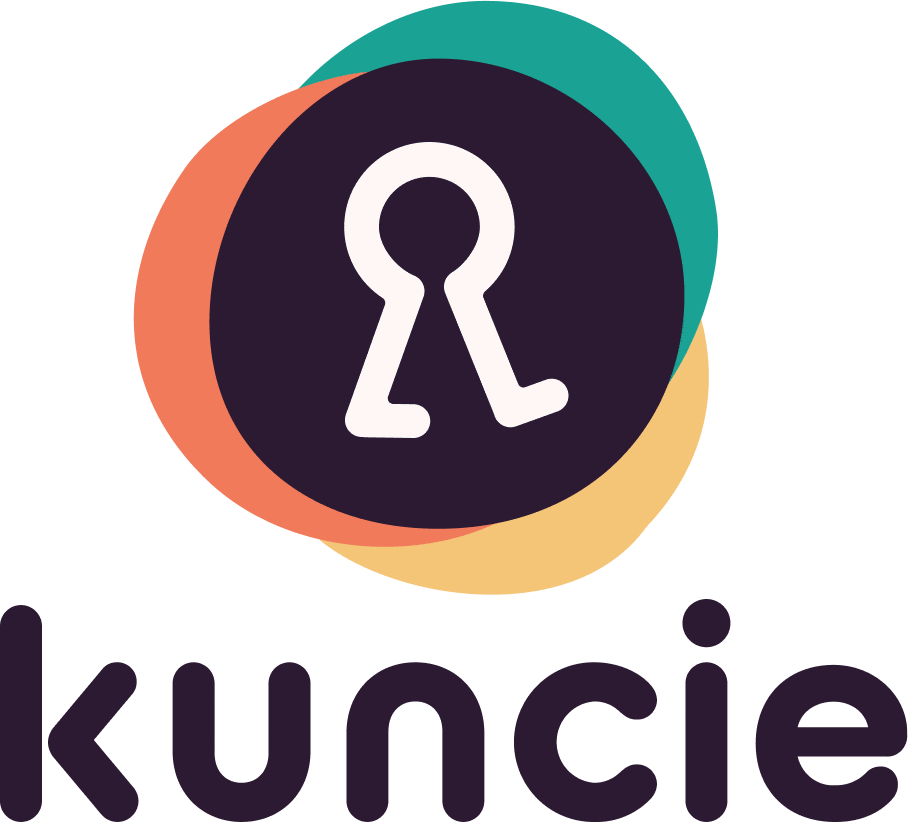

# Our Mission
 **_"Unlock human potential, empowering people to prosper doing what they love_** ”

# Introduction
[[Getting Started - Kuncie Team Onboarding|Getting-Started---Kuncie-Team-Onboarding]]

[[Kuncie General|Kuncie-General]]

# Guidelines
Below is the list of guidelines and policies to make our work productive and comfortable!

[[Communications Guideline|Communications-Guideline]]

[[Information Security Policies|Information-Security-Policies]]

## Announcements

# Teams
To get to know more about our organization structure, please open the page below.

[[Team Directory|Team-Directory]]

[[Organization Structure|Organization-Structure]]

Below list of teams in Kuncie, feel free to browse around!

https://kuncie.atlassian.net/wiki/spaces/ENGINEERING

https://kuncie.atlassian.net/wiki/spaces/DES

https://kuncie.atlassian.net/wiki/spaces/RD

https://kuncie.atlassian.net/wiki/spaces/PROD

https://kuncie.atlassian.net/wiki/spaces/PM

https://kuncie.atlassian.net/wiki/spaces/MC

https://kuncie.atlassian.net/wiki/spaces/CS

https://kuncie.atlassian.net/wiki/spaces/PRODOPS

https://kuncie.atlassian.net/wiki/spaces/RECRUITMENT

https://kuncie.atlassian.net/wiki/spaces/PMM

https://kuncie.atlassian.net/wiki/spaces/BT

## Important Calendars

1. [ **Mini MBA schedule calendar** ](https://calendar.google.com/calendar/u/0?cid=Y19ldXFwaTFyYjZqM25lY2YwYzZnbXU0bGFqMEBncm91cC5jYWxlbmRhci5nb29nbGUuY29t)

1. [ **Kuncie event cohort class & paid webinar** ](https://calendar.google.com/calendar/u/0?cid=Y19lbGZsYzU3bm80dWZlaTE4NXJpcGw5Z3Rzb0Bncm91cC5jYWxlbmRhci5nb29nbGUuY29t)

1. 

## Meeting cadences
[[Business Product Alignment - English|Business-Product-Alignment---English]]

[[Business Product Alignment - Bahasa Indonesia|Business-Product-Alignment---Bahasa-Indonesia]]

 **Deprecated** 

[[Sprint Planning: xStream|Sprint-Planning--xStream]]

[[Sprint Retrospectives Cross Team|Sprint-Retrospectives-Cross-Team]]

[[Sprint Review: Shareback|Sprint-Review--Shareback]]

## How Tos
[[How to submit product ideas?|How-to-submit-product-ideas-]]

[[How to utilize MoEngage (Campaign Creation, Segmentation & Analytic)|How-to-utilize-MoEngage-(Campaign-Creation,-Segmentation-&-Analytic)]]

[[How to utilize Zendesk|How-to-utilize-Zendesk]]

*****

[[category.storage-team]] 
[[category.confluence]] 
