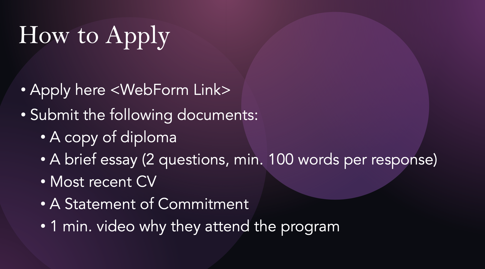
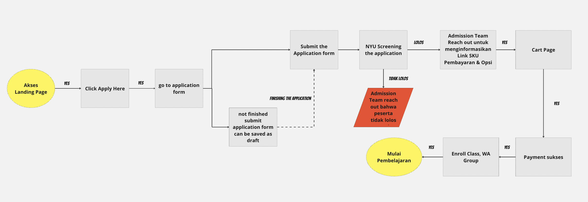

noteThis template is brought to you by Scaled Agile, Inc., provider of SAFe®. All Rights Reserved.

This template is brought to you by Scaled Agile, Inc., provider of SAFe®. All Rights Reserved.

##  Profil Epic

|  **Tanggal mulai project**  |  ETA rilis | 
|  **Proposal tanggal rilis**  |  | 
|  **Pemilik Epic**  |  | 
|  **Stakeholder utama**  |  | 
|  **Stakeholder Terkait**  |  | 
|  **Deskripsi Epic**  | Landing Page ini gunakan sebagai alat komunikasi, informasi sekaligus platform pembayaran untuk program kerjasama dengan NYU Application form ini digunakan sebagai requirement pendaftaran peserta sesuai ketentuan yang telah ditetapkan oleh NYU untuk dapat mengikuti program Global Executive Program: Innovative Leadership | 
|  **Hasil Prioritas**  | [https://docs.google.com/spreadsheets/d/1JZ6vuL7WfSGMytqj1UZ_4tVwGupo2L8-hSyiPVZ146s/edit#gid=569384378](https://docs.google.com/spreadsheets/d/1JZ6vuL7WfSGMytqj1UZ_4tVwGupo2L8-hSyiPVZ146s/edit#gid=569384378) | 

##  Deskripsi Epic
Landing Page ini gunakan sebagai alat komunikasi, informasi sekaligus platform pembayaran untuk program kerjasama dengan NYU 

Form admission ini digunakan sebagai requirement pendaftaran peserta sesuai ketentuan yang telah ditetapkan oleh NYU untuk dapat mengikuti program Global Executive Program: Innovative Leadership

Dalam Landing Page semua informasi dari mulai harga, deskripsi pembelajaran, pengajar, syarat mengikuti kelas dsb digunakan untuk mempermudah para calon peserta memahami program ini.

Yang berbeda dari program ini adalah, NYU memiliki requirement khusus bagi calon peserta untuk dapat mendaftarkan diri melalui persyaratan berikut

dikarenakan membutuhkan platform khusus bagi calon peserta untuk mengumpulkan beberapa dokumen tersebut,  **diharapkan terdapat build in application form yang dapat tersimpan dan juga diakses kembali oleh user ketika dia belum lengkap mengisi semua requirement.**  Sehingga ketika calon peserta mengakses kembali form tersebut, dokumen yang sebelumnya telah tersimpan tidak perlu dilakukan pengupload-an ulang. Dan ketika user melakukan submission, semua dokumen dapat tersimpan dan terupload dengan baik untuk selanjutnya dilakukan pemilihan oleh pihak NYU.

 **Customer Journey** 

##  Hipotesa dan Tujuan

|  **Hipotesa hasil bisnis (**  **_Business outcome_**  **)**  _Bagian ini diisi tim business_  |  **Indikator Utama**  _Bagian ini diisi tim business_  | 
| Landing Page dapat diakses dengan baikApplication Form  dapat diakses dan digunakan dengan baik dan mudah oleh pesertaCampaign timeline & Budget here [https://docs.google.com/spreadsheets/u/0/d/1IDQmI74y_84eTTYAyq4_kwkDZqiWgYEF5JvqoZaTqbE/htmlview#](https://docs.google.com/spreadsheets/u/0/d/1IDQmI74y_84eTTYAyq4_kwkDZqiWgYEF5JvqoZaTqbE/htmlview#) | Minimal mencapai 10-30 peserta pembelajaran | 
|  **Didalam Cakupan (**  **_In scope_**  **)**  _Bagian ini diisi tim business terlebih dahulu, kemudian difinalisasi tim product_  |  **Diluar Cakupan (**  **_Out of scope_**  **)**  _Bagian ini diisi tim bisnis terlebih dahulu, kemudian difinalisasi tim product_  |  **Kebutuhan Non-fungsional**  _Bagian ini diisi tim engineering_  | 
| <ul><li>tersedia informasi lengkap mengenai program dsb

</li><li>terdapat feature application form build in yang mudah di akses dan digunakan peserta

</li></ul> | <ul><li>terdapat dropbox untuk mengakses dokumen peserta yang mudah di sortir

</li><li>

</li></ul> | <ul><li>

</li><li>

</li></ul> | 
|   **_Minimum Viable Product_**  _Bagian ini diisi tim business dan product_  |  **Fitur Potensial Tambahan**  _Bagian ini diisi tim business dan product_  | 
| <ul><li>template application form build in

</li></ul> | List out nice-to-have features or capabilities<ul><li>

</li><li>

</li></ul> | 
|  **Hasil Analisa**  _Bagian ini diisi bersama-sama_  |   **Go /**   **No-go**  _Bagian ini diisi tim product_  | 
| Briefly summarize the analysis formed to create the business case<ul><li>

</li></ul> | Document final recommendation and reasoning<ul><li>

</li></ul> | 

#  _Lean Business Case_  untuk <short name of epic>

##  Analisa Solusi

|  | 
|  --- |  --- | 
|  **User internal dan/atau eksternal mana yang terpengaruh, dan bagaimana caranya?**  _Bagian ini diisi tim business_  | 
| calon pembeli | 
|  **Apa dampak potensial pada solusi, program, dan layanan?**  _Bagian ini diisi tim business_  | 
| peningkatan revenue, sortir the most suitable student for the course | 
|  **Apa dampak potensial pada penjualan, distribusi, penerapan, dan dukungan yang dilakukan?**  _Bagian ini diisi tim business_  | 
| 900,000,000 dalam 1 batch30.000.000/studentMaximal kelas: 30 pesertaMinimal running kelas: 10 peserta | 
|  | 
|  **Modal Awal**  _Bagian ini diisi tim product dan engineering_  | Calculate investment requested to fund the MVP | Calculate investment of full implementation if MVP hypothesis is proven true _Initial estimate:_  This can be expressed as a range _Refined estimate(s):_  Identify material updates to the estimated implementation cost, usually informed from experiments | 
|  **Keuntungan/**  **Balik modal**  _Bagian ini diisi tim business_  | e.g., Market share, increased revenue, improved productivity, or new markets served | 

##  Strategi Pengembangan Produk
 _bagian ini di isi tim produk dan engineering_ 

|  **Tim Internal Kuncie/Eksternal**  | Provide recommendations on where epic should be developed | 
|  **Strategi implementasi tambahan**  | Click [here](https://www.scaledagileframework.com/implementation-strategies-for-business-epics/) for potential strategies | 
|  **Urutan dan Dependensi**  | Describe any constraints for sequencing and identify potential dependencies with other epics or solutions | 

##  Data Dukungan Tambahan
 _Bagian ini bisa diisi oleh siapa saja_ 

| Type /link to add studies, models, market analysis, or other data used in the creation of the business case | 
| Provide miscellaneous information relevant to LPM team | 
|  --- | 
|  --- | 
| Type /link to add studies, models, market analysis, or other data used in the creation of the business case | 
| Provide miscellaneous information relevant to LPM team | 

*****

[[category.storage-team]] 
[[category.confluence]] 
