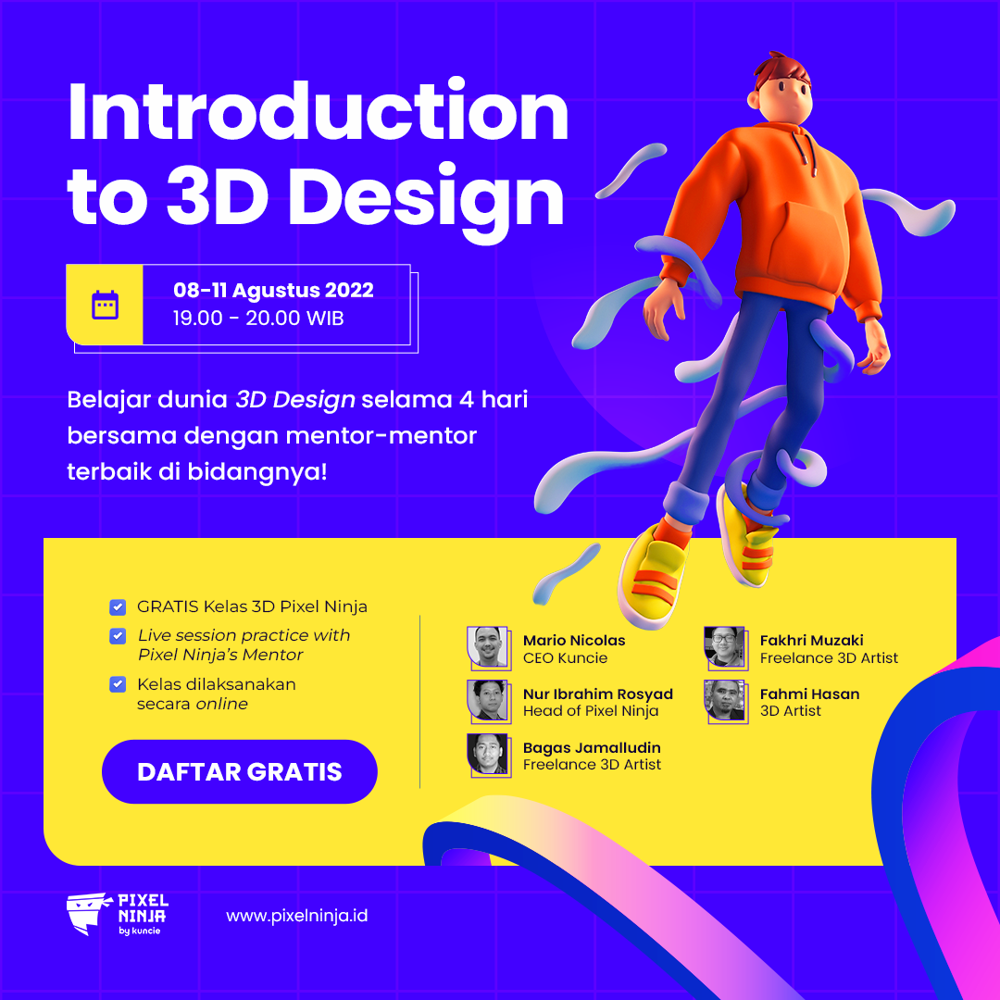
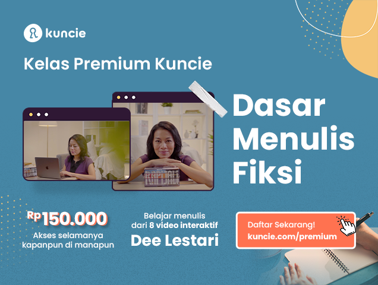
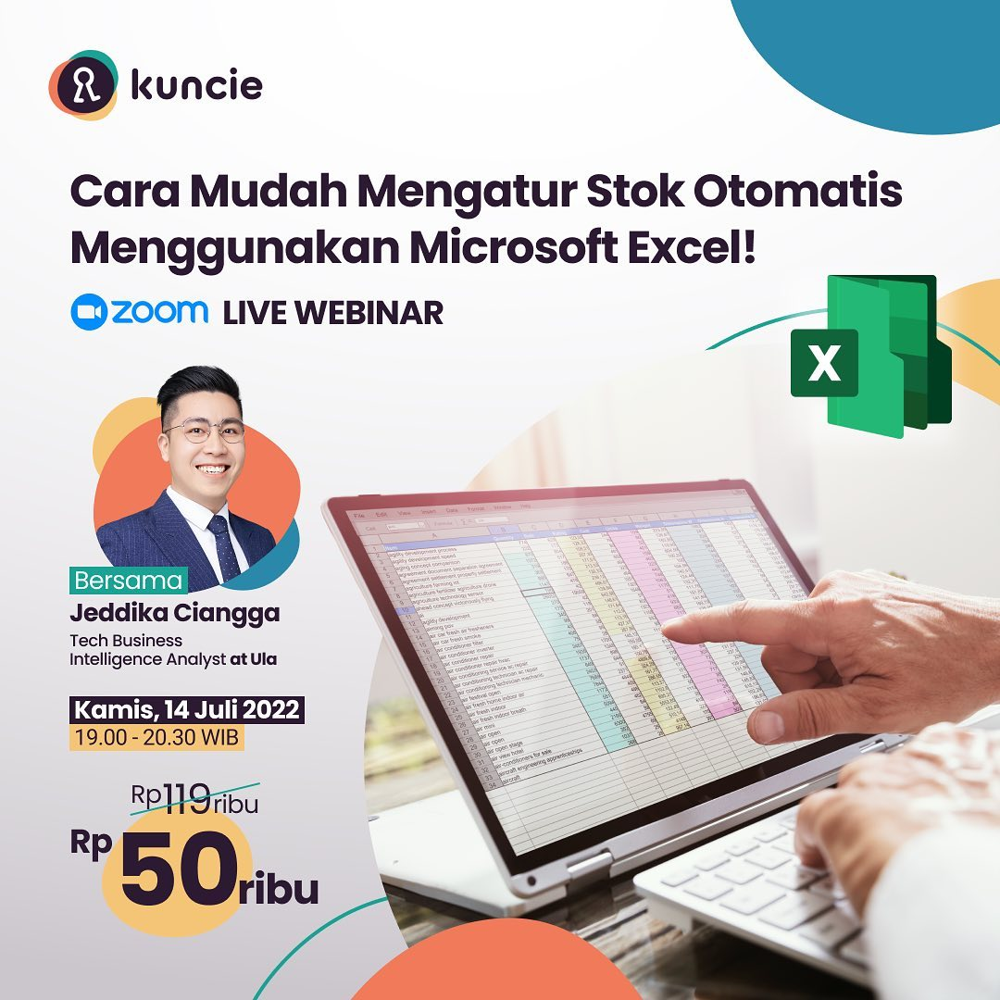

## Apa itu Komponen Pembelajaran?
Komponen pembelajaran ialah format belajar dari para pengguna Kuncie. Format belajar ini bisa berupa webinar live, atau hybrid, dan lain sebagainya. Di dokumen ini akan dijelaskan 9 tipe komponen pembelajaran yang ada di Kuncie dan penjelasannya.

Berikut adalah penamaan komponen pembelajaran di Kuncie:

|  **Nama Komponen**  |  **Deskripsi**  | 
|  --- |  --- | 
| Online Live Session | Sesi pembelajaran 1 kali secara langsung yang dilakukan dengan format pertemuan secara online via Zoom/GMeet atau platform lain online, hanya bisa diakses ketika sesi berlangsung | 
| Offline Live Session | Sesi pembelajaran 1 kali yang dilakukan dengan format tatap muka secara offline, hanya bisa dilakukan di tempat dan waktu yang sudah ditentukan | 
| Online Live Series | Sesi pembelajaran lebih dari 1 kali secara langsung yang dilakukan dengan format pertemuan secara online via Zoom/GMeet atau platform lain, hanya bisa diakses ketika sesi berlangsung | 
| Offline Live Series | Sesi pembelajaran lebih dari 1 kali yang dilakukan dengan format tatap muka secara offline, hanya bisa dilakukan di tempat dan waktu yang sudah ditentukan | 
| Recorded Session | Sesi pembelajaran dalam format video yang merupakan hasil rekaman Online Live Session dan bisa diakses kapan saja | 
| Recorded Series | Sesi pembelajaran dalam format serangkaian video yang bisa diakses kapan saja | 
| Written Material | Materi pembelajaran berbentuk dokumen tertulis (PDF, Word, Excel, PowerPoint, Text) | 
| Podcast | Sesi pembelajaran dengan materi Audio | 
| Kuis | Sesi pembelajaran berbentuk evaluasi dengan format pilihan ganda, isian singkat, esai, tugas (assignment) dan sebagainya. | 

Berikut adalah penamaan Program pembelajaran di Kuncie:

|  **Nama Komponen**  |  **Deskripsi**  | 
|  --- |  --- | 
| Kuncie Kilat | Program pembelajaran yang cepat dan singkat sehingga dalam konteks kedalaman materi belajar ini akan cocok untuk materi-materi perkenalan. Diidentifikasi dengan program yang dipublikasikan secara gratis.Bagi peserta yang menginginkan sertifikat pada program Kuncie Kilat, diwajibkan menjalani assement Quiz untuk mengetahui tingkat keefektifitasan  _Learning Experience & Design_ yang disampaikan.Contoh: **Kuncie Kilat Introduction to 3D Design**  | 
| Kuncie Jago | Program pembelajaran dengan tingkat kedalaman materi  _intermediate_  yang dipublikasikan secara berbayar baik berupa  _recorded session_ dan  _online live session._ Contoh:  **Kuncie Jago Dee Lestari**  **Kuncie Jago Live Session**  **Kuncie Jago PASTI (Paket Kelas Istimewa)** Program kelas paket _(bundling)_ dengan topik yang relevan dalam judul  _recorded session_  berbeda.Contoh: BTS Promo campaign (Kuncie Premium dan Pixel Ninja).png).png).png) | 
| Kuncie Komplit | Program pembelajaran dengan tingkat kedalaman penjelasan yang lebih mendalam dengan berbagai macam cara belajar yang akan membantu mereka dalam belajar. Dipublikasikan secara berbayar dengan berupa _recorded series, Online Live Series_ , atau kombinasi dari keduanya _._  **Kuncie Komplit Data Science**  Program kelas  _online live series_  dengan topik yang sama yang dilakukan secara online lebih dari satu kali pertemuan. **Kuncie Komplit Bootcamp → Mini MBA** Program kelas kombinasi dari pembelajaran mandiri ( _self-learning_ ) dengan  _recorded series_  digabungkan dengan  _online live series_  yang dilakukan lebih dari satu kali pertemuan secara online..jpg) | 
| Kuncie Sukses\* | Program penyaluran kerja ke  _hiring Partner_  Kuncie bagi para alumni yang telah lulus mengikuti kelas Komplit Bootcamp. Program ini juga akan menjadi solusi bagi perusahaan dalam menemukan talenta terbaik dari berbagai bidang. Contoh: **Kuncie Sukses untuk Data Analytics** <ul><li>Lulusan bootcamp Data Analytics berkesempatan untuk magang di Telkomsel

</li></ul> | 

*****

[[category.storage-team]] 
[[category.confluence]] 
