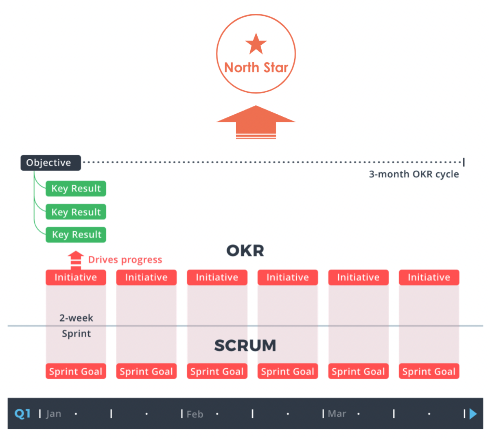

### What is Sprint Planning?
Sprint planning is an event in scrum that kicks off the sprint cadences. The purpose of sprint planning is to define what can be delivered in the sprint and how that work will be achieved. In cross stream context, the entire team will signal if the  **list of initiatives**  is the best plan they can make  _given_  what they know right now to move the needle of each respective OKRs — which will get us closer to our goals and [North Star](https://www.notion.so/North-Star-cd1717f5b86c45cebd43c07e3f99467e).

### Sprint Goal and Initiative Planning
[[Sprint 33|Sprint-33]]

[https://www.notion.so/munateam/Sprint-Planning-xStream-45c6a2c5f90844cf8608167af2a0811a](https://www.notion.so/munateam/Sprint-Planning-xStream-45c6a2c5f90844cf8608167af2a0811a)

*****

[[category.storage-team]] 
[[category.confluence]] 
