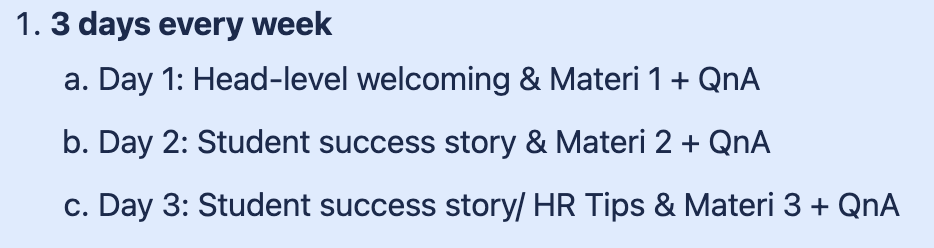

## Overview

|  **Department**  | 
|  **Accountable**  | 
|  **Responsible**  | 
|  **Tracker MM Jago**  | 
|  **Master Database**  | 
|  **Edu Team**  | 
|  --- | 
|  --- | 
|  --- | 
|  --- | 
|  --- | 
|  --- | 
|  **Department**  | 
|  **Accountable**  | 
|  **Responsible**  | 
|  **Tracker MM Jago**  | 
|  **Master Database**  | 
|  **Edu Team**  | 

## Assignment Project Overview

|  **Wiyan**  |  **Atika**  |  **Rae**  |  **Ayurei**  | 
|  --- |  --- |  --- |  --- | 
| <ul><li>Komplit Coffee Barista

</li><li>Roadshow - Hi Student Project

</li><li>Adhoc B2B project

</li><li>Mentor Inbound 

</li><li>Mentor Birthday

</li><li>Upskilling Program

</li></ul> | <ul><li>Komplit QA

</li><li>Komplit Product Management

</li><li>All Mentor Partnership

</li><li>Mentor Inbound

</li><li>Mentor Birthday

</li></ul> | <ul><li>Kilat mini MBA - SBM ITB

</li><li>Guest Lecturer mini MBA

</li><li>Kilat Tax - UK Petra

</li><li>All Mentor Kuncie

</li><li>Social Media Mentor

</li><li>Mentor Birthday

</li></ul> | <ul><li>Komplit Data Analytics

</li><li>Kilat Data Analytics

</li><li>Komplit Graphic Design

</li><li>Kilat Graphic Design

</li><li>All Mentor PixelNinja

</li><li>Mentor Birthday

</li><li>Upskilling Program

</li></ul> | 

##  On going Project

|  |  **Project**  |  **Details Current Progress**  |  **Status**  |  **PIC**  | 
| 1 | Important links:<ul><li>Tracker kilat mini MBA : [https://docs.google.com/spreadsheets/d/1AwENMr1D-5echdQ3ot6AFp6CHa1M_-VYpBuwydsRtiU/edit#gid=0](https://docs.google.com/spreadsheets/d/1AwENMr1D-5echdQ3ot6AFp6CHa1M_-VYpBuwydsRtiU/edit#gid=0)

</li><li>Tracker kilat internal : [https://docs.google.com/spreadsheets/d/1K2q6gK3yQ6zGPR5CTdzgVhUFe3sRjCb3QGD0jeQjDIE/edit#gid=358690268](https://docs.google.com/spreadsheets/d/1K2q6gK3yQ6zGPR5CTdzgVhUFe3sRjCb3QGD0jeQjDIE/edit#gid=358690268)

</li></ul>18350completeProcess payment previous webinar (Theo Derick) - old scheme18351completePKS for upcoming webinar on Nov 25 (Jonathan) - old scheme 18352completeMaterials for upcoming webinar on Nov 25 (Jonathan) - old scheme (by eod)18353completeList down Mentor for kilat mini MBA - new scheme (9 Dec)18477completeMentor SBM ITB: Bu Yuanita & Mas Sandy18478completeAlumni Batch 1: Mba Sylvia18479completeAlumni Batch 2: Mas Ramadhan18495completeReferral link alumni code → Mba Reni18510completealign sama Dita regarding referral18508incompletealign with SBM for upcoming Kilat on January 2023 | On progressYellow |  | 
| 2 | <ul><li>Tracker kilat internal : [https://docs.google.com/spreadsheets/d/1K2q6gK3yQ6zGPR5CTdzgVhUFe3sRjCb3QGD0jeQjDIE/edit#gid=358690268](https://docs.google.com/spreadsheets/d/1K2q6gK3yQ6zGPR5CTdzgVhUFe3sRjCb3QGD0jeQjDIE/edit#gid=358690268)

</li></ul>18354completeProcess payment previous webinar (Ritchie Goenawan)18355completeUpcoming webinar on Dec 2 (Andry Firdiansyah) : free/unpaid18356completeMaterials for upcoming webinar on Dec 2 (Andry Firdiansyah) :  by Nov 2318456completeUpcoming Guest Lecturer on Jan 6 : Pak Edo | On progressYellow |  | 
| 3 | Important links:<ul><li>Tracker kilat UK Petra : [https://docs.google.com/spreadsheets/d/1UTG8rbZ1iYr6O_hTUmZN7pXTIVU_5Aq45mHVEj4xatg/edit#gid=0](https://docs.google.com/spreadsheets/d/1UTG8rbZ1iYr6O_hTUmZN7pXTIVU_5Aq45mHVEj4xatg/edit#gid=0)

</li><li>Tracker kilat internal : [https://docs.google.com/spreadsheets/d/1K2q6gK3yQ6zGPR5CTdzgVhUFe3sRjCb3QGD0jeQjDIE/edit#gid=358690268](https://docs.google.com/spreadsheets/d/1K2q6gK3yQ6zGPR5CTdzgVhUFe3sRjCb3QGD0jeQjDIE/edit#gid=358690268)

</li><li>awaiting feedback regarding PKS from UK Petra

</li></ul>18357incompletePKS CEC UK Petra18440incompleteProcess payment CEC UK Petra18358completeInform UK Petra regarding kuncie hiring external mentor18359completePKS for upcoming webinar on Nov 23 (Rayhan Gautama)18360completeMaterials for upcoming webinar on Nov 23 (Rayhan Gautama)18457completeDiscuss with Bu Dyah regarding KIlat18496incompleteupcoming Kilat on 19 Dec with Pak Edo | On progressYellow |  | 
| 4 | <ul><li>Confluence Data Analytics Batch 2: [[Kuncie Komplit Data Analytics Batch 2|Batch-2---Kuncie-Komplit-Data-Analytics]]

</li><li>Payment Mentor DA batch 1

</li></ul>18361completeBrian Pamukti18363completeReza Aditya18450completeUmar Fudin18364completeDaniel Samuel<ul><li>PKS Mentor DA Batch 2

</li></ul>18365completeBrian Pamukti18366completeUmar Fudin18367completeAbdullah Ghifari18368completeRachmat Purnomo18369completeWanda Kinasih18370completeDaniel Samuel | DONEGreen |  | 
| 5 | 18371completeProcess payment previous webinar (Ahmad Chaerus)18372completeList down Mentor for kilat new scheme on Dec 21-23 (Basic Python)<ul><li>BAP & Materials for upcoming Kilat Series on Nov 21-23

</li></ul>18373completeBrian Pamukti18374completeRachmat Poernomo<ul><li>BAP & Materials for upcoming Kilat Series on Dec 5-7

</li></ul>18458completeAbdullah Ghifari, latest: Dec 118459completeRachmat Purnomo, latest: Dec 1<ul><li>BAP & Materials for upcoming Kilat Series on Dec 19-21

</li></ul>18462completeBrian Pamukti, latest: Dec 1518463completeRachmat Purnomo, latest: Dec 1518497completeContact Brian for new scheme Kilat (recording) | DONEGreen |  | 
| 6 | <ul><li>Payment Mentor GD Batch 2

</li></ul>18377completeAulia Akbar18378completeBahrul Ilmi18379completeLabib Ahmadin18380completeAri Arsyadi18381completeFind replacement  **Aulia Akbar : Darindra Mahendradata** <ul><li>Send PKS for Mentor GD batch 3

</li></ul>18382completeBahrul Ilmi18383completeLabib Ahmadin18384completeAri Arsyadi18437completeDarindra Mahendradata<ul><li>To do list Graduation

</li></ul> | DONEGreen |  | 
| 7 | 18464completeUpcoming kilat with Ari Arsyadi on Nov 24 “Introduction to Instagram for Graphic Designer”18466completeUpcoming kilat with Ari Arsyadi on Dec 8 “Langkah Awal Eksplorasi Artworks Menggunakan AI” | DoneGreen |  | 
| 8 | <ul><li>1st Class : 26 Nov

</li><li>Partnership scheme : revenue share 60% Mentor

</li></ul>18385completePKS sent to Almira18386completePKS Received18455completeOffine Event, 22 Nov at Sensory Coffee : [https://docs.google.com/presentation/d/1g_3ow3jF6MnQuei0F0CE3TAWdiHslu7-/edit#slide=id.g16bbdc2b7fc_0_492](https://docs.google.com/presentation/d/1g_3ow3jF6MnQuei0F0CE3TAWdiHslu7-/edit#slide=id.g16bbdc2b7fc_0_492)18460complete1st Class on Nov 2618461completeFollow up Almira regarding ingredients Coffee fee 18480incompleteUpcoming batch 2 on 21 Januari18488completePayment Komplit batch 118489completePayment Coffee Ingredients | On progressYellow |  | 
| 9 | <ul><li>Curriculum : [https://miro.com/app/board/uXjVOhhvCAM=/?moveToWidget=3458764537043933259&cot=14](https://miro.com/app/board/uXjVOhhvCAM=/?moveToWidget=3458764537043933259&cot=14)[[Tech Acceleration Program - QA Engineer|Batch-1---Kuncie-Komplit-QA-Engineer]]

</li><li>On sale : 1 Des

</li></ul>18387completeMeeting with All Mentor (21 November 2022)18388completeAlignment between LXD - Mentor18481completePKS sent, latest on Dec 918503completePKS on e-materai process, latest done on Dec 1218511incompletePKS not signed yet (Tegar Raharditya & Genta Wibowo)18504incompleteVideo Sambutan from Mentor | on progressYellow |  | 
| 10 | <ul><li>Find Potential Mentors

</li><li>List of Mentor [Komplit PM List of Mentor](https://docs.google.com/spreadsheets/d/19-6P4cMEakzbjuQFOsoCfbWvAg5PlePPGtZk3jN85Uo/edit?usp=sharing)

</li><li> Confluence PM [[Tech Acceleration Program - Product Management|Batch-1---Product-Management]]

</li></ul>18485completeFollowing up discussion with Raden Ayu (06/12)18486completeFollowing up discussion with Pedcawanto (06/12)18493incompletePKS sent to Mentor, latest on Dec 1218505incompletePKS on e-materai process, latest done on Dec 1318512incompletePKS not signed yet (Pedcawanto, Deska Setiawan, Raden Ayu, Hilman Zainul, Wildiyanto Yawin)18499incompleteVideo sambutan from Mentor | on progressYellow |  | 
| 11 | <ul><li>Important link: [https://docs.google.com/spreadsheets/d/1I_j2jyZIJ8ffFUA7tPvQS-YQsiAFyjy1-S4SekumIg0/edit#gid=0](https://docs.google.com/spreadsheets/d/1I_j2jyZIJ8ffFUA7tPvQS-YQsiAFyjy1-S4SekumIg0/edit#gid=0)

</li><li>[[Tracker Mentor Jago Premium|Tracker-Mentor-Jago-Premium]]

</li><li>Martha Suherman - Photography : done shooting, workbook done

</li><li>Reiza Nurrafi - Mobile Photography : class launched

</li><li>Jeddika Ciangga - Excel  : done shooting, workbook done

</li></ul> | On progressYellow |  | 
| 12 | <ul><li>[https://docs.google.com/spreadsheets/d/147do48K-smuiRLJuinBGGmFA9HBWhy1GCQE57fHY6hs/edit#gid=678276748](https://docs.google.com/spreadsheets/d/147do48K-smuiRLJuinBGGmFA9HBWhy1GCQE57fHY6hs/edit#gid=678276748) di tab Mentor UGC Tracker

</li></ul> | On progressYellow |  | 
| 13 | <ul><li>Important link: [https://docs.google.com/spreadsheets/d/1h4CGjty-VAp1J5bUKb1NIQgCoQj_rNEjPGe11jpXTTo/edit#gid=1595082024](https://docs.google.com/spreadsheets/d/1h4CGjty-VAp1J5bUKb1NIQgCoQj_rNEjPGe11jpXTTo/edit#gid=1595082024)

</li><li>Ongoing recording : 6 Mentors

</li><li>Crafting challenge : 3 Mentors

</li><li>Drafting materials : 6 Mentors 

</li></ul> | On progressYellow |  | 
| 14 | <ul><li>Important link : [https://docs.google.com/spreadsheets/d/1t6KfFy-DZs1Q3ow_aBbG0gtgh7T_BECu/edit#gid=2094427763](https://docs.google.com/spreadsheets/d/1t6KfFy-DZs1Q3ow_aBbG0gtgh7T_BECu/edit#gid=2094427763)

</li><li>Awaiting Roadmap Mapping dari Mas Jati

</li></ul> | DoneGreen |  | 
| 15 | <ul><li>Data Science Class : launched 

</li><li>Workbook : by Nov 21

</li></ul>18438incompleteOn Boarding Dashboard18439completePayment Oct 22 (33 transactions) (Including free Class for MIni MBA & Data Analytics) - 28 Nov | On progressYellow |  | 
| 16 | <ul><li>List Class Aroom [https://docs.google.com/spreadsheets/d/1mAf_aERr57a85JeyWLWvtBhkq-9auea5/edit?usp=sharing&ouid=116866316590459472130&rtpof=true&sd=true](https://docs.google.com/spreadsheets/d/1mAf_aERr57a85JeyWLWvtBhkq-9auea5/edit?usp=sharing&ouid=116866316590459472130&rtpof=true&sd=true)

</li><li>3 pending class : 

<ul><li>Brush Calligraphy

</li><li>Blackletter Calligraphy

</li><li>Script Lettering

</li></ul></li></ul>18389completePayment on Nov (0 transaction) | On progressYellow |  | 
| 17 | <ul><li>Film Production Skill Class : done shooting (class launched)

</li></ul>18490completePayment on Nov (0 transaction) | On progressYellow |  | 
| 18 | <ul><li>follow up PMM for the latest updates

</li><li>Hold project until early next year (Jan 2023)

</li></ul> | on holdRed |  | 
| 19 | <ul><li>Previous class launched

</li><li>upcoming create other Jago

</li></ul>18390completeMaterials (Tiktok & Google Ads) received18487incompleteVideo will be sent to Kuncie by EoW on 16 Dec18500incompleteSent BAP18391completeMaterials checked by LXD18469completeShare Recording Guideline to Bloometrics (28 Nov) | ON ProgressYellow |  | 
| 20 | <ul><li>Mentor : Marlin Siahaan 

</li><li>Topic: Finding Opportunities for  Your Career Success

</li><li>Propose for produce video learning by their self

</li></ul>18392completeScript Received [https://drive.google.com/file/d/1J4grVeuGIDKDdLSev3E5SZQaKsOEWduw/view?usp=sharing](https://drive.google.com/file/d/1J4grVeuGIDKDdLSev3E5SZQaKsOEWduw/view?usp=sharing)18471completeShare Guideline Recording [https://docs.google.com/presentation/d/1drf2XAAhAPDv4XKS9sOVEuMOKZ7Ope-wuTZj-JpcicU/edit?usp=sharing](https://docs.google.com/presentation/d/1drf2XAAhAPDv4XKS9sOVEuMOKZ7Ope-wuTZj-JpcicU/edit?usp=sharing)  (tunggu approval dari Ci Vero)18472completeInformasi profit scheme-nya seperti apa (karena recording dilakukan oleh V&V)18494incompleteSend PKS18509incompletealign with production team on dec 13 | ON ProgressYellow |  | 
| 21 | <ul><li>Previous class launched

</li><li>upcoming create other Jago

</li><li>there’s payment on Nov 2022

</li></ul>18393completeDiscuss with Create It18394completeMaterials received (UI/UX) | ON HOLDRed |  | 
| 22 | <ul><li>Outline Sibertren [Outline](https://drive.google.com/file/d/1HKz2iJpXNFKhAiTFz5jZt3NFAu9OS8-_/view?usp=share_link)

</li><li>Profil Putra [CV ](https://drive.google.com/file/d/1Zzz66iaT9a69aqu9kavjxUdLClC6eoYJ/view?usp=share_link)

</li><li>Video mengajar [Video Mengajar](https://drive.google.com/file/d/12Y6tUd2UxjHKpwgtG9IdmopKizhqgn_F/view?usp=share_link)

</li></ul>18506incompleteSet meeting for Outline Alignment (barrier rev share)18507incompleteSend PKS | On progressYellow |  | 
| 23 | <ul><li>Important link:[https://docs.google.com/spreadsheets/d/1F5cB2Zaxe36hSyippw8q2HF24A2iTp_GwYim80ITtNY/edit#gid=921296140](https://docs.google.com/spreadsheets/d/1F5cB2Zaxe36hSyippw8q2HF24A2iTp_GwYim80ITtNY/edit#gid=921296140)

</li></ul>18395completeMonthly Payment Jago Kuncie - Sep 18396completeMonthly Payment Jago PN - Sep 18397completeMonthly payment Group chat PN - Sept18398completeMonthly Payment Jago Kuncie - Oct 18399completeMonthly Payment Jago PN - Oct 18400completeMonthly payment Group chat PN - Oct18482completeMonthly Payment Jago Kuncie - Nov18483completeMonthly Payment Jago PN - Nov18484completeMonthly payment Group chat PN - Nov | DONEGreen |  | 
| 24 | <ul><li>Provide 4 Mentor for free Webinar (GTF Ops)

</li><li>Propose 2 topic for paid webinar (Kuncie Ops)

</li><li>PKS Mentor

</li></ul>18401completeSteven Wang - Nov 318402completeDevy Nathalia - Nov 1718403completeRizky Arief - Dec 14 (canceled)18404completeJoshua Dave - Dec 15 (canceled)18405incompleteGo-To-Finance (regarding content rights)<ul><li>Payment Mentor

</li></ul>18406completeSteven Wang - Nov 318407completeDevy Nathalia - Nov 1718410incomplete2 Mentors from GTF for upcoming paid webinar (w1 & w3 Jan 2023) - FU in 28 Nov<ul><li>Awaiting Mentors from GTF

</li><li>Project will be start on w1 january

</li></ul> | On progressYellow |  | 
| 25 | <ul><li>We propose Pak Salman for Guest Lecturer mini MBA/Community Alumni   

</li></ul> | ON HOLDRed |  | 
| 26 | <ul><li>Proposed 3 topic for free webinar

</li><li>craft PKS

</li></ul>18411complete3 Mentors from Tokoscholar18470completeKV for Webinar 2 & 3 | On progressYellowON HOLDRed |  | 
| 27 | [https://docs.google.com/presentation/d/1KfwSBf1MRMBq7Rd9Uu_tvtqGCP3VIW8grbEN2pyIQ8M/edit#slide=id.g195b19faf92_0_30](https://docs.google.com/presentation/d/1KfwSBf1MRMBq7Rd9Uu_tvtqGCP3VIW8grbEN2pyIQ8M/edit#slide=id.g195b19faf92_0_30)18491completeList down potential Mentors18492completecreate pricing mentor | On progressYellow |  | 
| 28 | <ul><li>Training Data Visualisasi \[Offline]

</li><li>Peserta Training : 7 Orang

</li><li>Profil Peserta : Level SPV dgn tugas mengolah Data

</li><li>Outcome : Semua peserta bisa membuat visualisasi data

</li><li>Waktu Training : hari sabtu pukul 09.00-16.00 (waktu pastinya ditentukan setelah deal harga)

</li><li>Lokasi : Kantor WOM Finance

</li><li>Fee : 5jt/Mentor/day

</li></ul> | DONEGreen |  | 
| 29 | <ul><li>Important Link : [[Gesellschaft für Internationale Zusammenarbeit (GIZ)|Gesellschaft-für-Internationale-Zusammenarbeit-(GIZ)]]

</li><li>Deck : [https://docs.google.com/presentation/d/1J4tCcYiF0ve_2OZ_3nM8dGAsOwosN0ba/edit?usp=sharing&ouid=116866316590459472130&rtpof=true&sd=true](https://docs.google.com/presentation/d/1J4tCcYiF0ve_2OZ_3nM8dGAsOwosN0ba/edit?usp=sharing&ouid=116866316590459472130&rtpof=true&sd=true)

</li><li>Provide Mentor for training in 3 days + 20 hours mentoring

</li><li>Due date : 25 Nov

</li><li>Budget : 300jt

</li><li>Validate Your Business & Creating BMC : Annisa Pratiwi (Ladanglima)

</li><li>Defining Product Branding & Designing Creative Marketing : Ryan Dwana (MySkill)

</li><li>Managing Budget & Creating Financial Report dan Build Effective Team & Excellent Daily Operations : Mas Hensap

</li><li>Designing Powerful Investment Deck & Personal Mentoring : Ritchie Goenawan

</li><li>What Investor Want : Eddie Danusaputro

</li></ul> | DONEGreenPRIO 0Red |  | 
| 30 | 18412completeAlign with AsiaCoach<ul><li>bottomline fee : 8jt/mentor/day

</li></ul>18413completeReceive list Mentor <ul><li>Proposal Deck Cogindo : [https://docs.google.com/presentation/d/1s-FQurmScj_lsO8ZmZ6BF-qgIg6Dp3Mt/edit#slide=id.g18d6601f189_0_171](https://docs.google.com/presentation/d/1s-FQurmScj_lsO8ZmZ6BF-qgIg6Dp3Mt/edit#slide=id.g18d6601f189_0_171)

</li></ul> | DONEGreen |  | 
| 31 | 18414completeProvide Mentor <ul><li>Proposal Deck Harvest group : [https://docs.google.com/presentation/d/1WAxxYjfYBB-XOOkC0f3g5gJhJR59KiA9EpBSyT0VZg0/edit#slide=id.g149ea3363ba_0_549](https://docs.google.com/presentation/d/1WAxxYjfYBB-XOOkC0f3g5gJhJR59KiA9EpBSyT0VZg0/edit#slide=id.g149ea3363ba_0_549)

</li></ul>18473incompleteFollowing up mentor untuk Harvest - namanya akan di provide dari Mas Jati [[The Harvest Training|The-Harvest-Training]] | DONEGreen |  | 
| 32 | <ul><li>Important link : [https://docs.google.com/spreadsheets/d/1wM2-DnhTKdlEVMPlXFbck0oi8Gqjhcdu34n5dbjw3fo/edit#gid=39995156](https://docs.google.com/spreadsheets/d/1wM2-DnhTKdlEVMPlXFbck0oi8Gqjhcdu34n5dbjw3fo/edit#gid=39995156)

</li><li>Upcoming event on Nov 24 with Christian Sugiono in Unbraw (ONHOLD)

</li></ul>18415completePKS <ul><li>Upcoming event on Dec 17 with Eunike Selomith in ITS (canceled)

</li></ul>18416completePKS<ul><li>Event on Dec 25 with Yus Priyanatha in Bali

</li></ul>18441completeEvent18442completeProcess payment18443completePayment done | DONEGreen |  | 
| 33 | <ul><li>Recording Content + Live Session for 1st Batch

</li></ul>18417completeProvide 4 Internal Mentor for Certain Topic18418completeCraft PKS for 4 Internal Mentor (Arif, Dinda, Alkautsar, Fia)18419completeCreate Recoding Session with 4 Internal Mentor18420completeLive Session with 4 Internal Mentor18421completeProcess Payment <ul><li>Workshop Unlock

</li></ul>18422completeContact, Create PKS, Process Payment Josephine (Nov 27)18423completeContact, Create PKS, Process Payment Miracle (Nov 26)18444completeContact Teuku Daffa (Feb 25)18445completePKS Teuku Daffa18446incompleteProcess Payment Teuku Daffa18447completeContact Hendi Motivasi (Feb 26)18448completePKS Hendi Motivasi18449incompleteProcess Payment Hendi Motivasi | DONEGreen |  | 
| 34 | <ul><li>Future of Design: AI-Generated Art, Tech-Enabled, and Beyond (Oct 27)

</li></ul>18424completeContact & Create PKS with Create It18425completeProcess Payment Create It | DONEGreen |  | 
| 35 | <ul><li>Teuku Daffa (Oct 27)

</li></ul>18426completesend PKS18427completeprocess payment<ul><li>Joshua Dave (date tbc) - bundling kelas kuncie + melts product - melts : hiring partner 

</li><li>Upcoming Tiktok LIve with Daffa on Dec 2022

</li></ul> | On progressYellow |  | 
| 36 | <ul><li>Discord Stage Channel : Group call (Audio)

</li><li>Pixel Ninja : [https://docs.google.com/spreadsheets/d/1Z7e-Q6URSlyE5GNmKD9jAQZxF6ewsEvjggXMCs__R60/edit#gid=1761489024](https://docs.google.com/spreadsheets/d/1Z7e-Q6URSlyE5GNmKD9jAQZxF6ewsEvjggXMCs__R60/edit#gid=1761489024) Latest Nov 15 : Ananda Nadya (UX Research 101) Latest Nov 24 : Christian Aditya (Blender Rendering)

</li><li>Latest Nov 30 : Faris Fatahillah (UX Writing) Latest Nov 30 : Luthfi Ascha (Blender 3D Abstract)

</li><li>Latest Dec 13 : Ananda Nadya (UX Research 101)

</li><li>Latest Dec 26 : Mulki Adrhy (Video Editing) Latest Dec 26 : Khoiril Amri (Logo Design)

</li></ul> | DONEGreen |  | 
| 37 | <ul><li>Remind Mentor for Posting [https://docs.google.com/spreadsheets/d/1LWCT_VBnm1sGthJmwoG7Zf8MGZxuugq0zjjrLCLr_oo/edit#gid=1761489024](https://docs.google.com/spreadsheets/d/1LWCT_VBnm1sGthJmwoG7Zf8MGZxuugq0zjjrLCLr_oo/edit#gid=1761489024)

</li></ul> | DONEGreen |  | 
| 38 | <ul><li>Important Link : [https://docs.google.com/spreadsheets/d/1ZFtxBVuhcpqYJ_Mzv6EDV2LTw3u2txUGMKGTtJthhDA/edit#gid=281706610](https://docs.google.com/spreadsheets/d/1ZFtxBVuhcpqYJ_Mzv6EDV2LTw3u2txUGMKGTtJthhDA/edit#gid=281706610)

</li><li>Mentor Scoring Sheet : [https://docs.google.com/spreadsheets/d/1kUfH2t2Dj5xVVqTHcb2_ByKRIF_1p5bSGYqRZuL7KGc/edit#gid=323872249](https://docs.google.com/spreadsheets/d/1kUfH2t2Dj5xVVqTHcb2_ByKRIF_1p5bSGYqRZuL7KGc/edit#gid=323872249)

<ul><li>bottomline score : 70

</li></ul></li><li>Pitching deck for UGC Mentor : [https://docs.google.com/presentation/d/1LfRSWtMyXA_1uT3T5SXsciXOtI0gn8PV__8mGID9FQY/edit#slide=id.g1404a6bfc56_0_94](https://docs.google.com/presentation/d/1LfRSWtMyXA_1uT3T5SXsciXOtI0gn8PV__8mGID9FQY/edit#slide=id.g1404a6bfc56_0_94)

</li><li>Guideline v.1:[https://docs.google.com/presentation/d/14xORKNoxnVuN2iS5xqC-Ln3vKgCai0F7/edit#slide=id.p44](https://docs.google.com/presentation/d/14xORKNoxnVuN2iS5xqC-Ln3vKgCai0F7/edit#slide=id.p44)

</li><li>Guideline v.2 : [https://docs.google.com/presentation/d/1gyxClyh3kh2tifZfUreqtegbFkr1flFnOrua8qaOoE0/edit#slide=id.g13006f76cfa_0_697](https://docs.google.com/presentation/d/1gyxClyh3kh2tifZfUreqtegbFkr1flFnOrua8qaOoE0/edit#slide=id.g13006f76cfa_0_697)

</li><li>Template workbook : [https://docs.google.com/presentation/d/1tp5SEIfo2Vts-Nz-YJxbOy1-a1X8yNXz/edit#slide=id.g1463ef980ef_0_105](https://docs.google.com/presentation/d/1tp5SEIfo2Vts-Nz-YJxbOy1-a1X8yNXz/edit#slide=id.g1463ef980ef_0_105)

</li><li>Template email rejection : [https://docs.google.com/document/d/1jMAW3Pxu1uuAORZBM4PJe0Th5PJf8jEoEt-NJ2a1CeM/edit](https://docs.google.com/document/d/1jMAW3Pxu1uuAORZBM4PJe0Th5PJf8jEoEt-NJ2a1CeM/edit)

</li><li>Deck : [https://docs.google.com/presentation/d/1gmk4GwsqIjsagRQCse0NsHyDMUu7RlRh/edit#slide=id.g13e0127f8af_0_0](https://docs.google.com/presentation/d/1gmk4GwsqIjsagRQCse0NsHyDMUu7RlRh/edit#slide=id.g13e0127f8af_0_0)

</li><li>PKS : [https://docs.google.com/document/d/1r-M76jmjDNXGN5Jn8v0keANDJLGSxCZa/edit?usp=share_link&ouid=102213250340818566013&rtpof=true&sd=true](https://docs.google.com/document/d/1r-M76jmjDNXGN5Jn8v0keANDJLGSxCZa/edit?usp=share_link&ouid=102213250340818566013&rtpof=true&sd=true)

</li><li>Total Submission : 101

</li></ul>Next Step : 18451completeRapihin deck18452completealign sama Vero buat guideline production updated or not18453completeBuat tracker progress (target 1 bulan/mentor)18476completeContact Selected & Not Selected Mentor | On progressYellow |  | 
| 39 | Skill : Communication & Public Speaking<ul><li>Brian Pamukti 

</li><li>Meikelwis

</li><li>Ari Arsyadi

</li><li>Bahrul Ilmi

</li><li>Labib Ahmadin

</li></ul>18428completeRequest  **Dita**  for access Teuku Daffa class 18454completeFeedback Mentor (next 2 week) : [https://docs.google.com/presentation/d/1dVBkGpppusVXAEr_lYdvQH6_e6BNRBCyUFa4hWhsiVY/edit#slide=id.g17b16b85254_4_0](https://docs.google.com/presentation/d/1dVBkGpppusVXAEr_lYdvQH6_e6BNRBCyUFa4hWhsiVY/edit#slide=id.g17b16b85254_4_0) | DONEGreen |  | 
| 40 | 18429completeRequest KV to creative (Mas Al) - Nov & DesLink Trello [https://trello.com/c/zONa4XIH](https://trello.com/c/zONa4XIH)18430completeRequest Video to production (Sarah) - Nov & DesLink Trello [https://trello.com/c/osrDd0Z8](https://trello.com/c/osrDd0Z8)18431completeSchedule send email to Mentor | DONEGreen |  | 
| 41 | <ul><li>Link Trello request :

</li><li>https://trello.com/b/by9GUznq/social-media

</li></ul>18432completeCreate Brief, [https://docs.google.com/presentation/d/1-Eei0N1hBeR_culVgPPrWe-ZYNP8nvvk/edit#slide=id.g16823685307_0_6](https://docs.google.com/presentation/d/1-Eei0N1hBeR_culVgPPrWe-ZYNP8nvvk/edit#slide=id.g16823685307_0_6)18433completeBrainstorm with Socmed team (Hana)18434completeCreate account [https://www.instagram.com/mentordikuncie/?igshid=YmMyMTA2M2Y%3D](https://www.instagram.com/mentordikuncie/?igshid=YmMyMTA2M2Y%3D)18435incompleteCreate schedule timeline for posting feed + story (aim: post feed 2 times/week, story 3 times/week)18436completeAlign with Mas Al and April (for Asset + Copy) | HoldRed |  | 
| 42 | [https://docs.google.com/spreadsheets/d/1KYNbdv48IujWCqzp3FgJNmKZFisH8qClxMD_Dj7RiOE/edit#gid=0](https://docs.google.com/spreadsheets/d/1KYNbdv48IujWCqzp3FgJNmKZFisH8qClxMD_Dj7RiOE/edit#gid=0)[[Referral for Alumni|Referral-for-Alumni]][https://docs.google.com/presentation/d/1xpsGGJWTZTbSvgtSxQipm6Bgv5lrZAIZm7oQ9eflwJI/edit#slide=id.g19d653630de_0_94](https://docs.google.com/presentation/d/1xpsGGJWTZTbSvgtSxQipm6Bgv5lrZAIZm7oQ9eflwJI/edit#slide=id.g19d653630de_0_94) | DONEGreen |  | 
| 43 | <ul><li>Mario for BI event (offline) : 18 November 

</li><li>Ardi for UGM event (online) : 30 November

</li></ul> | On progressYellow |  | 
|  --- |  --- |  --- |  --- |  --- | 
|  --- | 
|  --- | 
|  --- | 
|  --- | 
|  --- | 
|  --- | 
|  --- | 
|  --- | 
|  --- | 
|  --- | 
|  --- | 
|  --- | 
|  --- | 
|  --- | 
|  --- | 
|  --- | 
|  --- | 
|  --- | 
|  --- | 
|  --- | 
|  --- | 
|  --- | 
|  --- | 
|  --- | 
|  --- | 
|  --- | 
|  --- | 
|  --- | 
|  --- | 
|  --- | 
|  --- | 
|  --- | 
|  --- | 
|  --- | 
|  --- | 
|  --- | 
|  --- | 
|  --- | 
|  --- | 
|  --- | 
|  --- | 
|  --- | 
|  --- | 
| 1 | Important links:<ul><li>Tracker kilat mini MBA : [https://docs.google.com/spreadsheets/d/1AwENMr1D-5echdQ3ot6AFp6CHa1M_-VYpBuwydsRtiU/edit#gid=0](https://docs.google.com/spreadsheets/d/1AwENMr1D-5echdQ3ot6AFp6CHa1M_-VYpBuwydsRtiU/edit#gid=0)

</li><li>Tracker kilat internal : [https://docs.google.com/spreadsheets/d/1K2q6gK3yQ6zGPR5CTdzgVhUFe3sRjCb3QGD0jeQjDIE/edit#gid=358690268](https://docs.google.com/spreadsheets/d/1K2q6gK3yQ6zGPR5CTdzgVhUFe3sRjCb3QGD0jeQjDIE/edit#gid=358690268)

</li></ul>18350completeProcess payment previous webinar (Theo Derick) - old scheme18351completePKS for upcoming webinar on Nov 25 (Jonathan) - old scheme 18352completeMaterials for upcoming webinar on Nov 25 (Jonathan) - old scheme (by eod)18353completeList down Mentor for kilat mini MBA - new scheme (9 Dec)18477completeMentor SBM ITB: Bu Yuanita & Mas Sandy18478completeAlumni Batch 1: Mba Sylvia18479completeAlumni Batch 2: Mas Ramadhan18495completeReferral link alumni code → Mba Reni18510completealign sama Dita regarding referral18508incompletealign with SBM for upcoming Kilat on January 2023 | On progressYellow |  | 
| 2 | <ul><li>Tracker kilat internal : [https://docs.google.com/spreadsheets/d/1K2q6gK3yQ6zGPR5CTdzgVhUFe3sRjCb3QGD0jeQjDIE/edit#gid=358690268](https://docs.google.com/spreadsheets/d/1K2q6gK3yQ6zGPR5CTdzgVhUFe3sRjCb3QGD0jeQjDIE/edit#gid=358690268)

</li></ul>18354completeProcess payment previous webinar (Ritchie Goenawan)18355completeUpcoming webinar on Dec 2 (Andry Firdiansyah) : free/unpaid18356completeMaterials for upcoming webinar on Dec 2 (Andry Firdiansyah) :  by Nov 2318456completeUpcoming Guest Lecturer on Jan 6 : Pak Edo | On progressYellow |  | 
| 3 | Important links:<ul><li>Tracker kilat UK Petra : [https://docs.google.com/spreadsheets/d/1UTG8rbZ1iYr6O_hTUmZN7pXTIVU_5Aq45mHVEj4xatg/edit#gid=0](https://docs.google.com/spreadsheets/d/1UTG8rbZ1iYr6O_hTUmZN7pXTIVU_5Aq45mHVEj4xatg/edit#gid=0)

</li><li>Tracker kilat internal : [https://docs.google.com/spreadsheets/d/1K2q6gK3yQ6zGPR5CTdzgVhUFe3sRjCb3QGD0jeQjDIE/edit#gid=358690268](https://docs.google.com/spreadsheets/d/1K2q6gK3yQ6zGPR5CTdzgVhUFe3sRjCb3QGD0jeQjDIE/edit#gid=358690268)

</li><li>awaiting feedback regarding PKS from UK Petra

</li></ul>18357incompletePKS CEC UK Petra18440incompleteProcess payment CEC UK Petra18358completeInform UK Petra regarding kuncie hiring external mentor18359completePKS for upcoming webinar on Nov 23 (Rayhan Gautama)18360completeMaterials for upcoming webinar on Nov 23 (Rayhan Gautama)18457completeDiscuss with Bu Dyah regarding KIlat18496incompleteupcoming Kilat on 19 Dec with Pak Edo | On progressYellow |  | 
| 4 | <ul><li>Confluence Data Analytics Batch 2: [[Kuncie Komplit Data Analytics Batch 2|Batch-2---Kuncie-Komplit-Data-Analytics]]

</li><li>Payment Mentor DA batch 1

</li></ul>18361completeBrian Pamukti18363completeReza Aditya18450completeUmar Fudin18364completeDaniel Samuel<ul><li>PKS Mentor DA Batch 2

</li></ul>18365completeBrian Pamukti18366completeUmar Fudin18367completeAbdullah Ghifari18368completeRachmat Purnomo18369completeWanda Kinasih18370completeDaniel Samuel | DONEGreen |  | 
| 5 | 18371completeProcess payment previous webinar (Ahmad Chaerus)18372completeList down Mentor for kilat new scheme on Dec 21-23 (Basic Python)<ul><li>BAP & Materials for upcoming Kilat Series on Nov 21-23

</li></ul>18373completeBrian Pamukti18374completeRachmat Poernomo<ul><li>BAP & Materials for upcoming Kilat Series on Dec 5-7

</li></ul>18458completeAbdullah Ghifari, latest: Dec 118459completeRachmat Purnomo, latest: Dec 1<ul><li>BAP & Materials for upcoming Kilat Series on Dec 19-21

</li></ul>18462completeBrian Pamukti, latest: Dec 1518463completeRachmat Purnomo, latest: Dec 1518497completeContact Brian for new scheme Kilat (recording) | DONEGreen |  | 
| 6 | <ul><li>Payment Mentor GD Batch 2

</li></ul>18377completeAulia Akbar18378completeBahrul Ilmi18379completeLabib Ahmadin18380completeAri Arsyadi18381completeFind replacement  **Aulia Akbar : Darindra Mahendradata** <ul><li>Send PKS for Mentor GD batch 3

</li></ul>18382completeBahrul Ilmi18383completeLabib Ahmadin18384completeAri Arsyadi18437completeDarindra Mahendradata<ul><li>To do list Graduation

</li></ul> | DONEGreen |  | 
| 7 | 18464completeUpcoming kilat with Ari Arsyadi on Nov 24 “Introduction to Instagram for Graphic Designer”18466completeUpcoming kilat with Ari Arsyadi on Dec 8 “Langkah Awal Eksplorasi Artworks Menggunakan AI” | DoneGreen |  | 
| 8 | <ul><li>1st Class : 26 Nov

</li><li>Partnership scheme : revenue share 60% Mentor

</li></ul>18385completePKS sent to Almira18386completePKS Received18455completeOffine Event, 22 Nov at Sensory Coffee : [https://docs.google.com/presentation/d/1g_3ow3jF6MnQuei0F0CE3TAWdiHslu7-/edit#slide=id.g16bbdc2b7fc_0_492](https://docs.google.com/presentation/d/1g_3ow3jF6MnQuei0F0CE3TAWdiHslu7-/edit#slide=id.g16bbdc2b7fc_0_492)18460complete1st Class on Nov 2618461completeFollow up Almira regarding ingredients Coffee fee 18480incompleteUpcoming batch 2 on 21 Januari18488completePayment Komplit batch 118489completePayment Coffee Ingredients | On progressYellow |  | 
| 9 | <ul><li>Curriculum : [https://miro.com/app/board/uXjVOhhvCAM=/?moveToWidget=3458764537043933259&cot=14](https://miro.com/app/board/uXjVOhhvCAM=/?moveToWidget=3458764537043933259&cot=14)[[Tech Acceleration Program - QA Engineer|Batch-1---Kuncie-Komplit-QA-Engineer]]

</li><li>On sale : 1 Des

</li></ul>18387completeMeeting with All Mentor (21 November 2022)18388completeAlignment between LXD - Mentor18481completePKS sent, latest on Dec 918503completePKS on e-materai process, latest done on Dec 1218511incompletePKS not signed yet (Tegar Raharditya & Genta Wibowo)18504incompleteVideo Sambutan from Mentor | on progressYellow |  | 
| 10 | <ul><li>Find Potential Mentors

</li><li>List of Mentor [Komplit PM List of Mentor](https://docs.google.com/spreadsheets/d/19-6P4cMEakzbjuQFOsoCfbWvAg5PlePPGtZk3jN85Uo/edit?usp=sharing)

</li><li> Confluence PM [[Tech Acceleration Program - Product Management|Batch-1---Product-Management]]

</li></ul>18485completeFollowing up discussion with Raden Ayu (06/12)18486completeFollowing up discussion with Pedcawanto (06/12)18493incompletePKS sent to Mentor, latest on Dec 1218505incompletePKS on e-materai process, latest done on Dec 1318512incompletePKS not signed yet (Pedcawanto, Deska Setiawan, Raden Ayu, Hilman Zainul, Wildiyanto Yawin)18499incompleteVideo sambutan from Mentor | on progressYellow |  | 
| 11 | <ul><li>Important link: [https://docs.google.com/spreadsheets/d/1I_j2jyZIJ8ffFUA7tPvQS-YQsiAFyjy1-S4SekumIg0/edit#gid=0](https://docs.google.com/spreadsheets/d/1I_j2jyZIJ8ffFUA7tPvQS-YQsiAFyjy1-S4SekumIg0/edit#gid=0)

</li><li>[[Tracker Mentor Jago Premium|Tracker-Mentor-Jago-Premium]]

</li><li>Martha Suherman - Photography : done shooting, workbook done

</li><li>Reiza Nurrafi - Mobile Photography : class launched

</li><li>Jeddika Ciangga - Excel  : done shooting, workbook done

</li></ul> | On progressYellow |  | 
| 12 | <ul><li>[https://docs.google.com/spreadsheets/d/147do48K-smuiRLJuinBGGmFA9HBWhy1GCQE57fHY6hs/edit#gid=678276748](https://docs.google.com/spreadsheets/d/147do48K-smuiRLJuinBGGmFA9HBWhy1GCQE57fHY6hs/edit#gid=678276748) di tab Mentor UGC Tracker

</li></ul> | On progressYellow |  | 
| 13 | <ul><li>Important link: [https://docs.google.com/spreadsheets/d/1h4CGjty-VAp1J5bUKb1NIQgCoQj_rNEjPGe11jpXTTo/edit#gid=1595082024](https://docs.google.com/spreadsheets/d/1h4CGjty-VAp1J5bUKb1NIQgCoQj_rNEjPGe11jpXTTo/edit#gid=1595082024)

</li><li>Ongoing recording : 6 Mentors

</li><li>Crafting challenge : 3 Mentors

</li><li>Drafting materials : 6 Mentors 

</li></ul> | On progressYellow |  | 
| 14 | <ul><li>Important link : [https://docs.google.com/spreadsheets/d/1t6KfFy-DZs1Q3ow_aBbG0gtgh7T_BECu/edit#gid=2094427763](https://docs.google.com/spreadsheets/d/1t6KfFy-DZs1Q3ow_aBbG0gtgh7T_BECu/edit#gid=2094427763)

</li><li>Awaiting Roadmap Mapping dari Mas Jati

</li></ul> | DoneGreen |  | 
| 15 | <ul><li>Data Science Class : launched 

</li><li>Workbook : by Nov 21

</li></ul>18438incompleteOn Boarding Dashboard18439completePayment Oct 22 (33 transactions) (Including free Class for MIni MBA & Data Analytics) - 28 Nov | On progressYellow |  | 
| 16 | <ul><li>List Class Aroom [https://docs.google.com/spreadsheets/d/1mAf_aERr57a85JeyWLWvtBhkq-9auea5/edit?usp=sharing&ouid=116866316590459472130&rtpof=true&sd=true](https://docs.google.com/spreadsheets/d/1mAf_aERr57a85JeyWLWvtBhkq-9auea5/edit?usp=sharing&ouid=116866316590459472130&rtpof=true&sd=true)

</li><li>3 pending class : 

<ul><li>Brush Calligraphy

</li><li>Blackletter Calligraphy

</li><li>Script Lettering

</li></ul></li></ul>18389completePayment on Nov (0 transaction) | On progressYellow |  | 
| 17 | <ul><li>Film Production Skill Class : done shooting (class launched)

</li></ul>18490completePayment on Nov (0 transaction) | On progressYellow |  | 
| 18 | <ul><li>follow up PMM for the latest updates

</li><li>Hold project until early next year (Jan 2023)

</li></ul> | on holdRed |  | 
| 19 | <ul><li>Previous class launched

</li><li>upcoming create other Jago

</li></ul>18390completeMaterials (Tiktok & Google Ads) received18487incompleteVideo will be sent to Kuncie by EoW on 16 Dec18500incompleteSent BAP18391completeMaterials checked by LXD18469completeShare Recording Guideline to Bloometrics (28 Nov) | ON ProgressYellow |  | 
| 20 | <ul><li>Mentor : Marlin Siahaan 

</li><li>Topic: Finding Opportunities for  Your Career Success

</li><li>Propose for produce video learning by their self

</li></ul>18392completeScript Received [https://drive.google.com/file/d/1J4grVeuGIDKDdLSev3E5SZQaKsOEWduw/view?usp=sharing](https://drive.google.com/file/d/1J4grVeuGIDKDdLSev3E5SZQaKsOEWduw/view?usp=sharing)18471completeShare Guideline Recording [https://docs.google.com/presentation/d/1drf2XAAhAPDv4XKS9sOVEuMOKZ7Ope-wuTZj-JpcicU/edit?usp=sharing](https://docs.google.com/presentation/d/1drf2XAAhAPDv4XKS9sOVEuMOKZ7Ope-wuTZj-JpcicU/edit?usp=sharing)  (tunggu approval dari Ci Vero)18472completeInformasi profit scheme-nya seperti apa (karena recording dilakukan oleh V&V)18494incompleteSend PKS18509incompletealign with production team on dec 13 | ON ProgressYellow |  | 
| 21 | <ul><li>Previous class launched

</li><li>upcoming create other Jago

</li><li>there’s payment on Nov 2022

</li></ul>18393completeDiscuss with Create It18394completeMaterials received (UI/UX) | ON HOLDRed |  | 
| 22 | <ul><li>Outline Sibertren [Outline](https://drive.google.com/file/d/1HKz2iJpXNFKhAiTFz5jZt3NFAu9OS8-_/view?usp=share_link)

</li><li>Profil Putra [CV ](https://drive.google.com/file/d/1Zzz66iaT9a69aqu9kavjxUdLClC6eoYJ/view?usp=share_link)

</li><li>Video mengajar [Video Mengajar](https://drive.google.com/file/d/12Y6tUd2UxjHKpwgtG9IdmopKizhqgn_F/view?usp=share_link)

</li></ul>18506incompleteSet meeting for Outline Alignment (barrier rev share)18507incompleteSend PKS | On progressYellow |  | 
| 23 | <ul><li>Important link:[https://docs.google.com/spreadsheets/d/1F5cB2Zaxe36hSyippw8q2HF24A2iTp_GwYim80ITtNY/edit#gid=921296140](https://docs.google.com/spreadsheets/d/1F5cB2Zaxe36hSyippw8q2HF24A2iTp_GwYim80ITtNY/edit#gid=921296140)

</li></ul>18395completeMonthly Payment Jago Kuncie - Sep 18396completeMonthly Payment Jago PN - Sep 18397completeMonthly payment Group chat PN - Sept18398completeMonthly Payment Jago Kuncie - Oct 18399completeMonthly Payment Jago PN - Oct 18400completeMonthly payment Group chat PN - Oct18482completeMonthly Payment Jago Kuncie - Nov18483completeMonthly Payment Jago PN - Nov18484completeMonthly payment Group chat PN - Nov | DONEGreen |  | 
| 24 | <ul><li>Provide 4 Mentor for free Webinar (GTF Ops)

</li><li>Propose 2 topic for paid webinar (Kuncie Ops)

</li><li>PKS Mentor

</li></ul>18401completeSteven Wang - Nov 318402completeDevy Nathalia - Nov 1718403completeRizky Arief - Dec 14 (canceled)18404completeJoshua Dave - Dec 15 (canceled)18405incompleteGo-To-Finance (regarding content rights)<ul><li>Payment Mentor

</li></ul>18406completeSteven Wang - Nov 318407completeDevy Nathalia - Nov 1718410incomplete2 Mentors from GTF for upcoming paid webinar (w1 & w3 Jan 2023) - FU in 28 Nov<ul><li>Awaiting Mentors from GTF

</li><li>Project will be start on w1 january

</li></ul> | On progressYellow |  | 
| 25 | <ul><li>We propose Pak Salman for Guest Lecturer mini MBA/Community Alumni   

</li></ul> | ON HOLDRed |  | 
| 26 | <ul><li>Proposed 3 topic for free webinar

</li><li>craft PKS

</li></ul>18411complete3 Mentors from Tokoscholar18470completeKV for Webinar 2 & 3 | On progressYellowON HOLDRed |  | 
| 27 | [https://docs.google.com/presentation/d/1KfwSBf1MRMBq7Rd9Uu_tvtqGCP3VIW8grbEN2pyIQ8M/edit#slide=id.g195b19faf92_0_30](https://docs.google.com/presentation/d/1KfwSBf1MRMBq7Rd9Uu_tvtqGCP3VIW8grbEN2pyIQ8M/edit#slide=id.g195b19faf92_0_30)18491completeList down potential Mentors18492completecreate pricing mentor | On progressYellow |  | 
| 28 | <ul><li>Training Data Visualisasi \[Offline]

</li><li>Peserta Training : 7 Orang

</li><li>Profil Peserta : Level SPV dgn tugas mengolah Data

</li><li>Outcome : Semua peserta bisa membuat visualisasi data

</li><li>Waktu Training : hari sabtu pukul 09.00-16.00 (waktu pastinya ditentukan setelah deal harga)

</li><li>Lokasi : Kantor WOM Finance

</li><li>Fee : 5jt/Mentor/day

</li></ul> | DONEGreen |  | 
| 29 | <ul><li>Important Link : [[Gesellschaft für Internationale Zusammenarbeit (GIZ)|Gesellschaft-für-Internationale-Zusammenarbeit-(GIZ)]]

</li><li>Deck : [https://docs.google.com/presentation/d/1J4tCcYiF0ve_2OZ_3nM8dGAsOwosN0ba/edit?usp=sharing&ouid=116866316590459472130&rtpof=true&sd=true](https://docs.google.com/presentation/d/1J4tCcYiF0ve_2OZ_3nM8dGAsOwosN0ba/edit?usp=sharing&ouid=116866316590459472130&rtpof=true&sd=true)

</li><li>Provide Mentor for training in 3 days + 20 hours mentoring

</li><li>Due date : 25 Nov

</li><li>Budget : 300jt

</li><li>Validate Your Business & Creating BMC : Annisa Pratiwi (Ladanglima)

</li><li>Defining Product Branding & Designing Creative Marketing : Ryan Dwana (MySkill)

</li><li>Managing Budget & Creating Financial Report dan Build Effective Team & Excellent Daily Operations : Mas Hensap

</li><li>Designing Powerful Investment Deck & Personal Mentoring : Ritchie Goenawan

</li><li>What Investor Want : Eddie Danusaputro

</li></ul> | DONEGreenPRIO 0Red |  | 
| 30 | 18412completeAlign with AsiaCoach<ul><li>bottomline fee : 8jt/mentor/day

</li></ul>18413completeReceive list Mentor <ul><li>Proposal Deck Cogindo : [https://docs.google.com/presentation/d/1s-FQurmScj_lsO8ZmZ6BF-qgIg6Dp3Mt/edit#slide=id.g18d6601f189_0_171](https://docs.google.com/presentation/d/1s-FQurmScj_lsO8ZmZ6BF-qgIg6Dp3Mt/edit#slide=id.g18d6601f189_0_171)

</li></ul> | DONEGreen |  | 
| 31 | 18414completeProvide Mentor <ul><li>Proposal Deck Harvest group : [https://docs.google.com/presentation/d/1WAxxYjfYBB-XOOkC0f3g5gJhJR59KiA9EpBSyT0VZg0/edit#slide=id.g149ea3363ba_0_549](https://docs.google.com/presentation/d/1WAxxYjfYBB-XOOkC0f3g5gJhJR59KiA9EpBSyT0VZg0/edit#slide=id.g149ea3363ba_0_549)

</li></ul>18473incompleteFollowing up mentor untuk Harvest - namanya akan di provide dari Mas Jati [[The Harvest Training|The-Harvest-Training]] | DONEGreen |  | 
| 32 | <ul><li>Important link : [https://docs.google.com/spreadsheets/d/1wM2-DnhTKdlEVMPlXFbck0oi8Gqjhcdu34n5dbjw3fo/edit#gid=39995156](https://docs.google.com/spreadsheets/d/1wM2-DnhTKdlEVMPlXFbck0oi8Gqjhcdu34n5dbjw3fo/edit#gid=39995156)

</li><li>Upcoming event on Nov 24 with Christian Sugiono in Unbraw (ONHOLD)

</li></ul>18415completePKS <ul><li>Upcoming event on Dec 17 with Eunike Selomith in ITS (canceled)

</li></ul>18416completePKS<ul><li>Event on Dec 25 with Yus Priyanatha in Bali

</li></ul>18441completeEvent18442completeProcess payment18443completePayment done | DONEGreen |  | 
| 33 | <ul><li>Recording Content + Live Session for 1st Batch

</li></ul>18417completeProvide 4 Internal Mentor for Certain Topic18418completeCraft PKS for 4 Internal Mentor (Arif, Dinda, Alkautsar, Fia)18419completeCreate Recoding Session with 4 Internal Mentor18420completeLive Session with 4 Internal Mentor18421completeProcess Payment <ul><li>Workshop Unlock

</li></ul>18422completeContact, Create PKS, Process Payment Josephine (Nov 27)18423completeContact, Create PKS, Process Payment Miracle (Nov 26)18444completeContact Teuku Daffa (Feb 25)18445completePKS Teuku Daffa18446incompleteProcess Payment Teuku Daffa18447completeContact Hendi Motivasi (Feb 26)18448completePKS Hendi Motivasi18449incompleteProcess Payment Hendi Motivasi | DONEGreen |  | 
| 34 | <ul><li>Future of Design: AI-Generated Art, Tech-Enabled, and Beyond (Oct 27)

</li></ul>18424completeContact & Create PKS with Create It18425completeProcess Payment Create It | DONEGreen |  | 
| 35 | <ul><li>Teuku Daffa (Oct 27)

</li></ul>18426completesend PKS18427completeprocess payment<ul><li>Joshua Dave (date tbc) - bundling kelas kuncie + melts product - melts : hiring partner 

</li><li>Upcoming Tiktok LIve with Daffa on Dec 2022

</li></ul> | On progressYellow |  | 
| 36 | <ul><li>Discord Stage Channel : Group call (Audio)

</li><li>Pixel Ninja : [https://docs.google.com/spreadsheets/d/1Z7e-Q6URSlyE5GNmKD9jAQZxF6ewsEvjggXMCs__R60/edit#gid=1761489024](https://docs.google.com/spreadsheets/d/1Z7e-Q6URSlyE5GNmKD9jAQZxF6ewsEvjggXMCs__R60/edit#gid=1761489024) Latest Nov 15 : Ananda Nadya (UX Research 101) Latest Nov 24 : Christian Aditya (Blender Rendering)

</li><li>Latest Nov 30 : Faris Fatahillah (UX Writing) Latest Nov 30 : Luthfi Ascha (Blender 3D Abstract)

</li><li>Latest Dec 13 : Ananda Nadya (UX Research 101)

</li><li>Latest Dec 26 : Mulki Adrhy (Video Editing) Latest Dec 26 : Khoiril Amri (Logo Design)

</li></ul> | DONEGreen |  | 
| 37 | <ul><li>Remind Mentor for Posting [https://docs.google.com/spreadsheets/d/1LWCT_VBnm1sGthJmwoG7Zf8MGZxuugq0zjjrLCLr_oo/edit#gid=1761489024](https://docs.google.com/spreadsheets/d/1LWCT_VBnm1sGthJmwoG7Zf8MGZxuugq0zjjrLCLr_oo/edit#gid=1761489024)

</li></ul> | DONEGreen |  | 
| 38 | <ul><li>Important Link : [https://docs.google.com/spreadsheets/d/1ZFtxBVuhcpqYJ_Mzv6EDV2LTw3u2txUGMKGTtJthhDA/edit#gid=281706610](https://docs.google.com/spreadsheets/d/1ZFtxBVuhcpqYJ_Mzv6EDV2LTw3u2txUGMKGTtJthhDA/edit#gid=281706610)

</li><li>Mentor Scoring Sheet : [https://docs.google.com/spreadsheets/d/1kUfH2t2Dj5xVVqTHcb2_ByKRIF_1p5bSGYqRZuL7KGc/edit#gid=323872249](https://docs.google.com/spreadsheets/d/1kUfH2t2Dj5xVVqTHcb2_ByKRIF_1p5bSGYqRZuL7KGc/edit#gid=323872249)

<ul><li>bottomline score : 70

</li></ul></li><li>Pitching deck for UGC Mentor : [https://docs.google.com/presentation/d/1LfRSWtMyXA_1uT3T5SXsciXOtI0gn8PV__8mGID9FQY/edit#slide=id.g1404a6bfc56_0_94](https://docs.google.com/presentation/d/1LfRSWtMyXA_1uT3T5SXsciXOtI0gn8PV__8mGID9FQY/edit#slide=id.g1404a6bfc56_0_94)

</li><li>Guideline v.1:[https://docs.google.com/presentation/d/14xORKNoxnVuN2iS5xqC-Ln3vKgCai0F7/edit#slide=id.p44](https://docs.google.com/presentation/d/14xORKNoxnVuN2iS5xqC-Ln3vKgCai0F7/edit#slide=id.p44)

</li><li>Guideline v.2 : [https://docs.google.com/presentation/d/1gyxClyh3kh2tifZfUreqtegbFkr1flFnOrua8qaOoE0/edit#slide=id.g13006f76cfa_0_697](https://docs.google.com/presentation/d/1gyxClyh3kh2tifZfUreqtegbFkr1flFnOrua8qaOoE0/edit#slide=id.g13006f76cfa_0_697)

</li><li>Template workbook : [https://docs.google.com/presentation/d/1tp5SEIfo2Vts-Nz-YJxbOy1-a1X8yNXz/edit#slide=id.g1463ef980ef_0_105](https://docs.google.com/presentation/d/1tp5SEIfo2Vts-Nz-YJxbOy1-a1X8yNXz/edit#slide=id.g1463ef980ef_0_105)

</li><li>Template email rejection : [https://docs.google.com/document/d/1jMAW3Pxu1uuAORZBM4PJe0Th5PJf8jEoEt-NJ2a1CeM/edit](https://docs.google.com/document/d/1jMAW3Pxu1uuAORZBM4PJe0Th5PJf8jEoEt-NJ2a1CeM/edit)

</li><li>Deck : [https://docs.google.com/presentation/d/1gmk4GwsqIjsagRQCse0NsHyDMUu7RlRh/edit#slide=id.g13e0127f8af_0_0](https://docs.google.com/presentation/d/1gmk4GwsqIjsagRQCse0NsHyDMUu7RlRh/edit#slide=id.g13e0127f8af_0_0)

</li><li>PKS : [https://docs.google.com/document/d/1r-M76jmjDNXGN5Jn8v0keANDJLGSxCZa/edit?usp=share_link&ouid=102213250340818566013&rtpof=true&sd=true](https://docs.google.com/document/d/1r-M76jmjDNXGN5Jn8v0keANDJLGSxCZa/edit?usp=share_link&ouid=102213250340818566013&rtpof=true&sd=true)

</li><li>Total Submission : 101

</li></ul>Next Step : 18451completeRapihin deck18452completealign sama Vero buat guideline production updated or not18453completeBuat tracker progress (target 1 bulan/mentor)18476completeContact Selected & Not Selected Mentor | On progressYellow |  | 
| 39 | Skill : Communication & Public Speaking<ul><li>Brian Pamukti 

</li><li>Meikelwis

</li><li>Ari Arsyadi

</li><li>Bahrul Ilmi

</li><li>Labib Ahmadin

</li></ul>18428completeRequest  **Dita**  for access Teuku Daffa class 18454completeFeedback Mentor (next 2 week) : [https://docs.google.com/presentation/d/1dVBkGpppusVXAEr_lYdvQH6_e6BNRBCyUFa4hWhsiVY/edit#slide=id.g17b16b85254_4_0](https://docs.google.com/presentation/d/1dVBkGpppusVXAEr_lYdvQH6_e6BNRBCyUFa4hWhsiVY/edit#slide=id.g17b16b85254_4_0) | DONEGreen |  | 
| 40 | 18429completeRequest KV to creative (Mas Al) - Nov & DesLink Trello [https://trello.com/c/zONa4XIH](https://trello.com/c/zONa4XIH)18430completeRequest Video to production (Sarah) - Nov & DesLink Trello [https://trello.com/c/osrDd0Z8](https://trello.com/c/osrDd0Z8)18431completeSchedule send email to Mentor | DONEGreen |  | 
| 41 | <ul><li>Link Trello request :

</li><li>https://trello.com/b/by9GUznq/social-media

</li></ul>18432completeCreate Brief, [https://docs.google.com/presentation/d/1-Eei0N1hBeR_culVgPPrWe-ZYNP8nvvk/edit#slide=id.g16823685307_0_6](https://docs.google.com/presentation/d/1-Eei0N1hBeR_culVgPPrWe-ZYNP8nvvk/edit#slide=id.g16823685307_0_6)18433completeBrainstorm with Socmed team (Hana)18434completeCreate account [https://www.instagram.com/mentordikuncie/?igshid=YmMyMTA2M2Y%3D](https://www.instagram.com/mentordikuncie/?igshid=YmMyMTA2M2Y%3D)18435incompleteCreate schedule timeline for posting feed + story (aim: post feed 2 times/week, story 3 times/week)18436completeAlign with Mas Al and April (for Asset + Copy) | HoldRed |  | 
| 42 | [https://docs.google.com/spreadsheets/d/1KYNbdv48IujWCqzp3FgJNmKZFisH8qClxMD_Dj7RiOE/edit#gid=0](https://docs.google.com/spreadsheets/d/1KYNbdv48IujWCqzp3FgJNmKZFisH8qClxMD_Dj7RiOE/edit#gid=0)[[Referral for Alumni|Referral-for-Alumni]][https://docs.google.com/presentation/d/1xpsGGJWTZTbSvgtSxQipm6Bgv5lrZAIZm7oQ9eflwJI/edit#slide=id.g19d653630de_0_94](https://docs.google.com/presentation/d/1xpsGGJWTZTbSvgtSxQipm6Bgv5lrZAIZm7oQ9eflwJI/edit#slide=id.g19d653630de_0_94) | DONEGreen |  | 
| 43 | <ul><li>Mario for BI event (offline) : 18 November 

</li><li>Ardi for UGM event (online) : 30 November

</li></ul> | On progressYellow |  | 

 

*****

[[category.storage-team]] 
[[category.confluence]] 
